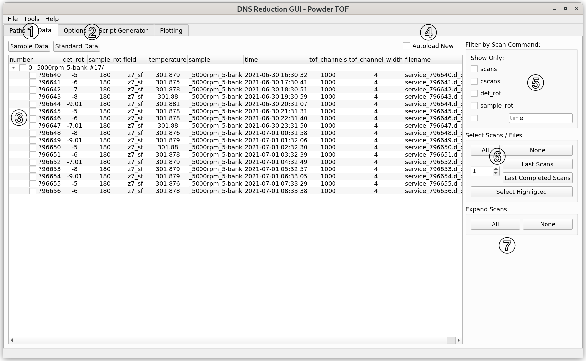

.. _dns_powder_tof_data_tab-ref:

DNS Data Tab
------------

\

This tab is a file browser for the DNS datafiles.

(1) Click on the **Read All** button to read all the files cointained in the
**Data Directory** (as specified in the
:ref:`Paths <dns_powder_tof_paths_tab-ref>` tab). As a result, only TOF or
elastic datafiles in the dependency of the selected mode will be displayed.
If the **Autoload New** checkbox is selected, new data which are found in
the directory will be automatically loaded every 5 seconds. If an incomplete
scan was selected for reduction, autoload will also check new files in this
scan for reduction.

(2) Here, a tree of DNS datafiles, grouped by scan commands, is displayed.
Top tree elements (``0_5000rpm_5-bank #17`` in the present example) show the sample
name (``0_5000rpm_5-bank``) followed by the scan command (not contained in the
present example) and the number of files found and the number of files expected for
a complete scan (``#17``). The branches of the tree elements (``796640..796656``)
are ordered by the filenumbers. You can select files or scans for data reduction
by checking the corresponding check boxes on the left or by using the quick selection
buttons located in (4). One can also right click on the files in the filetree to open
them in a text editor.

(3) The displayed scans can be filtered by their scan commands (e.g. ``scans``,
``cscans``, ``det_rot``, ``sample_rot``) or by text matching (e.g. ``time``).

(4) The **Last Scans** button selects the most recent number of scans given in
the input field next to it.  **Last Completed Scans** does the same, but only
considers complete scans. **Select Highlighted** checks scans previously selected
by mouse selection and one can use "Ctrl" or "Shift" buttons for multiple selection.

(5) Expands or unexpands all treeview elements.
\

(6) Here a user can switch between sample data and standard data. If standard data
is not selected, then all files found in the **Standard Files Directory** (as
specified in :ref:`Paths <dns_powder_tof_paths_tab-ref>` tab) will be automatically
selected by default. One can change this set up by switching to "Standard Data" and
unselecting the **Authomatically Select Standard Files** checkbox. If no standard
files are found in the **Standard Files Directory** directory, the GUI will look for
the newest ``.zip`` file with the word *standard* in its name in **Standard Files
Directory** and **Data Directory**. If the corresponding ``.zip`` file is found, the
GUI will unzip it and try to use the unzipped files.
