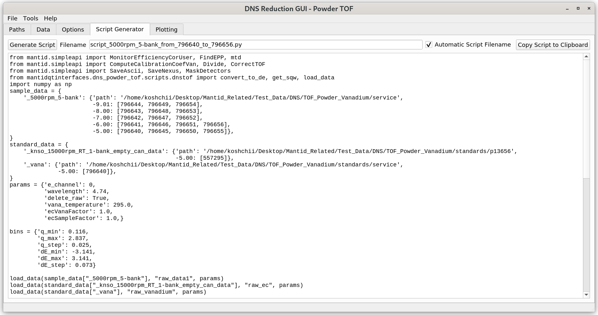

.. _dns_powder_tof_script_generator_tab-ref:

DNS Powder TOF - Script Generator Tab
-------------------------------------

\

This tab enables a user to generate and run a mantid script for data reduction
by clicking on the **Generate Script** button.

**Automatic Script Filename** checkbox is selected by default, and the filename
for the generated script will be set automatically to
``script_{sample name}_from_{first file number}_to_{last file number}.py``.
Alternatively, the user can deselect this box and set manually the filename for t
he output script. The script will be saved to the **Script Directory** selected in
the :ref:`Paths <dns_powder_tof_paths_tab-ref>` tab. The path is shown in the status
line.

Running of the script can be aborted, by clicking the **Abort Loading** button,
but then the data will not be displayed under the
:ref:`Plotting <dns_powder_tof_plotting_tab-ref>` tab.
The displayed script window cannot be edited inside the GUI, but can be copied to the
clipboard using the **Copy Script to Clipboard** button and redacted elsewhere.
