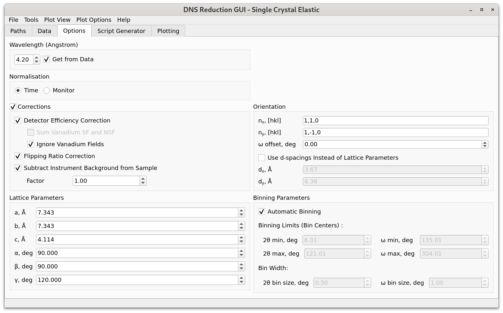

.. _dns_single_crystal_elastic_options_tab-ref:

DNS Single Crystal Elastic - Options Tab
========================================

\

**Wavelength** sets the wavelength of the neutron beam. If **Get from Data**
is checked, then the wavelength is read from the data files. If the selected
data files have a different wavelength, or the wavelength does not
match the corresponding frequency of the velocity selector, a warning will be
given to the user and **Get from Data** checkbox will be unselected. In this
case, the wavelength will have to be set manually by the user.

**Normalisation** can be used to select whether the dataset should be normalised
by measurement time or monitor counts.

**Corrections** should be selected to activate various options for data reduction.

**Detector Efficiency Correction** corrects for different detector efficiencies
by normalizing selected sample data on vanadium measurements. When the detector
efficiency correction checkbox is selected, the user must select the corresponding
vanadium and empty container measurements under the **Standard Data** view of
the :ref:`Data <dns_powder_tof_data_tab-ref>` tab. The empty measurement is
required because background subtraction from vanadium is mandatory. Detector
efficiencies will be evaluated for each of those vanadium "field" channels
that correspond to the user-selected sample "field" channels, unless either
from **Sum Vanadium SF and NSF** and **Ignore Vanadium Fields** options is
additionally selected by the user (both options can't be selected at the same time).

**Sum Vanadium SF and NSF** calculates detector efficiencies by combining
vanadium spin-flip (SF) and non-spin-flip (NSF) data for each of the vanadium
polarisation components that correspond to the selected polarisation components
(:math:`x, y`, or :math:`z`) of the sample.

**Ignore Vanadium Fields** calculates detector efficiencies by combining all
selected vanadium "fields". In this case, the calculated detector efficiencies
can be applied to any of the selected sample "fields".

**Flipping Ratio Correction** corrects for the finite flipping ratio, using
NiCr data selected under the **Standard Data** view of the
:ref:`Data <dns_powder_tof_data_tab-ref>` tab. Similarly to the case with detector
efficiency correction, when the flipping ratio option is selected, the corresponding
empty measurement must also be selected (for the background subtraction from NiCr).
Both, spin-flip and non-spin-flip measurements are required to be selected in
**Sample Data** and **Standard Data** views of the
:ref:`Data <dns_powder_tof_data_tab-ref>` tab.

**Subtract Instrument Background from Sample** can be enabled to subtract the
instrument background from sample data. The corresponding **Factor** box can be
used to set a scaling factor for this correction.

The **Lattice Parameters** group box can be used to set the lattice parameters of
the sample. As a result, :math:`d`-spacings :math:`d_x` and :math:`d_y` for vectors
:math:`\tau_1` and :math:`\tau_2`, specified in the **Orientation** group box, will be
automatically calculated. These :math:`d`-spacings will be used by the program for
transforming the intensity function from :math:`(2 \theta, \omega)` in coordinate space
to :math:`(hkl_x, \hkl_y)` in reciprocal space. Alternatively, the user can set the
:math:`d`-spacings manually by checking the
**Use d-spacings Instead of Lattice Parameters** checkbox (in the **Orientation**
group box) and providing the corresponding values for :math:`d_x` and :math:`d_y`.

The **Orientation** group box can be used to specify the horizontal scattering plane.
For this, hkl for vectors :math:`\tau_1` and :math:`\tau_2`, which define the horizontal
plane, must be provided (:math:`\tau_1` and :math:`\tau_2` do not need to be perpendicular).
In case when :math:`\tau_1` and :math:`\tau_2` are not perpendicular, instead of the vector
:math:`\tau_2`, the GUI will use the vector that is perpendicular to :math:`\tau_1` and lies
in the (:math:`\tau_1`, :math:`\tau_2`) plane. The :math:`\omega` offset box can be used to
set the deviation of the rotation angle :math:`\omega` from 0 for the position
when :math:`\tau_1` is parallel to the direct beam.

When the **Automatic Binning** checkbox is selected, the interface will determine
the minimum and maximum values for the scattering angle :math:`2 \theta` and the
sample rotation angle :math:`\omega` based on the angles specified in the selected
sample data files. The default bin size values for the scattering and sample rotation
angles are chosen to be :math:`0.5^{\circ}` and :math:`1^{\circ}`, respectively.
When **Automatic Binning** is unselected, the user can manually choose the desired bin
sizes, as well as the angular ranges that will be used for plotting under
the :ref:`Plotting <dns_powder_elastic_plotting_tab-ref>` tab.
