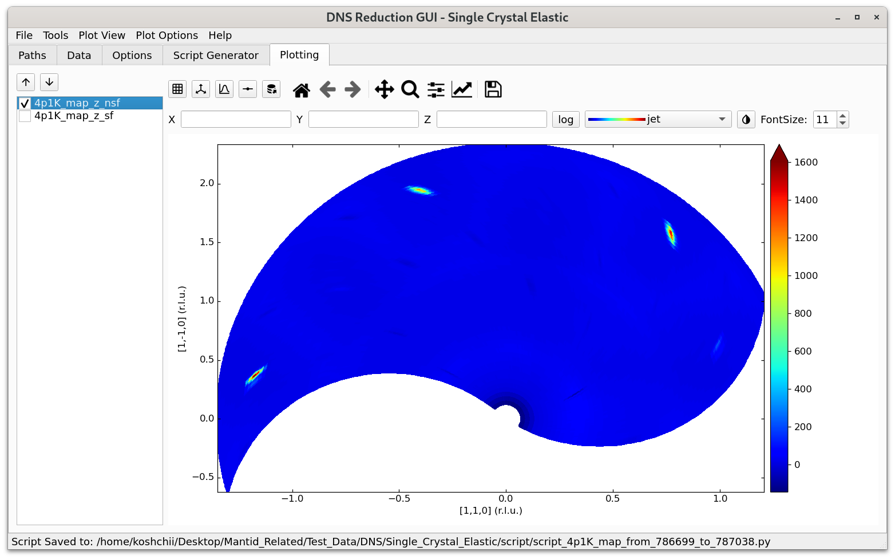
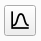

.. _dns_single_crystal_elastic_plotting_tab-ref:

DNS Single Crystal Elastic - Plotting Tab
=========================================

The **Plotting** tab offers basic plotting functionality for reduced datasets.

\

On the left of this tab, a list with different channels of the reduced dataset is shown and
the user can select which channel to display.

The buttons below the **Plotting** tab have the following functionality (from left to right):

+------------------------------------------------+----------------------------------------------------------------------------+
| Option                                         | Description                                                                |
+================================================+============================================================================+
| |exp-down|/|exp-up|                            | Move through single plots using down or up arrow.                          |
| File selector                                  |                                                                            |
+------------------------------------------------+----------------------------------------------------------------------------+
| |exp-grid| Grid selector                       | Toggle through different grid sizes.                                       |
+------------------------------------------------+----------------------------------------------------------------------------+
| |exp-crystal-axes| Grid style selector         | Switch between a) orthogonal axes defined by :math:`n_x` and :math:`n_y`,  |
|                                                | or b) crystalographic principal axes lying in the horizontal scattering    |
|                                                | plane. The latter works only if two principle axes change in the           |
|                                                | horizontal plane.                                                          |
+------------------------------------------------+----------------------------------------------------------------------------+
| |exp-projections| Projection selector          | Turn on/off projections of the intensity function averaged along           |
|                                                | :math:`x` and :math:`y` directions.                                        |
+------------------------------------------------+----------------------------------------------------------------------------+
| |exp-edge-control| Data                        | Toggle through drawing of borders of the triangles or quadrilaterals of the|
| display style selector                         | plot. The following modes are available: a) no border, b) white border,    |
|                                                | c) black border (one might have to zoom in in order to see data).          |
|                                                | In addition, when the **Scatter** mode is activated ("Plot View" ->        |
|                                                | "Plot Type" -> "Scatter"), this button can be used to change               |
|                                                | the size of the displayed datapoints.                                      |
+------------------------------------------------+----------------------------------------------------------------------------+
| |exp-data-export| Data export selector         | Export the shown plot as an ascii file to the directory specified for      |
|                                                | exports in the **Path** tab.                                               |
+------------------------------------------------+----------------------------------------------------------------------------+

The rest of the buttons have the same functionality as in matplotlib's navigation toolbar.

When the mouse cursor is hovered over the plot, the cursor's :math:`(x, y)` coordinates together with the coresponding
:math:`hkl` values will be displayed on the right hand side of matplotlib's control buttons. In addition, the correponding
value of intensity (with an error-bar) of the closest measured data point will be displayed as well. (This does not give the
intensity of the quadrilateral, which could involve interpolation.)

The **X**, **Y** and **Z** input lines below the navigation buttons allow to manually specify the region to zoom into. The
syntax to be used inside these lines is similar to the python's list slicing (or dnsplot's range). For example, **0:2** in the
**X** input line would imply that the displayed values of X should be in the range from 0 to 2. When the desired ranges of
**X**, **Y** and **Z** are specified, pressing the Enter key inside an input line will update the plot.

The **log** button next to **X, Y, Z** turns on/off the logarithmic intensity scale. The dropdown list nearby to the **log**
button allows to select different colormaps for visualisation. The button next to the dropdown list inverts the colormap color
scale. The **FontSize** dialog allows to change the fontsize of the legend (the Enter key has to be pressed inside the fontsize
box for the change to have an effect).

The **Plot View** menu, which can be accessed from the main menu of the "DNS Reduction" GUI, offers control over the style of
the plot.

The **Plot Type** menu of **Plot View** can be used to toggle between **Triangulation**, **Quadmesh**, and **Scatter** display
modes. When **Triangulation** is activated, the map is created out of triangles build between the measured points by
Delaunay-triangulation. This mode works with any kind of data distribution, but is the slowest. **Quadmesh** builds the
map out of quadrilaterals, which is much faster and this mode is used by the old "dnsplot" software. For this mode to operate
properly, the number of data points in the :math:`\omega` space for each of the selected :math:`2 \theta` positions must be
the same, otherwise quadrilaterals are not well defined. The **Scatter** mode can be used to display the measured data points.

The **Axes** menu of **Plot View** allows to change the plot axes between (:math:`n_x` and :math:`n_y`), as given in the
**Options**, or (:math:`q_x, q_x`), or (:math:`2 \theta, \omega`). In addition, **Fix Aspect Ratio** can be selected to fix
the aspect ratio between the :math:`x` and :math:`y` axis of the plot. This is especially usefull if crystallographic axes
are used since then the shown angles will be correct. **Switch Axes** will switch :math:`x` and :math:`y` axes in the plot.

The **Interpolation** menu of **Plot View** allows to generate additional triangles/quadrilaterals in order to make the plot
look smoother. For example, if **1->9** option is selected, each quadrilateral will be replaced by 9 quadrilaterals, and so
on. In this case, the data points will be interpolated using the RectBivariateSpline() method of the scipy library. The
interpolation grid is generated by splitting the original data point range of each dimension into uniformly distributed
intevals in such a way that the amount of geterated data points in each dimension is 3 times larger than the original amount.

The **Gourad Shading** checkbox can be used to toggle the shading on and off. If **Gourad Shading** is off, each quadrilateral
will have a solid color, determined by the average of the intensity of the datapoints. If **Gourad Shading** is checked, the
color will be smeared out inside the qualiteral towards its corners, giving a smoother change of color.

The **Synchronize zooming** menu allows to synchronize the zooming betweeen different scattering channels. If
**Synchronize zooming** is turned on for a specific axis and the user zooms in into a specific region of the plot,
then the synchronous zooming will be performed for each plot corresponding to different scattering channels.

The **Plot Options** menu can be used to toggle between **Change** :math:`\mathbf{\omega}` **offset** and **Change d-spacings**
modes. **Change** :math:`\mathbf{\omega}` **offset** activates a finder dialog, using which the user can interactively change
the :math:`\omega` offset of the actual plot in order to search for the correct offset value. The changes achieved this way
will be only temporary and will not be applied to all scattering channels. Therefore, once an appropriate value of the
:math:`\omega` offset is found, it is suggested that the user switches back to the **Options** tab, sets the proper values of
the :math:`\omega` offset in the **Orientation** groupbox, and re-runs the script. **Change d-spacings** allows the user to
adjust the d-spacing of :math:`n_x` and :math:`n_y`. The corresponding changes will be also temporary.
