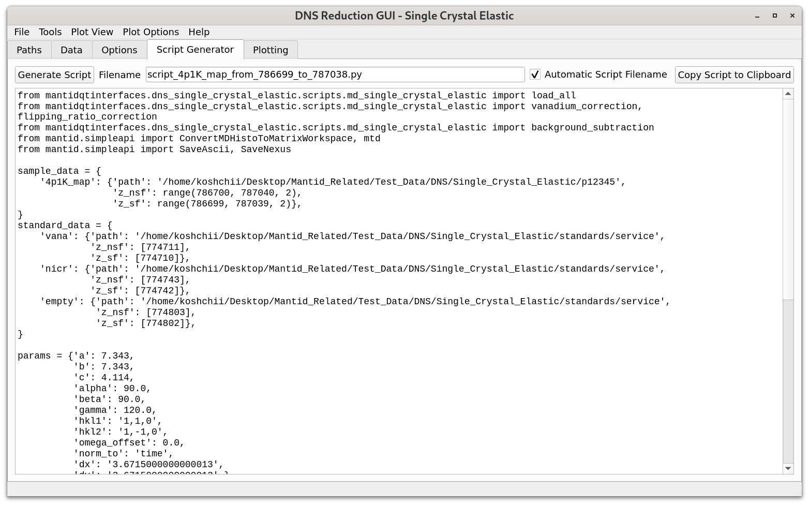

.. _dns_single_crystal_elastic_script_generator_tab-ref:

DNS Single Crystal Elastic - Script Generator Tab
=================================================

\

The functionality of the "Script Generator" tab of this operational mode is
identical to that of :ref:`Script Generator <dns_powder_tof_script_generator_tab-ref>`
of the DNS Powder TOF.

It should be noted that for this operational mode, when the user selects
more standard data files than it is required for data reduction (e.g., sample data
with the bank rotation of :math:`5^{\circ}` were selected, whereas the standard
data with bank rotations of :math:`5^{\circ}` and :math:`6^{\circ}` were chosen),
then the unnecessary standard files will be removed from the analysis at this stage
and will not be included in the generated script.
