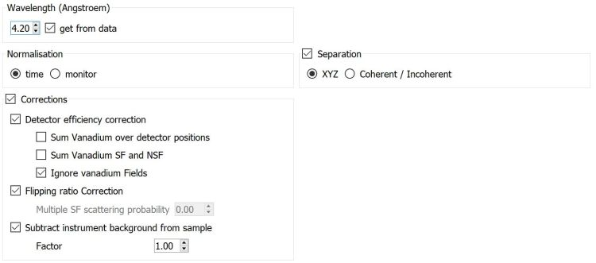
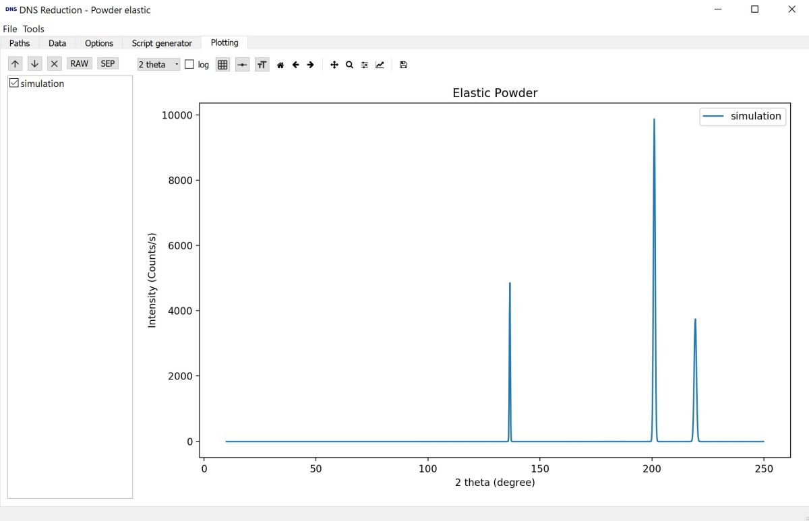

.. _dns_elastic_powder-ref:

DNS Powder elastic
==================

The powder elastic mode is for the reduction of polarized and unpolarized
powder diffraction data and separation of scattering contributions by
polarization analysis at the DNS instrument at MLZ.

Path / Data / Script Generator Tabs
-----------------------------------
The **path**, **data** and **script generator** tabs are described in 
:ref:`DNS reduction <DNSReduction-ref>`.

Option Tab
----------

   
**Wavelength** defines the used wavelength, if **get from data** is checked, it
is read from the data files. In case the selected data files have 
different wavelength or the wavelength does not match the selector speed an 
error is given and **get from data** is turned off. In this case, the wavelength
has to be given manually.

**Normalisation** selects whether the dataset is normalized on counting time or
monitor counts.

**Detector efficiency correction** corrects for different detector efficiency, 
angular coverage and Lorentz factor by  normalisation to vanadium data.
It is further possible to **Sum Vanadium over detector positions**, sum SF and
NSF channels and ignore the fields in the vanadium files. 

**Flipping ratio Correction** corrects for the finite flipping ratio, 
using NiCr data. 

**Separation** allows choosing **XYZ** polarization analysis for magnetic 
samples, requiring  X_SF, Y_SF, Z_SF and Z_NSF channels.
**Coherent/Incoherent** requires only SF and NSF channel, but is only useful
for non-magnetic samples.

Plotting Tab
------------
The **Plotting** tab offers basic plotting functionality for reduced data sets.

   
On the left a list with the different channels of a reduced datasets is shown,
which can be checked for plotting.
With the up and down arrows, one can move through single plots.
**RAW** selects the reduced and corrected data, while **SEP** selects the
workspaces with the separated nuclear coherent, spin incoherent and in case of
XYZ-analysis magnetic contributions.
In case a simulation was created in the :ref:`Simulation<dns_simulation-ref>`
tab, the result normed to the maximum observed intensity can also be plotted.

The dropdown box **2 theta** switches the x-axis between *2 theta*, *q* and 
*d-spacing*. The **log** checkbox switches to logarithmic y-axis scaling.
The buttons to the right switch: grids, line styles and error bars.

Used By
^^^^^^^

:ref:`DNS Reduction <DNSReduction-ref>`,
