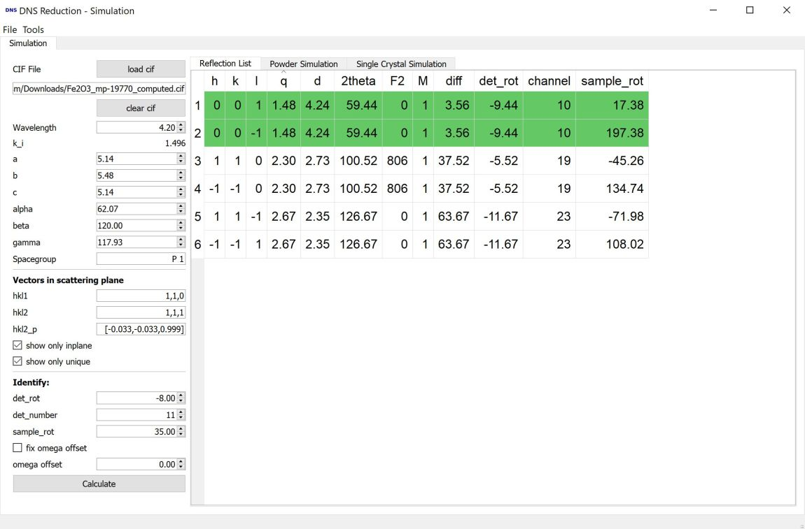
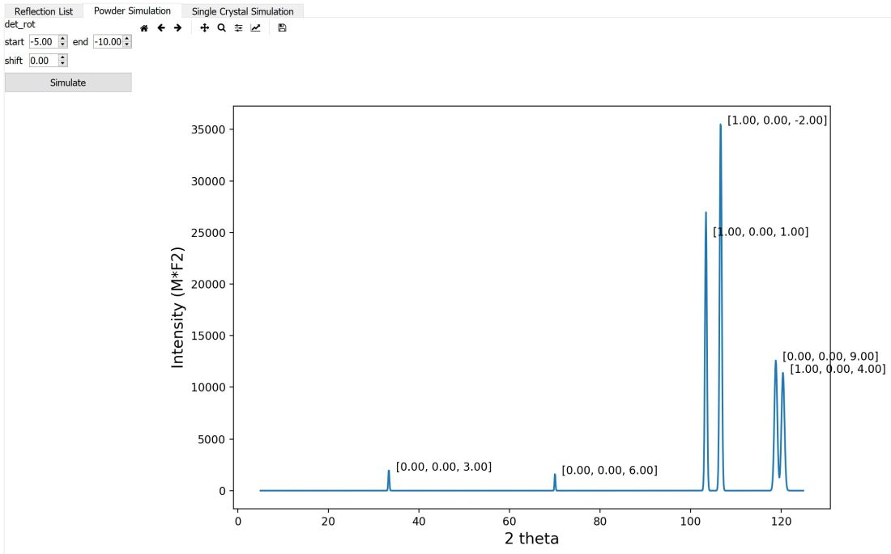
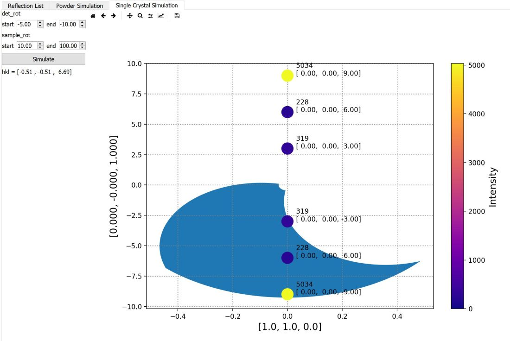

.. _dns_simulation-ref:

DNS Simulation
==============

The simulation mode, allows generating a reflection list  and simulate powder 
and single crystal diffraction patterns for the DNS instrument.

Left Menu
---------
**load cif** loads a crystallographic  cif file, if it was successful the
filename and the lattice parameters are updated. 
The lattice parameters can also be manually changed.
The **clear cif** button is used to remove a loaded cif file. 
If a cif file is loaded, the atom positions are used for intensity calculation.

The wavelength has to be specified manually.

**Vectors in the scattering plane** allows giving two vectors
**hkl1** and **hkl2** in reciprocal space, to define the horizontal scattering
plane. If the two vectors are not perpendicular, **hkl2_p** will show the vector
in the horizontal scattering plane perpendicular to **hkl1**. The tooltip of 
the input fields show the corresponding d-spacing.

The checkbox **show only inplane** will filter the generated reflection list to 
show only reflections exactly in the horizontal scattering plane.
The checkbox **show only unique** list only unique reflections, based on the
specified spacegroup.

**Calculate** generates a list of at DNS reachable reflections,
which will be show on the tab **Reflection List**.

The **Identify** box allows to identify observed reflections in the reflection
list, if the observed **det_rot** and **det_number** are given possible
identifications are marked green.

Reflection List
---------------
The reflection list can be sorted by clicking the header
labels. **F2** is the Lorentz corrected squared structure factor,
which is only calculated if a cif file was loaded. **M** is the multiplicity of
the reflection, by hovering over the numbers the equivalent reflections are
shown in the tooltip.
**det_rot** gives the lowest possible **det_rot** and **channel** the
corresponding detector number. 

If the checkbox **fix omega offset** is not checked, the **sample_rot** column
gives the calculated angle based on **hkl1** being parallel to the beam
if the goniometer is at 0. 

To determine the omega offset, one can enter **det_rot**, **det_number** and
**sample_rot** of an observed reflection in the **Identify** box 
(**hkl1** needs to be set).
After calculation, clicking the rotation angle in the **sample rotation** 
column of a matching reflection, will update the **omega offset** value.
If now **fix omega offset** is checked, the **sample rotation** column will be
updated with the corrected angles (clicking the angle has no effect now).
 
Powder Simulation
-----------------
After the reflection list has been calculated, the **Powder Simulation** tab
shows a powder diffractogram, considering the reachable angles at DNS. For the
latter the start and end points of the detector rotation and a possible zero 
shift have to be entered. **Simulate** updates the plot.

Single Crystal Simulation
-------------------------
**Single Crystal Simulation** the horizontal scattering plane, with **hkl1** as
x-axis and **hkl2_p** as y-axis.
The coverage of a scan is shown, if the **omega osset** has been fixed and
**det_rot** and **sample_rot** start and endpoints are given.
**Simulate** updates the plot. The reflections are indexed and their intensity
is shown. Hovering with the mouse over the map will show the corresponding hkl.

Used By
^^^^^^^

:ref:`DNS Reduction <DNSReduction-ref>`,