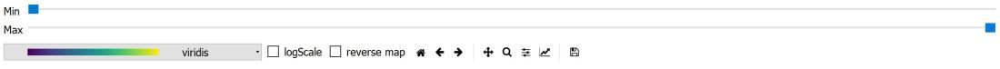

.. _dns_tof_powder-ref:

DNS Powder TOF
==============

The powder tof mode is for the reduction of unpolarized time-of-flight 
powder data at the DNS instrument at MLZ.

Path / Data / Script Generator Tabs
-----------------------------------
The **path**, **data** and **script generator** tabs are described in
:ref:`DNS reduction <DNSReduction-ref>`.

Option Tab
----------
.. image::  ../images/dns_tof_powder_options.jpg
   :height: 200px
   
**Wavelength** defines the used wavelength, if **get from data** is checked, it
is read from the data files. In case the selected data files have 
different wavelength or the wavelength does not match the selector speed an 
error is given and **get from data** is turned off. In this case, the wavelength
has to be given manually.

**Normalisation** select whether the dataset is normalized on monitor counts or
not normalized.

**Detector efficiency correction** corrects for different detector efficiency,
 angular coverage and Lorentz factor by  normalisation to vanadium data.

**Correct elastic peak position to 0 meV** will determine the elastic
line in the vanadium data and set the corresponding channel to dE = 0meV.

**Mask bad detectors** will exclude detectors, which show negative counts for
Vanadium after background subtraction. 

The **TOF Options** box allows manually defining the elastic peak channel.

The **Binning** box, defines the binning used for data reduction. 
**Suggest from data** creates an optimized binning based on the selected
data files and covered energy range. If all fields are left at zero, the script 
generation will trigger automatic bin creation.

 
Plotting Tab
------------
The **Plotting** tab shows a single dE vs Q plot.

   
The two sliders on top allow shifting the maximum and minimum of the intensity 
colorbar. The drop down list selects the used colorbar, and the buttons right
of it turn on logarithmic scaling  of the Intensity and inversion of the
colormap.

Used By
^^^^^^^

:ref:`DNS Reduction <DNSReduction-ref>`,