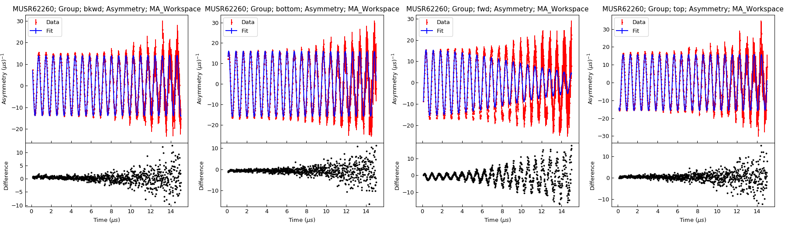
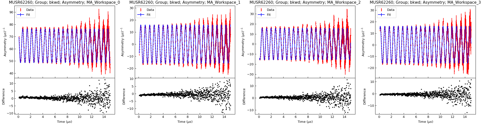

.. _Fit_Script_Generator-ref:

Fit Script Generator
====================

.. image::  ../../images/FitScriptGenerator.PNG
   :align: right
   :height: 400px

.. contents:: Table of Contents
  :local:

Interface Overview
------------------

This interface is used to generate a python script used for sequential or simultaneous fitting. The interface allows you to select
specific domains of a workspace, and choose different fit ranges for each domain. For simultaneous fitting, the interface allows
you to choose different fit functions for different domains. It also allows great flexibility when setting a Global tie. See the
usage examples below for a full explanation of how to use this interface.

Interface Options
-----------------

**Remove Domains**
Removes the selected domains from the domain data table.

**Add Domains**
Choose workspace domains to load into the domain data table.

**Domain Data Table**
Displays the loaded workspace domain data and their corresponding fit range. The fit ranges can be different for each domain, and
can be edited by double clicking the ``StartX`` or ``EndX`` cell. The Function Index corresponding to each domain is displayed when
Simultaneous fitting mode is selected.

**Apply function changes to**
There are several changes you can make to the selected fit function such as adding or removing a fit function, changing the value of
a parameter, tying a parameter or constraining a parameter. These changes can be applied to all the domains in the ``Domain Data Table``
if ``All Domains`` is selected, or only to the domains with highlighted rows if ``Selected Domains`` is selected.

**Function Browser**
The Function Browser allows you to add or remove fit functions and adjust their parameters and attributes. It also allows you to add
Fixes, Ties and Constraints. The Function Index corresponding to a specific domain is displayed at the top of the Function Browser
when in Simultaneous fitting mode.

**Fitting Mode**
Determines whether to generate a python script for Sequential or Simultaneous fitting.

**Generate Script to File**
The data selected in the Fit Script Generator is used to generate a python script, which is then saved to a file.

**Generate Script to Clipboard**
The data selected in the Fit Script Generator is used to generate a python script, which is then copied to the clipboard. Paste this
into a python script editor window.

Concepts
--------

**Domain**
This refers to a set of X, Y and error data at a specific index of a :ref:`MatrixWorkspace <MatrixWorkspace>`.

**Function Index**
Different domains can have the same function, and therefore have identically named parameters. A Function Index is used to differentiate
between these identically named parameters by specifying the exact location of a parameter. For example if you are performing a simultaneous
fit with two domains each containing a :ref:`FlatBackground <func-FlatBackground>`, the first domain will have a Function Index of `f0.`
while the second domain has a Function Index of `f1.`. There are therefore two parameters, `f0.A0` and `f1.A0`.

**Attribute**
An attribute is a property of a function which doesn't change during fitting.

**Parameter**
A parameter is a decimal value property of a function which will change during fitting. It has an error.

**Fix**
A Fix is where a parameters value is forced to stay the same during a fit. It is a type of Tie.

**Constraint**
A Constraint is where a parameters value is forced to stay within a defined region during a fit.

**Tie**
A Tie is where a parameters value is set to be equal to the value of another parameter, or an expression, during a fit.

Sequential Fitting Concepts
---------------------------

During a Sequential fit, each domain is fitted one after another. The parameter values at the end of a domain fit are
passed to the next domain fit to be used as the initial parameter values.

**Local Tie**
A local tie is when you tie a parameter to another parameter which is in the same domain. This can be done for both
sequential and simultaneous fitting.

Simultaneous Fitting Concepts
-----------------------------

During a Simultaneous fit, each domain is fitted concurrently. This allows you to tie a parameter to another parameter
in a different domain.

**Global Tie**
A global tie is when you tie a parameter to another parameter which is in a different domain. This can only be done for
simultaneous fitting.

**Global Parameter**
A global parameter is a type of global tie. This is where each domain contains the same parameter, and it is 'shared' by
each domain during a simultaneous fit.

Usage Example for Sequential Fitting
------------------------------------

To carry out the following usage example you will first need to load some data into Mantid. Run the following script, and
make sure you have access to the data archive.

.. code-block:: python

    from mantid.simpleapi import *

    LoadMuonNexus(Filename=r'\\isis.cclrc.ac.uk\inst$\ndxmusr\instrument\data\cycle_16_5\MUSR00062260.nxs', OutputWorkspace='MUSR00062260.nxs', DeadTimeTable='MUSR00062260.nxs_deadtime_table', DetectorGroupingTable='__notUsed')
    RenameWorkspace(InputWorkspace='MUSR00062260.nxs_deadtime_table', OutputWorkspace='MUSR62260_deadtime MA')
    RenameWorkspace(InputWorkspace='MUSR00062260.nxs', OutputWorkspace='MUSR62260_raw_data MA')
    GroupWorkspaces(InputWorkspaces='MUSR62260_raw_data MA,MUSR62260_deadtime MA', OutputWorkspace='MUSR62260 MA')
    MuonPreProcess(InputWorkspace='MUSR62260_raw_data MA', OutputWorkspace='__MUSR62260_pre_processed_data', TimeMin=0.10199999999999999, TimeOffset=0, DeadTimeTable='MUSR62260_deadtime MA')
    MuonGroupingAsymmetry(InputWorkspace='__MUSR62260_pre_processed_data', OutputWorkspace='MUSR62260; Group; top; Asymmetry; MA', OutputUnNormWorkspace='__MUSR62260; Group; top; Asymmetry; MA_unnorm', GroupName='top', Grouping='17-24,49-56', AsymmetryTimeMin=0.10199999999999999, AsymmetryTimeMax=32.293998718261719)
    MuonGroupingAsymmetry(InputWorkspace='__MUSR62260_pre_processed_data', OutputWorkspace='MUSR62260; Group; bkwd; Asymmetry; MA', OutputUnNormWorkspace='__MUSR62260; Group; bkwd; Asymmetry; MA_unnorm', GroupName='bkwd', Grouping='25-32,41-48', AsymmetryTimeMin=0.10199999999999999, AsymmetryTimeMax=32.293998718261719)
    MuonGroupingAsymmetry(InputWorkspace='__MUSR62260_pre_processed_data', OutputWorkspace='MUSR62260; Group; bottom; Asymmetry; MA', OutputUnNormWorkspace='__MUSR62260; Group; bottom; Asymmetry; MA_unnorm', GroupName='bottom', Grouping='1-8,33-40', AsymmetryTimeMin=0.10199999999999999, AsymmetryTimeMax=32.293998718261719)
    MuonGroupingAsymmetry(InputWorkspace='__MUSR62260_pre_processed_data', OutputWorkspace='MUSR62260; Group; fwd; Asymmetry; MA', OutputUnNormWorkspace='__MUSR62260; Group; fwd; Asymmetry; MA_unnorm', GroupName='fwd', Grouping='9-16,57-64', AsymmetryTimeMin=0.10199999999999999, AsymmetryTimeMax=32.293998718261719)

1. Open the Fit Script Generator interface.

2. Click ``Add Domains`` and select each of the loaded Asymmetry workspaces in turn.

3. Double click the ``EndX`` cells and change each of them to 15.0.

4. Right click on the ``Function Browser`` and add a ``GausOsc`` function.

5. Change the ``Frequency`` parameter value to 1.4

6. Make sure the ``Fitting Mode`` is Sequential

7. Click ``Generate Script to Clipboard``, and then paste into an empty python script window.

8. Run the script and you will see the results of a sequential fit.

Usage Example for Simultaneous Fitting
--------------------------------------

To carry out the following usage example you will first need to load some data into Mantid. Run the following script, and
make sure you have access to the data archive. This will add a background to the 'bkwd' workspace only.

.. code-block:: python

    from mantid.api import AnalysisDataService
    from mantid.simpleapi import *

    LoadMuonNexus(Filename=r'\\isis.cclrc.ac.uk\inst$\ndxmusr\instrument\data\cycle_16_5\MUSR00062260.nxs', OutputWorkspace='MUSR00062260.nxs', DeadTimeTable='MUSR00062260.nxs_deadtime_table', DetectorGroupingTable='__notUsed')
    RenameWorkspace(InputWorkspace='MUSR00062260.nxs_deadtime_table', OutputWorkspace='MUSR62260_deadtime MA')
    RenameWorkspace(InputWorkspace='MUSR00062260.nxs', OutputWorkspace='MUSR62260_raw_data MA')
    GroupWorkspaces(InputWorkspaces='MUSR62260_raw_data MA,MUSR62260_deadtime MA', OutputWorkspace='MUSR62260 MA')
    MuonPreProcess(InputWorkspace='MUSR62260_raw_data MA', OutputWorkspace='__MUSR62260_pre_processed_data', TimeMin=0.10199999999999999, TimeOffset=0, DeadTimeTable='MUSR62260_deadtime MA')
    MuonGroupingAsymmetry(InputWorkspace='__MUSR62260_pre_processed_data', OutputWorkspace='MUSR62260; Group; top; Asymmetry; MA', OutputUnNormWorkspace='__MUSR62260; Group; top; Asymmetry; MA_unnorm', GroupName='top', Grouping='17-24,49-56', AsymmetryTimeMin=0.10199999999999999, AsymmetryTimeMax=32.293998718261719)
    MuonGroupingAsymmetry(InputWorkspace='__MUSR62260_pre_processed_data', OutputWorkspace='MUSR62260; Group; bkwd; Asymmetry; MA', OutputUnNormWorkspace='__MUSR62260; Group; bkwd; Asymmetry; MA_unnorm', GroupName='bkwd', Grouping='25-32,41-48', AsymmetryTimeMin=0.10199999999999999, AsymmetryTimeMax=32.293998718261719)
    MuonGroupingAsymmetry(InputWorkspace='__MUSR62260_pre_processed_data', OutputWorkspace='MUSR62260; Group; bottom; Asymmetry; MA', OutputUnNormWorkspace='__MUSR62260; Group; bottom; Asymmetry; MA_unnorm', GroupName='bottom', Grouping='1-8,33-40', AsymmetryTimeMin=0.10199999999999999, AsymmetryTimeMax=32.293998718261719)
    MuonGroupingAsymmetry(InputWorkspace='__MUSR62260_pre_processed_data', OutputWorkspace='MUSR62260; Group; fwd; Asymmetry; MA', OutputUnNormWorkspace='__MUSR62260; Group; fwd; Asymmetry; MA_unnorm', GroupName='fwd', Grouping='9-16,57-64', AsymmetryTimeMin=0.10199999999999999, AsymmetryTimeMax=32.293998718261719)

    ws = AnalysisDataService.retrieve('MUSR62260; Group; bkwd; Asymmetry; MA')
    background = CreateWorkspace(DataX=ws.dataX(0), DataY=[1.0] * len(ws.dataY(0)), ParentWorkspace='MUSR62260; Group; bkwd; Asymmetry; MA')
    Plus(LHSWorkspace='MUSR62260; Group; bkwd; Asymmetry; MA', RHSWorkspace='background', OutputWorkspace='MUSR62260; Group; bkwd; Asymmetry; MA')

1. Open the Fit Script Generator interface.

2. Click ``Add Domains`` and select each of the loaded Asymmetry workspaces in turn. For this example, add the 'MUSR62260; Group; bkwd; Asymmetry; MA' domain first.

3. Double click the ``EndX`` cells and change each of them to 15.0.

4. Change the ``Fitting Mode`` to Simultaneous.

5. Change ``All Domains`` to ``Selected Domains``, and then select the 'MUSR62260; Group; bkwd; Asymmetry; MA' domain table row.

6. Right click on the Function Browser and add a ``FlatBackground``. This will only add this function to the selected domain.
   Selecting the other table rows will show they do not have any fit functions yet.

7. Change the 'A0' parameter in the ``FlatBackground`` to a value of 1.0, and 'Fix' it by right clicking on the parameter.

8. Change ``Selected Domains`` back to ``All Domains``.

9. Right click on the Function Browser and add a ``GausOsc``. This will add the ``GausOsc`` function to all of the domains.

10. Change the ``Frequency`` parameter value in each of the domains to 1.3.

11. Select any table row that isn't the first domain table row.

12. Select the Frequency parameter, right click and add a tie to ``f0.f1.Frequency``. This is a global tie.

13. Click ``Generate Script to Clipboard``, and then paste into an empty python script window.

14. Run the script and you will see the results of a simultaneous fit. Notice the 'MUSR62260; Group; bkwd; Asymmetry; MA' background has been accounted for.

.. categories:: Interfaces General
