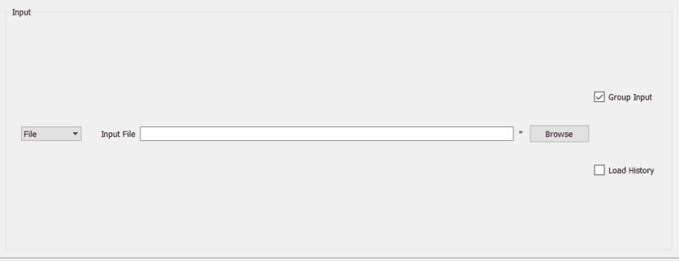

.. _interface-inelastic-data-processor:

Inelastic Data Processor
========================

.. contents:: Table of Contents
  :local:

Overview
--------

The Inelastic Data Processor interface provides processes for transforming
reduced data from, for example, :ref:`Indirect Data Reduction <interface-indirect-data-reduction>`
and Direct Reduction routines or S(Q, w). The output data can then be used for analysis by
processes in, for example, the :ref:`Inelastic QENS Fitting <interface-inelastic-qens-fitting>` and
:ref:`Inelastic Bayes Fitting <interface-inelastic-bayes-fitting>` interfaces.

.. interface:: Data Processor
  :align: right
  :width: 750

Action Buttons
~~~~~~~~~~~~~~

Settings
  Opens the :ref:`Settings <inelastic-interface-settings>` GUI which allows you to
  customize the settings for the Inelastic interfaces.

?
  Opens this help page.

Py
  Exports a Python script which will replicate the processing done by the current tab.

Manage Directories
  Opens the Manage Directories dialog allowing you to change your search directories
  and default save directory and enable/disable data archive search.

.. _inelastic-symmetrise:

Symmetrise
----------

This tab allows you to take an asymmetric reduced file (*_red.nxs*) and symmetrise it about
the Y axis.

The center of energy in the Y axis (*E=0*) is indicated by a solid red line. Two green vertical dashed
lines can be moved to change the value of :math:`E_{low}` and :math:`E_{high}`, which is the range of energies used to symmetrise
the spectra. Additionally, two horizontal blue dotted lines can be moved to help in selecting a range that prevents rigged curves
when the spectra is symmetrised.

The curve can be symmetrised using either side of the spectra by changing the *Reflect Type* property. This choice influences
the direction onto which the spectra is symmetrised. Note that :math:`E_{low}` represents
the lowest value on the range, so when the spectra is on the positive side, :math:`E_{low}` will be closer to the centre
while in the negative side :math:`E_{low}` will be farther from the centre. The following methods are available on the *Reflect Type* property:

1. *Positive to Negative* (default): the range of the positive values between :math:`E_{low}` and :math:`E_{high}`
   is reflected about the Y axis and replaces the corresponding values in the negative side of the spectra.
   The curve which ranges between :math:`\pm|E_{low}|` is not modified.

2. *Negative to Positive*: the range of the negative values between :math:`-E_{low}` and :math:`-E_{high}`
   is reflected about the Y axis and replaces the corresponding values in the positive side of the spectra.
   The curve which ranges between :math:`\pm|E_{high}|` is not modified.

.. interface:: Data Processor
  :widget: tabSymmetrise

Symmetrise Options
~~~~~~~~~~~~~~~~~~

Input
  Allows you to select a reduced NeXus file (*_red.nxs*) or workspace (*_red*) as the
  input to the algorithm.

ELow & EHigh
  Sets the energy range that is to be reflected about :math:`y=0`.

Reflect Type
  Whether to do *Positive to Negative* or *Negative to Positive* reflection.

Spectrum No
  Changes the spectrum shown in the preview plots.

XRange
  Changes the range of the preview plot, this can be useful for inspecting the
  curve before running the algorithm.

Preview
  This button will update the preview plot and parameters under the Preview
  section.

Run
  Runs the processing configured on the current tab.

Plot Spectra
  If enabled, it will plot the selected workspace indices in the selected output workspace.

Save Result
  If enabled the result will be saved as a NeXus file in the default save
  directory.

.. _preview-properties:

Preview
~~~~~~~

The preview section shows what a given spectra in the input will look like after
it has been symmetrised and gives an idea of how well the value of :math:`E_{low}` fits the
curve on both sides of the peak.

Negative Y
  The value of :math:`y` at :math:`x=-|E_{low}|` on  *Positive to Negative* or at :math:`x=-|E_{high}|` on *Negative to Positive*.

Positive Y
  The value of :math:`y` at :math:`x=|E_{low}|` on  *Positive to Negative* or at :math:`x=|E_{high}|` on *Negative to Positive*.

Delta Y
  The difference between Negative and Positive Y. Typically this should be as
  close to zero as possible.

.. _symmetrise-example-workflow:

Symmetrise Example Workflow
~~~~~~~~~~~~~~~~~~~~~~~~~~~
The Symmetrise tab operates on ``_red`` files. The file used in this workflow can
be produced using the 26176 run number on the ISIS Energy Transfer tab. The instrument used to
produce this file is IRIS, the analyser is graphite and the reflection is 002. See the
:ref:`isis-energy-transfer-example-workflow`.

1. In the **Input** box, load the file named ``iris26176_graphite002_red``. This will
   automatically plot the data on the first mini-plot.

2. Move the green slider located at x = 0.5 to be at x = 0.4.

3. Click **Preview**. This will update the :ref:`Preview properties <preview-properties>` and
   the neighbouring mini-plot.

4. Click **Run** and wait for the interface to finish processing. This will run the
   :ref:`Symmetrise <algm-Symmetrise>` algorithm. The output workspace is called
   ``iris26176_graphite002_sym_pn_red``.

5. Click **Plot Spectra** to produce a spectra plot of the output workspace. Other indices can be
   plotted by entering indices in the box next to the **Plot Spectra** button. For example,
   entering indices 0-2,4,6-7 will plot the spectra with workspace indices 0, 1, 2, 4, 6 and 7.

Go to the :ref:`sqw-example-workflow`.

.. _inelastic-sqw:

S(Q, w)
-------

Provides an interface for running the :ref:`SofQW <algm-SofQW>` algorithm
:ref:`SofQWNormalisedPolygon <algm-SofQWNormalisedPolygon>`.

.. interface:: Data Processor
  :widget: tabSQw

S(Q, w) Options
~~~~~~~~~~~~~~~

Input
  Allows you to select a reduced NeXus file (*_red.nxs*) or workspace (*_red*) as the
  input to the algorithm. An automatic contour plot of *_rqw* will be plotted in the preview
  plot once a file has finished loading.

Q Low, Q Width & Q High
  Q binning parameters that are passed to the :ref:`SofQW3 <algm-SofQWNormalisedPolygon>` algorithm. The low and high
  values can be determined using the neighbouring contour plot. The default values given show
  the Q range where there is data in the reduced workspace and these values cannot be changed.

Rebin in Energy
  If enabled the data will first be rebinned in energy before being passed to
  the :ref:`SofQW <algm-SofQW>` algorithm.

E Low, E Width & E High
  The energy rebinning parameters. The low and high values can be determined using the neighbouring contour plot.

Run
  Runs the processing configured on the current tab.

Plot Spectra
  If enabled, it will plot the selected workspace indices in the selected output workspace.

Open Slice Viewer
  If enabled, it will open the slice viewer for the selected output workspace.

Save Result
  If enabled the result will be saved as a NeXus file in the default save directory.

.. _sqw-example-workflow:

S(Q, w) Example Workflow
~~~~~~~~~~~~~~~~~~~~~~~~
The S(Q, w) tab operates on ``_red`` files. The file used in this workflow can be produced
using the 26176 run number on the ISIS Energy Transfer tab. The instrument used to
produce this file is IRIS, the analyser is graphite and the reflection is 002. See the
:ref:`isis-energy-transfer-example-workflow`.

1. In the **Input** box, load the file named ``iris26176_graphite002_red``. This will
   automatically plot the data as a contour plot within the interface.

2. Set the **Q Low**, **Q Width** and **Q High** to be 0.5, 0.05 and 1.8. These values are
   read from the contour plot.

3. Tick **Rebin in Energy**.

4. Set the **E Low**, **E Width** and **E High** to be -0.5, 0.005 and 0.5. Again, these values
   should be read from the contour plot.

5. Click **Run** and wait for the interface to finish processing. This will perform an energy
   rebin before performing the :ref:`SofQW <algm-SofQW>` algorithm. The output workspace ends
   with suffix _sqw and is called ``iris26176_graphite002_sqw``.

6. Enter a list of workspace indices in the output options (e.g. 0-2,4,6-7) and then click
   **Plot Spectra** to plot spectra from the output workspace.

6. Click the down arrow on the **Plot Spectra** button, and select **Open Slice Viewer**. This will
   open a slice viewer window for the output workspace.

7. Choose a default save directory and then click **Save Result** to save the output workspace.
   The _sqw file is used in the :ref:`moments-example-workflow`.

.. _inelastic-moments:

Moments
-------

This interface uses the :ref:`SofQWMoments <algm-SofQWMoments>` algorithm to
calculate the :math:`n^{th}` moment of an :math:`S(Q, \omega)` workspace created
by the SofQW tab.

.. interface:: Data Processor
  :widget: tabMoments

Moments Options
~~~~~~~~~~~~~~~

Input
  Allows you to select an :math:`S(Q, \omega)` file (*_sqw.nxs*) or workspace
  (*_sqw*) as the input to the algorithm.

Scale By
  Used to set an optional scale factor by which to scale the output of the
  algorithm.

EMin & EMax
  Used to set the energy range of the sample that the algorithm will use for
  processing.

Run
  Runs the processing configured on the current tab.

Plot Spectra
  If enabled, it will plot the selected workspace indices in the selected output workspace.

Save Result
  If enabled the result will be saved as a NeXus file in the default save directory.

.. _moments-example-workflow:

Moments Example Workflow
~~~~~~~~~~~~~~~~~~~~~~~~
The Moments tab operates on ``_sqw`` files. The file used in this workflow is produced during
the :ref:`sqw-example-workflow`.

1. In the **Input** box, load the file named ``irs26176_graphite002_sqw``. This will
   automatically plot the data in the first mini-plot.

2. Drag the blue sliders on the mini-plot so they are x=-0.4 and x=0.4.

3. Click **Run** and wait for the interface to finish processing. This will run the
   :ref:`SofQWMoments <algm-SofQWMoments>` algorithm. The output workspace ends
   with suffix _moments and is called ``iris26176_graphite002_moments``.

.. _elwin:

Elwin
-----

Provides an interface for the :ref:`ElasticWindow <algm-ElasticWindow>`
algorithm, with the option of selecting the range to integrate over as well as
the background range. An on-screen plot is also provided.

For workspaces that have a sample log, or have a sample log file available in the
Mantid data search paths that contains the sample environment information the
ELF workspace can also be normalised to the lowest temperature run in the range
of input files.

.. interface:: Data Processor
  :widget: tabElwin

Elwin Options
~~~~~~~~~~~~~

File or Workspace
  Choose to load data from a file or a workspace by using this dropdown menu. See image below for demonstration of how to load files using either option.

Input File
  Specify a range of input files that are either reduced (*_red.nxs*) or
  :math:`S(Q, \omega)`.

Group Input
  The :ref:`ElasticWindowMultiple <algm-ElasticWindowMultiple>` algorithm is performed on the input files and returns a group
  workspace as the output. This option, if unchecked, will ungroup these output workspaces.

Load History
  If unchecked the input workspace will be loaded without it's history.

Integration Range
  The energy range over which to integrate the values.

Background Subtraction
  If checked a background will be calculated and subtracted from the raw data.

Background Range
  The energy range over which a background is calculated which is subtracted from
  the raw data.

Normalise to Lowest Temp
  If checked the raw files will be normalised to the run with the lowest
  temperature, to do this there must be a valid sample environment entry in the
  sample logs for each of the input files.

SE log name
  The name of the sample environment log entry in the input files sample logs
  (defaults to ‘sample’).

SE log value
  The value to be taken from the "SE log name" data series (defaults to the
  specified value in the instrument parameters file, and in the absence of such
  specification, defaults to "last value")

Preview File
  The workspace currently active in the preview plot.

Spectrum
  Changes the spectrum displayed in the preview plot.

Plot Current Preview
  Plots the currently selected preview plot in a separate external window

Run
  Runs the processing configured on the current tab.

Plot Spectra
  If enabled, it will plot the selected workspace indices in the selected output workspace.

Save Result
  Saves the result in the default save directory.

.. _elwin-example-workflow:

Elwin Example Workflow
~~~~~~~~~~~~~~~~~~~~~~
The Elwin tab operates on ``_red`` and ``_sqw`` files. The files used in this workflow can
be produced using the run numbers 104371-104375 on the
:ref:`Indirect Data Reduction <interface-indirect-data-reduction>` interface in the ISIS Energy
Transfer tab. The instrument used to produce these files is OSIRIS, the analyser is graphite
and the reflection is 002.

1. Untick the **Load History** checkbox next to the file selector if you want to load your data
   without history.

2. Click **Browse** and select the files ``osiris104371_graphite002_red``,
   ``osiris104372_graphite002_red``, ``osiris104373_graphite002_red``, ``osiris104374_graphite002_red``
   and ``osiris104375_graphite002_red``. Load these files and they will be plotted in the mini-plot
   automatically.

3. The workspace and spectrum displayed in the mini-plot can be changed using the combobox and
   spinbox seen directly above the mini-plot.

4. You may opt to change the x range of the mini-plot by changing the **Integration Range**, or
   by sliding the blue lines seen on the mini-plot using the cursor. For the purpose of this
   demonstration, use the default x range.

5. Tick **Normalise to Lowest Temp**. This option will produce an extra workspace with end suffix
   _elt. However, for this to work the input workspaces must have a temperature. See the
   description above for more information.

6. Click **Plot Current Preview** if you want a larger plot of the mini-plot.

7. Click **Run** and wait for the interface to finish processing. This should generate four
   workspaces ending in _eq, _eq2, _elf and _elt.

8. In the **Output** section, select the workspace ending with _eq and then choose some workspace
   indices (e.g. 0-2,4). Click **Plot Spectra** to plot the spectrum from the selected workspace.

9. Choose a default save directory and then click **Save Result** to save the output workspaces.
   The workspace ending in _eq will be used in the :ref:`msdfit-example-workflow`.

.. _iqt:

I(Q, t)
-------

Given sample and resolution inputs, carries out a fit as per the theory detailed
in the :ref:`TransformToIqt <algm-TransformToIqt>` algorithm.

.. interface:: Data Processor
  :widget: tabIqt

I(Q, t) Options
~~~~~~~~~~~~~~~

Sample
  Either a reduced file (*_red.nxs*) or workspace (*_red*) or an :math:`S(Q,
  \omega)` file (*_sqw.nxs*) or workspace (*_sqw*).

Resolution
  Either a resolution file (_res.nxs) or workspace (_res) or an :math:`S(Q,
  \omega)` file (*_sqw.nxs*) or workspace (*_sqw*).

ELow, EHigh
  The rebinning range.

Enforce Normalization
  The LHSWorkspace from the output from :ref:`algm-ExtractFFTSpectrum` is used in both branches
  to perform the final workspace division and the two intermediate workspace divisions are skipped by unchecking
  this option.

SampleBinning
  The number of neighbouring bins are summed.

Symmetric Energy Range
  Untick to allow an asymmetric energy range.

Spectrum
  Changes the spectrum displayed in the preview plot.

Plot Current Preview
  Plots the currently selected preview plot in a separate external window

Calculate Errors
  The calculation of errors using a Monte Carlo implementation can be skipped by unchecking
  this option.

Number Of Iterations
  The number of iterations to perform in the Monte Carlo routine for error calculation
  in I(Q,t).

Run
  Runs the processing configured on the current tab.

Plot Spectra
  If enabled, it will plot the selected workspace indices in the selected output workspace.

Plot Tiled
  Generates a tiled plot containing the selected workspace indices. This option is accessed via the down
  arrow on the **Plot Spectra** button.

Save Result
  Saves the result workspace in the default save directory.

.. _iqt-example-workflow:

I(Q, t) Example Workflow
~~~~~~~~~~~~~~~~~~~~~~~~
The I(Q, t) tab allows ``_red`` and ``_sqw`` for it's sample file, and allows ``_red``, ``_sqw`` and
``_res`` for the resolution file. The sample file used in this workflow can be produced using the run
number 26176 on the :ref:`Indirect Data Reduction <interface-indirect-data-reduction>` interface in the ISIS
Energy Transfer tab. The resolution file is created in the ISIS Calibration tab using the run number
26173. The instrument used to produce these files is IRIS, the analyser is graphite
and the reflection is 002.

1. Click **Browse** for the sample and select the file ``iris26176_graphite002_red``. Then click **Browse**
   for the resolution and select the file ``iris26173_graphite002_res``.

2. Change the **SampleBinning** variable to be 5. Changing this will calculate values for the **EWidth**,
   **SampleBins** and **ResolutionBins** variables automatically by using the
   :ref:`TransformToIqt <algm-TransformToIqt>` algorithm where the **BinReductionFactor** is given by the
   **SampleBinning** value. The **SampleBinning** value must be low enough for the **ResolutionBins** to be
   at least 5. A description of this option can be found in the :ref:`a-note-on-binning` section.

3. Untick **Calculate Errors** if you do not want to calculate the errors for the output workspace which
   ends with the suffix _iqt.

4. Click **Run** and wait for the interface to finish processing. This should generate a workspace ending
   with a suffix _iqt.

5. In the **Output** section, select some workspace indices (e.g.0-2,4,6) for a tiled plot and then click
   the down arrow on the **Plot Spectra** button before clicking **Plot Tiled**.

6. Choose a default save directory and then click **Save Result** to save the _iqt workspace.
   This workspace will be used in the :ref:`iqtfit-example-workflow`.

.. _a-note-on-binning:

A note on Binning
~~~~~~~~~~~~~~~~~

The bin width is determined from the energy range and the sample binning factor. The number of bins is automatically
calculated based on the **SampleBinning** specified. The width is determined from the width of the range divided
by the number of bins.

The following binning parameters cannot be modified by the user and are instead automatically calculated through
the :ref:`TransformToIqt <algm-TransformToIqt>` algorithm once a valid resolution file has been loaded. The calculated
binning parameters are displayed alongside the binning options:

EWidth
  The calculated bin width.

SampleBins
  The number of bins in the sample after rebinning.

ResolutionBins
  The number of bins in the resolution after rebinning. Typically this should be at
  least 5 and a warning will be shown if it is less.

.. categories:: Interfaces Inelastic
