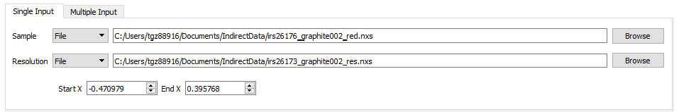
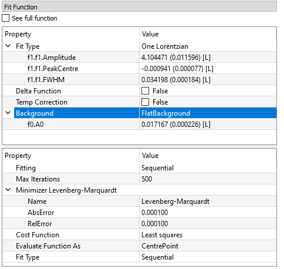
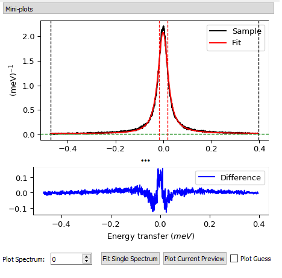

.. _interface-inelastic-qens-fitting:

Inelastic QENS Fitting
======================

Overview
--------

The Inelastic QENS Fitting interface is a collection of tools within Mantid
for analysing reduced data from indirect geometry spectrometers, such as IRIS and
OSIRIS and data from direct geometry spectrometer LET. Note that this interface
used to be called the Inelastic Data Analysis interface, but has been renamed.

The majority of the functions used within this interface can be used with both
reduced files (*_red.nxs*) and workspaces (*_red*) created using the Indirect Data
Reduction interface or using :math:`S(Q, \omega)` files (*_sqw.nxs*) and
workspaces (*_sqw*) created using either the Indirect Data Reduction interface or
taken from a bespoke algorithm or auto reduction.

QENS Fitting tabs
-----------------

There are four QENS Fitting interfaces that share a common layout and features:

* MSD
* I(Q,t)
* Convolution
* Function(Q)

Each tab also has a few unique options. These interfaces do not support GroupWorkspaces
as input.

Input
~~~~~

The input section for QENSFitting tabs consists of, a table along with two buttons 'Add Workspace' and 'Remove'.
Clicking 'Add Workspace' will allow you to add a new data-set to the fit (this will bring up a menu allowing you
to select a file/workspace and the spectra to load). Once the data has been loaded, it will be displayed in the table.
Highlighting data in the table and selecting 'Remove' will allow you to remove data from the fit. The `Unify Range`
button changes the startX and endX values for all selected spectra in the table to be the same as the first spectra
selected. Above the preview plots there is a drop-down menu with which can be used to select the active data-set, which
will be shown in the plots.

Sequential and Simultaneous fits
~~~~~~~~~~~~~~~~~~~~~~~~~~~~~~~~

There are options to fit your selected spectra either Sequentially or Simultaneously.

A :ref:`sequential fit <algm-IqtFitSequential>` will fit each spectra one after another. By default this will use the end values of one fit as the starting values of the next. This behaviour can be toggled
using the sequential/individual option.

A :ref:`simultaneous fit <algm-IqtFitSimultaneous>` will fit all the selected spectra against one cost function. The primary advantage of this method is that
parameters which are expected to be constant across the data range can be tied across all the spectra. This leads to these parameters being
fitted with better statistics and hence reduced errors.

Fit Function
~~~~~~~~~~~~

Under 'Fit Function', you can view the selected model and associated parameters as well as make modifications.

There are two modes which can be used to select functions. The default version allows easy selection of the most commonly used function models. The options
in this mode differ for each of the four fitting tabs so more detailed information is given in the specific sections below. The other mode, which may be switched to
bu ticking the `See full function` box, displays the generic function browser in which any function model can be specified.

Parameters may be tied by right-clicking on a parameter and selecting either 'Tie > To Function' to tie the parameter
to a parameter of the same name in a different function, or by selecting 'Tie > Custom Tie' to tie to parameters of
different names and for providing mathematical expressions. Parameters can be constrained by right-clicking and
using the available options under 'Constraint'.

Upon performing a fit, the parameter values will be updated here to display the result of the fit for the selected
spectrum.

Settings
~~~~~~~~
The bottom half of the Fit Function section contains a table of settings which control what sort of fit is done. These are:

Fitting
  Controls whether to do a sequential or simultaneous fit.

Max Iterations
  The maximum number of iterations used to perform the fit of each spectrum.

Minimizer
  The minimizer used for the fit (defaults to Levenberg-Marquadt).

Cost function
  The cost function used for the fit (defaults to Least Squares).

Evaluate Function As
  The way the function is evaluated on histogram data sets. If the value is “CentrePoint” then function is evaluated at centre of each bin. If it is “Histogram” then function is integrated within the bin and the integrals returned.

Fit Type
  Only available in sequential fits. Controls whether each fit is initialised from the end values of the previous fit.

Ignore Invalid Data
  If ticked the fit will exclude data points with values of `NAN` or `inf`. It will also exclude data with error bars of zero.

Preview Plots
~~~~~~~~~~~~~

Two preview plots are included in each of the fitting interfaces. The top preview plot displays the sample, guess
and fit curves. The bottom preview plot displays the difference curve.

The preview plots will display the curves for the selected spectrum ('Plot Spectrum') of the selected data-set
(when in multiple input mode, a drop-down menu will be available above the plots to select the active data-set).

The 'Plot Spectrum' option can be used to select the active/displayed spectrum.

A button labelled 'Fit Single Spectrum' is found under the preview plots and can be used to perform a fit of the
selected specturm.

'Plot Current Preview' can be used to plot the sample, fit, and difference curves of the selected spectrum in
a separate plotting window.

The 'Plot Guess' check-box can be used to enable/disable the guess curve in the top preview plot.

Output
~~~~~~

The results of the fit may be plotted and saved under the 'Output' section of the fitting interfaces.

Next to the 'Plot' label, you can select a parameter to plot and then click 'Plot' to plot it with error
bars across the fit spectra (if multiple data-sets have been used, a separate plot will be produced for each data-set).
The 'Plot Output' options will be disabled after a fit if there is only one data point for the parameters.

During a sequential fit, the parameters calculated for one spectrum are used as the initial parameters for the next spectrum to be fitted.
Although this normally yields better parameter values for the later spectra, it can also lead to poorly fitted parameters if the
next spectrum is not 'related' to the previous spectrum. It may be useful to replace this poorly fitted spectrum with the results
from a single fit using the 'Edit Result' option.
Clicking the 'Edit Result' button will allow you to modify the data within your *_Results* workspace using the results
produced from a fit to a single spectrum. See the algorithm :ref:`IndirectReplaceFitResult <algm-IndirectReplaceFitResult>`.

Clicking the 'Save Result' button will save the result of the fit to your default save location.

Action Buttons
~~~~~~~~~~~~~~

There are several buttons on the bottom left of every tab in the interface. These are:

Settings
  Opens the :ref:`Settings <inelastic-interface-settings>` GUI which allows you to
  customize the settings for the Indirect interfaces.

?
  Opens this help page.

Py
  Exports a Python script which will replicate the processing done by the current tab.

Manage Directories
  Opens the Manage Directories dialog allowing you to change your search directories
  and default save directory and enable/disable data archive search.

MSD
---

Given either a saved NeXus file, or workspace generated using the Elwin tab, this
tab fits :math:`intensity` vs. :math:`Q` with one of three functions for each
run specified to give the Mean Square Displacement (MSD). It then plots the MSD
as function of run number. This is done using the
:ref:`QENSFitSequential <algm-QENSFitSequential>` algorithm.

MSD searches for the log files named <runnumber>_sample.txt in your chosen
raw file directory (the name ‘sample’ is for OSIRIS). These log files will exist
if the correct temperature was loaded using SE-log-name in the Elwin tab. If they
exist the temperature is read and the MSD is plotted versus temperature; if they do
not exist the MSD is plotted versus run number (last 3 digits).

The fitted parameters for all runs are in _msd_Table and the <u2> in _msd. To
run the Sequential fit a workspace named <inst><first-run>_to_<last-run>_eq is
created, consisting of :math:`intensity` v. :math:`Q` for all runs. A contour or 3D plot of
this may be of interest.

A sequential fit is run by clicking the Run button at the bottom of the tab, a
single fit can be performed using the Fit Single Spectrum button underneath the
preview plot. A simultaneous fit may be performed in a very similar fashion by changeing the Fit Type to Simultaneous
and the clicking run.

The :ref:`Peters model <func-MsdPeters>` [1] reduces to a :ref:`Gaussian <func-MsdGauss>` at large
(towards infinity) beta. The :ref:`Yi Model <func-MsdYi>` [2] reduces to a :ref:`Gaussian <func-MsdGauss>` at sigma
equal to zero.

.. interface:: QENS Fitting
  :width: 450
  :widget: tabMSD

.. _msdfit-example-workflow:

MSD Example Workflow
~~~~~~~~~~~~~~~~~~~~~
The MSD tab operates on ``_eq`` files. The files used in this workflow are produced on the Elwin
tab as seen in the :ref:`elwin-example-workflow`.

1. Click **Browse** and select the file ``osi104371-104375_graphite002_red_elwin_eq``. Load this
   file and it will be automatically plotted in the upper mini-plot.

2. Change the **Plot Spectrum** spinbox seen underneath the mini-plots to change the spectrum displayed
   in the upper mini-plot.

3. Change the **EndX** variable to be around 0.8 in order to change the Q range over which the fit shall
   take place. Alternatively, drag the **EndX** blue line seen on the mini-plot using the cursor.

4. Choose the **Fit Type** to be Gaussian. The parameters for this function can be seen if you
   expand the row labelled **f0-MsdGauss**. Choose appropriate starting values for these parameters.
   As well as being able to change the value of the parameters, Two additional options are available.
   Clicking on the button with `...` will bring up more options to set constraints and ties on the parameters. The checkbox will toggle
   whether the parameter is local or global. You need to click on the parameter value to see these options.

5. Tick **Plot Guess** to get a prediction of what the fit will look like.

6. Click **Run** and wait for the interface to finish processing. This should generate a
   _Parameters table workspace and two group workspaces with end suffixes _Results and
   _Workspaces. The mini-plots should also update, with the upper plot displaying the
   calculated fit and the lower mini-plot displaying the difference between the input data and the
   fit.

7. Alternatively, you can click **Fit Single Spectrum** to perform a fit on just the currently displayed spectrum.
   Do not click this for the purposes of this demonstration.

8. In the **Output** section, select the **Msd** parameter and then click **Plot**. This plots the
   Msd parameter which can be found within the _Results group workspace.

.. _iqtfit:

I(Q, t)
-------

I(Q, t) provides a simplified interface for controlling various fitting
functions (see the :ref:`Fit <algm-Fit>` algorithm for more info). The functions
are also available via the fit wizard.

The fit types available for use in IqtFit are :ref:`Exponentials <func-ExpDecay>` and
:ref:`Stretched Exponential <func-StretchExp>`.

.. interface:: QENS Fitting
  :width: 450
  :widget: tabIqt

.. _iqtfit-example-workflow:

I(Q, t)  Example Workflow
~~~~~~~~~~~~~~~~~~~~~~~~~
The I(Q, t) tab operates on ``_iqt`` files. The files used in this workflow are produced on the
I(Q, t) tab as seen in the :ref:`iqt-example-workflow`.

1. Click **Browse** and select the file ``irs26176_graphite002_iqt``.

2. Change the **EndX** variable to be around 0.2 in order to change the time range. Alternatively, drag
   the **EndX** blue line seen on the upper mini-plot using the cursor.

3. Choose the number of **Exponentials** to be 1. Select a **Flat Background**.

4. Change the **Fit Spectra** to go from 0 to 7. This will ensure that only the spectra within the input
   workspace with workspace indices between 0 and 7 are fitted.

5. Click **Run** and wait for the interface to finish processing. This should generate a
   _Parameters table workspace and two group workspaces with end suffixes _Results and
   _Workspaces. The mini-plots should also update, with the upper plot displaying the
   calculated fit and the lower mini-plot displaying the difference between the input data and the
   fit.

6. In the **Output** section, you can choose which parameter you want to plot.

7. Click **Fit Single Spectrum** to produce a fit result for the first spectrum.

8. In the **Output** section, click **Edit Result** and then select the _Result workspace containing
   multiple fits (1), and in the second combobox select the _Result workspace containing the single fit
   (2). Choose an output name and click **Replace Fit Result**. This will replace the corresponding fit result
   in (1) with the fit result found in (2). See the :ref:`IndirectReplaceFitResult <algm-IndirectReplaceFitResult>`
   algorithm for more details. Note that the output workspace is inserted into the group workspace in which
   (1) is found.

.. _convfit:

Convolution
-----------

Convolution provides a simplified interface for controlling
various fitting functions (see the :ref:`Fit <algm-Fit>` algorithm for more
info). The functions are also available via the fit wizard.

Additionally, in the bottom-right of the interface there are options for doing a
sequential fit. This is where the program loops through each spectrum in the
input workspace, using the fitted values from the previous spectrum as input
values for fitting the next. This is done by means of the
:ref:`ConvolutionFitSequential <algm-ConvolutionFitSequential>` algorithm.

A sequential fit is run by clicking the Run button at the bottom of the tab, a
single fit can be done using the Fit Single Spectrum button underneath the
preview plot.

The fit types available in Convolution are One :ref:`Lorentzian <func-Lorentzian>`, Two Lorentzian,
:ref:`TeixeiraWater (SQE) <func-TeixeiraWaterSQE>`, :ref:`InelasticDiffSphere <func-InelasticDiffSphere>`,
:ref:`InelasticDiffRotDiscreteCircle <func-InelasticDiffRotDiscreteCircle>`, :ref:`ElasticDiffSphere <func-ElasticDiffSphere>`,
:ref:`ElasticDiffRotDiscreteCircle <func-ElasticDiffRotDiscreteCircle>` and :ref:`StretchedExpFT <func-StretchedExpFT>`.

.. interface:: QENS Fitting
  :width: 450
  :widget: tabConvolution

Convolution Options
~~~~~~~~~~~~~~~~~~~

Sample
  Either a reduced file (*_red.nxs*) or workspace (*_red*) or an :math:`S(Q,
  \omega)` file (*_sqw.nxs*, *_sqw.dave*) or workspace (*_sqw*).

Resolution
  Either a resolution file (_res.nxs) or workspace (_res) or an :math:`S(Q,
  \omega)` file (*_sqw.nxs*, *_sqw.dave*) or workspace (*_sqw*).
  If the resolution data contains any `NAN` values they will be replaced with zeros and
  a warning will be provided to the user when loading the data.

.. _convfit-example-workflow:

Convolution Example Workflow
~~~~~~~~~~~~~~~~~~~~~~~~~~~~
The Convolution tab allows ``_red`` and ``_sqw`` for its sample file, and allows ``_red``, ``_sqw`` and
``_res`` for the resolution file. The sample file used in this workflow can be produced using the run
number 26176 on the :ref:`Indirect Data Reduction <interface-indirect-data-reduction>` interface in the ISIS
Energy Transfer tab. The resolution file is created in the ISIS Calibration tab using the run number
26173. The instrument used to produce these files is IRIS, the analyser is graphite
and the reflection is 002.

1. Click **Browse** for the sample and select the file ``iris26176_graphite002_red``. Then click **Browse**
   for the resolution and select the file ``iris26173_graphite002_res``.

2. Choose the **Fit Type** to be One Lorentzian. Tick the **Delta Function** checkbox. Set the background
   to be a **Flat Background**.

3. Expand the variables called **f0-Lorentzian** and **f1-DeltaFunction**. To tie the delta functions Centre
   to the PeakCentre of the Lorentzian, right click on the Centre parameter and go to Tie->Custom Tie and then
   enter f0.PeakCentre.

4. Tick **Plot Guess** to get a prediction of what your fit will look like.

5. Click **Run** and wait for the interface to finish processing. This should generate a
   _Parameters table workspace and two group workspaces with end suffixes _Results and
   _Workspaces. The mini-plots should also update, with the upper plot displaying the
   calculated fit and the lower mini-plot displaying the difference between the input data and the
   fit.

6. Choose a default save directory and then click **Save Result** to save the _result workspaces
   found inside of the group workspace ending with _Results. The saved workspace will be used in
   the :ref:`fqfit-example-workflow`.

Theory
~~~~~~

For more on the theory of Convolution see the :ref:`ConvFitConcept` concept page.

Convolution fitting model
~~~~~~~~~~~~~~~~~~~~~~~~~

The model used to perform fitting in Convolution is described in the following tree, note that
everything under the Model section is optional and determined by the *Fit Type*
and *Use Delta Function* options in the interface.

- :ref:`CompositeFunction <func-CompositeFunction>`

  - :ref:`LinearBackground <func-LinearBackground>`

  - :ref:`Convolution <func-Convolution>`

    - Resolution

    - Model (:ref:`CompositeFunction <func-CompositeFunction>`)

      - DeltaFunction

      - :ref:`ProductFunction <func-ProductFunction>` (One Lorentzian)

        - :ref:`Lorentzian <func-Lorentzian>`

        - Temperature Correction

      - :ref:`ProductFunction <func-ProductFunction>` (Two Lorentzians)

        - :ref:`Lorentzian <func-Lorentzian>`

        - Temperature Correction

      - :ref:`ProductFunction <func-ProductFunction>` (InelasticDiffSphere)

        - :ref:`Inelastic Diff Sphere <func-DiffSphere>`

        - Temperature Correction

      - :ref:`ProductFunction <func-ProductFunction>` (InelasticDiffRotDiscreteCircle)

        - :ref:`Inelastic Diff Rot Discrete Circle <func-DiffRotDiscreteCircle>`

        - Temperature Correction

      - :ref:`ProductFunction <func-ProductFunction>` (ElasticDiffSphere)

        - :ref:`Elastic Diff Sphere <func-DiffSphere>`

        - Temperature Correction

      - :ref:`ProductFunction <func-ProductFunction>` (ElasticDiffRotDiscreteCircle)

        - :ref:`Elastic Diff Rot Discrete Circle <func-DiffRotDiscreteCircle>`

        - Temperature Correction

      - :ref:`ProductFunction <func-ProductFunction>` (StretchedExpFT)

        - :ref:`StretchedExpFT <func-StretchedExpFT>`

        - Temperature Correction

The Temperature Correction is a :ref:`UserFunction <func-UserFunction>` with the
formula :math:`((x * 11.606) / T) / (1 - exp(-((x * 11.606) / T)))` where
:math:`T` is the temperature in Kelvin.

.. _fqfit:

Function(Q)
-----------

One of the models used to interpret diffusion is that of jump diffusion in which
it is assumed that an atom remains at a given site for a time :math:`\tau`; and
then moves rapidly, that is, in a time negligible compared to :math:`\tau`.

This interface can be used for a jump diffusion fit as well as fitting across
EISF. This is done by means of the
:ref:`QENSFitSequential <algm-QENSFitSequential>` algorithm.

This interface can load :math:`A0`, :math:`EISF`, :math:`Width` or :math:`FWHM` fitting
parameters. The fit types available for each of these are listed below:

+----------------+---------------------+-------------------------------------------------------------------------------------------------------------------------------------------------------------------+
| Fit Parameter  | Produced on         | Available fit types                                                                                                                                               |
+================+=====================+===================================================================================================================================================================+
| A0             | :ref:`iqtfit` tab   | :ref:`EISFDiffCylinder <func-EISFDiffCylinder>`, :ref:`EISFDiffSphere <func-EISFDiffSphere>`, :ref:`EISFDiffSphereAlkyl <func-EISFDiffSphereAlkyl>`               |
+----------------+---------------------+-------------------------------------------------------------------------------------------------------------------------------------------------------------------+
| EISF           | :ref:`convfit` tab  | :ref:`EISFDiffCylinder <func-EISFDiffCylinder>`, :ref:`EISFDiffSphere <func-EISFDiffSphere>`, :ref:`EISFDiffSphereAlkyl <func-EISFDiffSphereAlkyl>`               |
+----------------+---------------------+-------------------------------------------------------------------------------------------------------------------------------------------------------------------+
| Width          | :ref:`convfit` tab  | :ref:`ChudleyElliot <func-ChudleyElliot>`, :ref:`HallRoss <func-Hall-Ross>`, :ref:`FickDiffusion <func-FickDiffusion>`, :ref:`TeixeiraWater <func-TeixeiraWater>` |
+----------------+---------------------+-------------------------------------------------------------------------------------------------------------------------------------------------------------------+
| FWHM           | :ref:`convfit` tab  | :ref:`ChudleyElliot <func-ChudleyElliot>`, :ref:`HallRoss <func-Hall-Ross>`, :ref:`FickDiffusion <func-FickDiffusion>`, :ref:`TeixeiraWater <func-TeixeiraWater>` |
+----------------+---------------------+-------------------------------------------------------------------------------------------------------------------------------------------------------------------+

.. interface:: QENS Fitting
  :width: 450
  :widget: tabFunctionQ

.. _fqfit-example-workflow:

Function(Q) Example Workflow
~~~~~~~~~~~~~~~~~~~~~~~~~~~~
The Function(Q) tab operates on ``_result`` files which can be produced on the Convolution tab.  The
sample file used in this workflow is produced on the Convolution tab as seen in the
:ref:`convfit-example-workflow`.

1. Click **Browse** and select the file ``irs26176_graphite002_conv_Delta1LFitF_s0_to_9_Result``.

2. Change the mini-plot data by choosing the type of **Fit Parameter** you want to display. For the
   purposes of this demonstration select **EISF**. The combobox immediately to the right can be used to
   choose which EISF you want to see in the mini-plot. In this example there is only one available.

3. Change the **Fit Parameter** back to **Width**.

4. Choose the **Fit Type** to be TeixeiraWater.

5. Click **Run** and wait for the interface to finish processing. This should generate a
   _Parameters table workspace and two group workspaces with end suffixes _Results and
   _Workspaces. The mini-plots should also update, with the upper plot displaying the
   calculated fit and the lower mini-plot displaying the difference between the input data and the
   fit.

6. In the **Output** section, you can choose which parameter you want to plot. In this case the plotting
   option is disabled as the output workspace ending in _Result only has one data point to plot.

Bayesian (FABADA minimizer)
---------------------------

There is the option to perform Bayesian analysis on the I(Q, t) and Convolution
tabs on this interface by using the :ref:`FABADA` fitting minimizer, however in
order to to use this you will need to use better starting parameters than the
defaults provided by the interface.

You may also experience issues where the starting parameters may give a reliable
fit on one spectra but not others, in this case the best option is to reduce
the number of spectra that are fitted in one operation.

In both I(Q, t) and Convolution the following options are available when fitting
using FABADA:

Output Chain
  Select to enable output of the FABADA chain when using FABADA as the fitting
  minimizer.

Chain Length
  Number of further steps carried out by fitting algorithm once the parameters have
  converged (see *ChainLength* is :ref:`FABADA` documentation)

Convergence Criteria
  The minimum variation in the cost function before the parameters are
  considered to have converged (see *ConvergenceCriteria* in :ref:`FABADA`
  documentation)

Acceptance Rate
  The desired percentage acceptance of new parameters (see *JumpAcceptanceRate*
  in :ref:`FABADA` documentation)

The FABADA minimizer can output a PDF group workspace when the PDF option is ticked. If this happens,
then it is possible to plot this PDF data using the output options at the bottom of the tabs.

**References**

1. Peters & Kneller, Journal of Chemical Physics, 139, 165102 (2013)
2. Yi et al, J Phys Chem B 116, 5028 (2012)

.. categories:: Interfaces Inelastic
