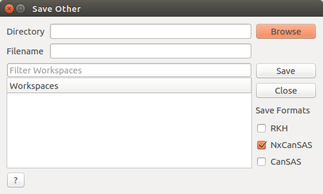

Save Other
==========

.. _save-other:

Interface Overview
------------------

This interface is intended to allow workspaces in the ADS to be easily saved in one of three formats RKH, NxCanSAS and CanSAS.

This uses the three algorithms:

:ref:`SaveRKH <algm-SaveRKH>`

:ref:`SaveNXcanSAS <algm-SaveNXcanSAS>`

:ref:`SaveCanSAS1D <algm-SaveCanSAS1D>`

The workspaces are saved into the directory specified using the following naming scheme:

* If a filename is input and one workspace is selected to be saved this name will be used.
* If a filename is input and multiple workspaces are selected the filename will be appended to the workspace name.
* If no filename is input the workspaces will be saved out using the names they have in Mantid.
