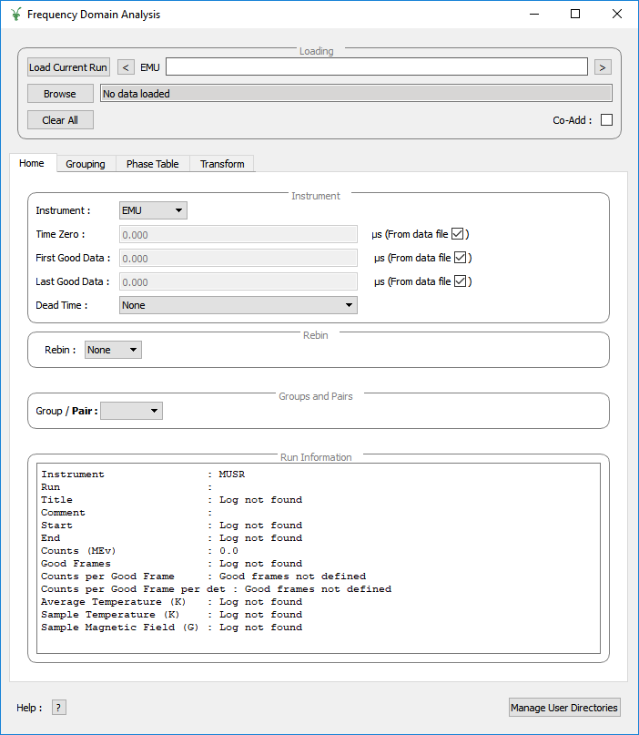

.. _Frequency_Domain_Analysis-ref:

Frequency Domain Analysis
=========================

.. contents:: Table of Contents
  :local:

Interface Overview
------------------

This interface is used to analyse the data collected on Muon instruments in the frequency domain. The interface can be
accessed from the main menu of MantidWorkbench, in *Interfaces → Muon → Frequency Domain Analysis*. For sample
datasets, please visit `Muon - Downloads <https://sourceforge.net/projects/mantid/files/Sample%20Data/SampleData-Muon.zip/download>`_.

Analysis of the frequency spectrum can be achieved by clicking the fit function icon.

Advanced users can access additional features such as model analysis, raw plots and the fit script generator using :ref:`Feature Flags <Muon_Feature_Flags-ref>`.

Loading
-------

The loading section is used to load data as well as to specify what the current runs of interest are.

**Load Current Run** This will load the latest run for the selected instrument. You must be connected to the
ISIS data archive for this to work. It also currently only works on windows.

**Run selection box** This takes a comma seperated list of run numbers and loads them all in. You may also
specify ranged of runs with a dash. For example ``62260, 62270-3`` will load ``62260, 62270, 62271, 62273``. This also specifies
which runs are used by the rest of the GUI.

**Browse** This lets you browse locally for files to load.

**Clear All** This clears all the data from the current GUI.

**Co-Add** If selected the list of runs chosen are added rather than being loaded individually.

Tabs
----

All these tabs can be dragged away from the interface into their own window.

* :ref:`Plotting Window <muon_plotting_window-ref>`
* :ref:`Home Tab <muon_home_tab-ref>`
* :ref:`Grouping Tab <muon_grouping_tab-ref>`
* :ref:`Corrections Tab <muon_corrections_tab-ref>`
* :ref:`Phase Table Tab <muon_phase_table_tab-ref>`
* :ref:`Transform Tab <muon_transform_tab-ref>`
* :ref:`Fitting Tab <muon_fitting_tab-ref>`
* :ref:`Sequential Fitting Tab <muon_sequential_fitting_tab-ref>`
* :ref:`Results Tab <muon_results_tab-ref>`
* :ref:`Model Fitting Tab <muon_model_fitting_tab-ref>`

.. categories:: Interfaces Muon
