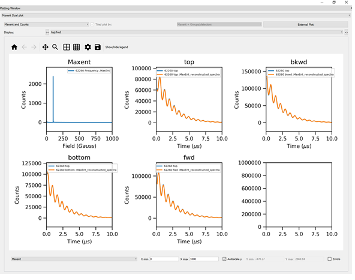

.. _Frequency_Domain_Analysis_plotting-ref:

Frequency Plotting Window
--------------------------

The :ref:`Frequency Domain Analysis <Frequency_Domain_Analysis-ref>` GUI has some extra plotting functionality.

Frequency Data
^^^^^^^^^^^^^^

This is shown when the user selects the following tabs:

- Transform
- Fitting
- Sequential Fitting

It displays the transform of the time domain data.
If a fit is requested this is also shown on the plot.
In the sequential fitting tab, the user can select the data to plot by highlighting the different rows in the table.

.. _Maxent_Dual_Plot-ref:

Maxent Dual Plot
^^^^^^^^^^^^^^^^

This is for use with the **Maxent** option in the :ref:`Transform Tab <muon_transform_tab-ref>`.
The user can select to **Output reconstructed data** and this will show the reconstructions and raw data.
Along with the frequency spectra.

:ref:`Plotting Window <muon_plotting_window-ref>`,
:ref:`Frequency Domain Analysis <Frequency_Domain_Analysis-ref>`
