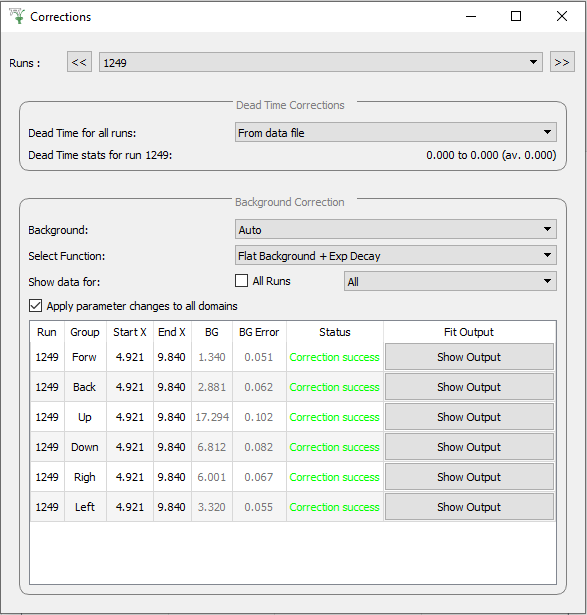
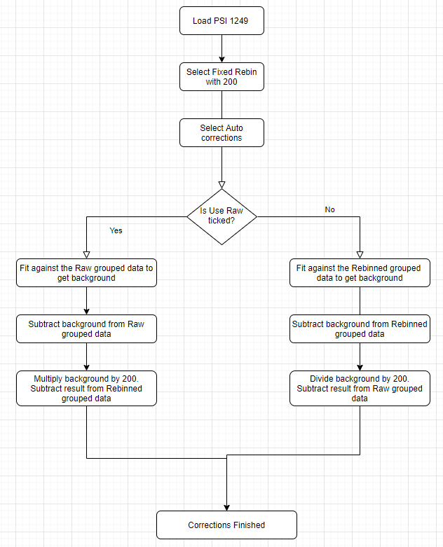

.. _muon_corrections_tab-ref:

Corrections Tab
---------------

The corrections tab is used for correcting the data to be analysed.
There are two types of corrections; dead time corrections, and background corrections.

**Runs** Allows you to select the runs to display correction data for.

Dead Time Corrections
^^^^^^^^^^^^^^^^^^^^^

**Dead Time for all runs** This allows you to select the method to use for dead time corrections for all runs. There are four deadtime correction options:

* ``From data file``: The deadtime table will be taken from the relevant data file
* ``From table workspace``: A previously loaded deadtime table may be selected which will then be used in all group and pair calculations.
* ``From other file``: A file may be selected to load a deadtime table from this will then be used in all group and pair calculations.
* ``None``: No deadtime corrections should be applied.

**Dead Time stats** Displays the minimum, maximum and average deadtime correction for the currently selected runs.

Background Corrections
^^^^^^^^^^^^^^^^^^^^^^

**Background** There are three background correction options:

* ``None``: No background correction should be applied.
* ``Auto``: The background is automatically calculated by performing a fit on the loaded data before being subtracted from the data. The accompanying diagram describes this process.
* ``Manual``: The background is entered manually by the user before being subtracted from the data.

**Select Function** This is only available when in ``Auto`` mode. It allows you to choose between using a ``Flat Background + Exp Decay``, or just a ``Flat Background`` to calculate the background. The Lambda value in the Exp Decay is fixed to a value of 1.0 over the muon lifetime.

**Show data for** There are two options for selecting which data should be displayed:

* ``All Runs``: Displays the correction data for all loaded runs when ticked. If it isn't ticked, only correction data for the currently selected runs are shown.
* ``Select Group``: Displays the correction data for all groups, or a specific group.

**Apply parameter changes to all domains** Changes made in the corrections data table will be applied to all domains when this option is ticked.

The corrections data table contains the data used for the background subtractions of each domain:

**Run** The run number corresponding to a specific domain.

**Group** The group corresponding to a specific domain.

**Use Raw** This is only available when in ``Auto`` mode, and the fixed rebin option is selected. It is used to specify whether the raw or rebinned data is used to calculate the background.

**Start X** This is only available when in ``Auto`` mode. It is the Start X used for the fit to calculate the background.

**End X** This is only available when in ``Auto`` mode. It is the End X used for the fit to calculate the background.

**BG** The background that has been calculated and subtracted from the corresponding data.

**BG Error** This is only available when in ``Auto`` mode. It is the error in the calculated background.

**Status** This states whether or not the correction was successful for a domain. A correction will be skipped if the chi squared of a fit is greater than 10.

**Fit Output** This is only available when in ``Auto`` mode. The button will open the parameters table and normalised covariance matrix for the performed background fit.

Used By
^^^^^^^

:ref:`Muon Analysis <Muon_Analysis-ref>`,
:ref:`Frequency Domain Analysis <Frequency_Domain_Analysis-ref>`
