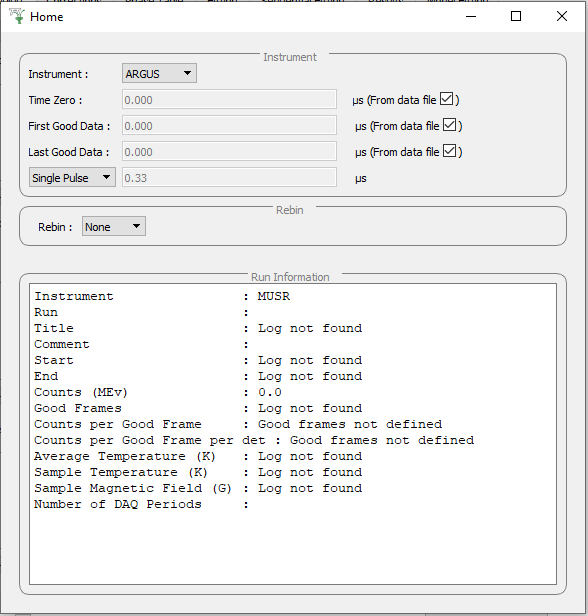

.. _muon_home_tab-ref:

Home Tab
--------

Pre-processing parameters
^^^^^^^^^^^^^^^^^^^^^^^^^

**Instrument** This selects the instrument used by the GUI.

**Time Zero** This is the time zero value used. By default the time zero is taken from the file but
it can be specified here in which case the specified time zero is used for all calculations.

**First Good Data** This is the first good data value used. By default the first good data is taken from the file. However, the user can manually change the value.
The specified first good data is used for all calculations.

**Last Good Data** This is the Last good data value used. By default the last good data is taken from the file. However, the user can manually set the value.
The specified first good data is used for all calculations.

**Double Pulse** This controls whether todo a double pulse fit and if so what time offset to use. If checked then :ref:`DoublePulseFit <algm-DoublePulseFit>` is run instead of :ref:`Fit <algm-Fit>`, when pressing the `fit` button. The `PulseOffset` parameter is the value entered here. The pulse weightings are set as

.. math::
  N_1 = \frac{x}{1+x} \quad and \quad N_2 = \frac{1}{1+x},

where :math:`x = \exp(\frac{-t_s}{\tau})`, :math:`t_s` is the time offset, :math:`\tau` is the posotive muon half life, :math:`N_1` is the first pulse weighting and :math:`N_2` is the second pulse weighting.

Rebin
^^^^^

**Fixed** Fixed rebinning allows a scale factor to be entered which will then be used to scale the raw bins.

**Variable** Variable binning allows a string to be entered which specifies the required binning. The string is of the format used by the :ref:`Rebin <algm-Rebin>` algorithm.

Used By
^^^^^^^

:ref:`Muon Analysis <Muon_Analysis-ref>`,
:ref:`Frequency Domain Analysis <Frequency_Domain_Analysis-ref>`
