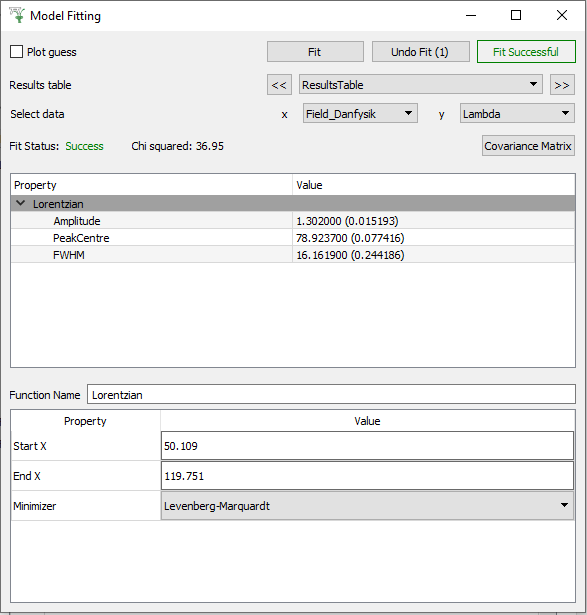
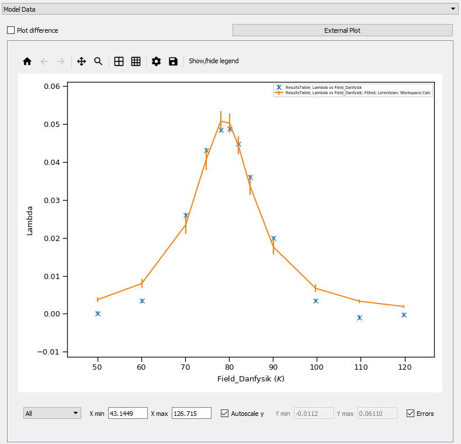

.. _muon_model_fitting_tab-ref:

Model Fitting Tab
-----------------

Overview
^^^^^^^^

The model fitting tab is used to perform a fit across fit parameters and sample logs found in a results table within the
:ref:`Muon Analysis <Muon_Analysis-ref>` and :ref:`Frequency Domain Analysis <Frequency_Domain_Analysis-ref>`. To use
Model fitting it must first be enabled via the :ref:`feature flags <Muon_Feature_Flags-ref>`.
This tab allows you to select a results table, before selecting the data that should be plotted on the x and y axes. It
is then possible to perform a fit using a selected fit function. The selected model fit data is displayed in a plotting
pane on the right hand side of the interface. An example model fit plot is seen in the image below.

**Fit** Executes the specified fit.

**Undo Fit** Undoes the previously performed fit.

**Results table** Allows you to select a results table from a drop-down menu.

**Select data** Allows you to select the fit parameter or sample log data to be plotted on the x and y axis.

**Covariance Matrix** Opens the normalised covariance matrix for the currently selected fit domain.

Fit function browser
^^^^^^^^^^^^^^^^^^^^

.. image::  ../../images/muon_interface_tab_fitting_browser.png
   :height: 125px

Right clicking in the central box will bring up a context menu for adding or removing functions.

**Property** This is a list of property names, individual functions can be collapsed down for greater legibility.

**Value** This lists the initial guesses for variables within fitting functions. Variables can be fixed for a given fit
from the edit parameter values dialog box (click the ellipsis to the right of the value box).

Fit properties browser
^^^^^^^^^^^^^^^^^^^^^^

**Start/End X** Defines the boundary values for the fit calculation.

**Minimizer** Choose the minimisation method for the fit.

Used By
^^^^^^^

:ref:`Muon Analysis <Muon_Analysis-ref>`
:ref:`Frequency Domain Analysis <Frequency_Domain_Analysis-ref>`
