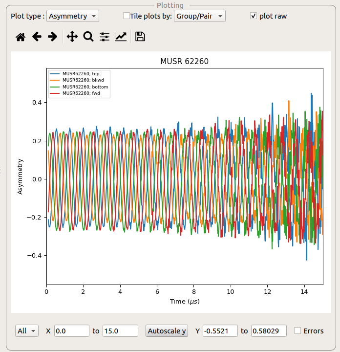
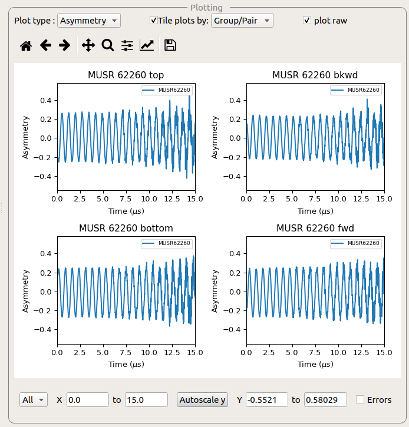
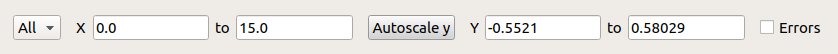
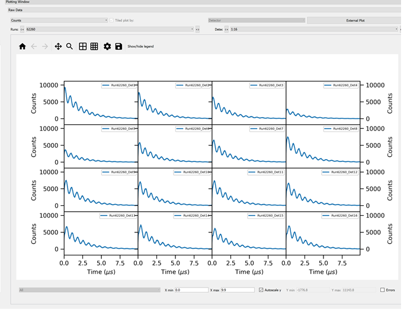

.. _muon_plotting_window-ref:

Plotting Window
-----------------

The plotting window displays the data specified by the tabs within the interface.
By default this plot window is docked to the right-hand side of the main interface window, but can be undocked by
double-clicking on the title bar of the window.

This data can be displayed as a single plot, or as tiled plots.

The custom plotting for Muon Analysis are described in the :ref:`here <Muon_Analysis_plotting-ref>`.
The custom plotting for Frequency Domain Analysis are described in the :ref:`here <Frequency_Domain_Analysis_plotting-ref>`.

Plotting Controls
^^^^^^^^^^^^^^^^^
At the very top of the interface is a drop down menu that selects the type of plot.
The main types are:

- **Plot Data**, which shows the measured/calculated data
- **Raw Data**, which shows the spectra per detector
- **Model Data**, which shows plots of the sample logs and fit parameter values. It also show fits to the data

The plotting can be controlled through serveral options:

**Plot type** Changes the plot type (e.g from asymmetry to counts).

**Tiled plotting** The 'tile plots by' checkbox enables tiled plotting, which can be performed over runs or Groups/pairs.
This is not always available.

**Plot raw** Plot raw controls whether the raw or rebinned workspaces are plotted.
This is not always available.

**Plot difference** is only available for Fit Data and Model Data.
When it is ticked it shows the difference between the data and the fit to the data.

Plotting Options
^^^^^^^^^^^^^^^^^

**Subplot Selector** Which axis to change the options for.

**x-Range** Sets the x-limits for the selected axes.

**Autoscale** Autoscales the y-axis based on the x-limits.

**y-Range**  Sets the y-limits for the selected axes.

**Errors** Whether to display errors for the workspaces plotted on the selected axes.

Raw Data Plots
^^^^^^^^^^^^^^

This can be used for inspecting individual detectors for potential faults.
There are two selectors above the plot; one for `runs` and one for `detectors`.
The `runs` selector allows the user to pick the run they want to plot (when loading multiple runs).
The 'detectors' selector allows the user to choose the detectors they want to inspect.
Only tiled plots can be shown and to improve the visibility of the plots the axis are identical for all subplots.

Model Data Plots
^^^^^^^^^^^^^^^^

This shows the data that has been selected on the :ref:`Model Fitting Tab <muon_model_fitting_tab-ref>` tab. This must
first be enabled via the :ref:`feature flags <Muon_Feature_Flags-ref>`.
If a fit is calculated for the data, this is also displayed on the plot.

:ref:`Muon Analysis <Muon_Analysis-ref>`,
:ref:`Muon Analysis Plotting <Muon_Analysis_plotting-ref>`,
:ref:`Frequency Domain Analysis <Frequency_Domain_Analysis-ref>`,
:ref:`Frequency Domain Analysis Plotting <Frequency_Domain_Analysis_plotting-ref>`,
