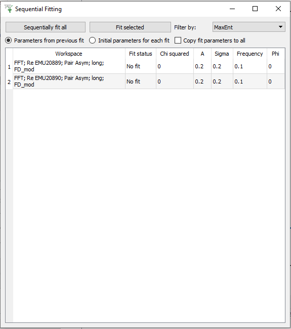

.. _muon_sequential_fitting_tab-ref:

Sequential Fitting Tab
------------------------

This tab allows the user to perform sequential fits. The sequential fits are based on the fit function specified in the fitting tab.
The primary widget in this tab is the Fit Table, which is automatically generated based on the selected Groups/pairs and the fit function defined
in the fitting tab.

Sequential fitting options
^^^^^^^^^^^^^^^^^^^^^^^^^^^
**Sequentially Fit** Sequentiailly fits each of the fit objects specified in the fit table.

**Fit selected** Performs a fit on the fit object selected in the table.

**Filter by** This is only available on the Frequency Domain Analysis interface. It allows you to select the type of data you want to sequentially fit.

**Parameters for previous fit** Uses the parameters from the previous fit calculation as initial values for the next fit.

**Initial parameters for each fit** Uses the initial values (as specified in the Fit Table) in each fit calculation.

**Copy fit parameters to all** Editing a fit parameter will copy its new value to all domains if this is ticked.

Fit Table
^^^^^^^^^^^^^^^^^^^^^^^^^^^
Each entry of the Fit Table corresponds to a fit object, which comprises a list of input workspaces and a fit function.

**Run** The runs present in the fit object.

**Groups/pairs** The groups/pairs present in the fit object.

**Fit quality** The quality of the fit returned from the fitting algorithm.

**List of fit parameters** The columns that proceed this correspond to the values of the fit parameters. The value of these
parameters can be edited.

Used By
^^^^^^^

:ref:`Muon Analysis <Muon_Analysis-ref>`
:ref:`Frequency Domain Analysis <Frequency_Domain_Analysis-ref>`
