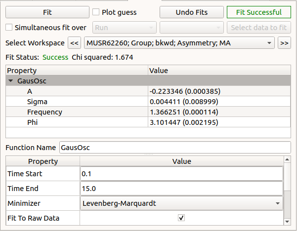
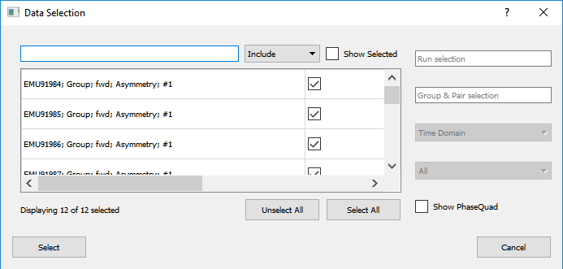
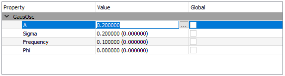

.. _muon_fitting_tab-ref:

Fitting Tab
-----------

This tab is for performing fits on the data.

**Fit** Executes the chosen fit for the fitting functions to the selected data.

**Single Fit** This option performs a fit for a single data set.

**Sequential Fit** This option will perform multiple fits sequentially, using the output of the previous fit as the starting guess. 

**Simultaneous Fit** This option will perform a fit for multiple data sets, which may share parameters. 

**Select data to fit** This launches a dialog box for selecting the data to be used in the fit.

Data Selection
^^^^^^^^^^^^^^

**Search bar** The search bar can be used to find (Include) or filter out (Exclude) data sets by name.

**Show Selected** If this option is checked the selection box will be limited to only the data sets that have already
been selected to be output.

**Selection Box** data sets are listed in this section, they can be selected individually by checking the boxes on the
right side of the box.

**Unselect/Select All** When clicked these buttons will automatically unselect or select all log values currently in the
selection box

**Run selection** Filter displayed data sets by run number

**Group & Pair selection** filter by group or pair name.

**Show PhaseQuad** If this option is checked the selection box will show any PhaseQuads that have been calculated for these runs.

Fit function browser
^^^^^^^^^^^^^^^^^^^^

Right clicking in the central box will bring up a context menu for adding or removing functions.
The fitting browser here is similar to that used in the :ref:`Multi-dataset Fitting Interface <Multi-dataset-Fitting-Interface>`.

**Property** This is a list of property names, individual functions can be collapsed down for greater legibility.

**Value** This lists the initial guesses for variables within fitting functions. Variables can be fixed for a given fit
from the edit paramiter values dialog box (the ellipsis to the right of the value box)

**Global** If multiple runs are being plotted then variables can be made identical for each run by checking the box next to it.

All selected workspaces will share the same composite fitting function but can have different variables.

Fit properties browser
^^^^^^^^^^^^^^^^^^^^^^

**Time Start/End** Defines the boundary values for the fit calculation.

**Minimizer** Choose the minimisation method for the fit.

**Fit To Raw Data** If this is checked it will use the raw data for the fit.
If it is unchecked it will use the rebinned data as specified on the home tab.

**Evaluate Function As** Select if to fit to histogram or point data.

Used By
^^^^^^^

:ref:`Muon Analysis 2 <MuonAnalysis_2-ref>`
:ref:`Frequency Domain Analysis <Frequency_Domain_Analysis_2-ref>`
