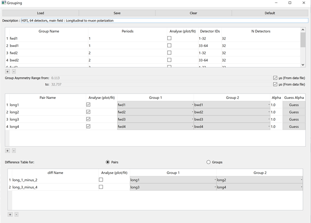

.. _muon_grouping_tab-ref:

Grouping Tab
------------

**Load** Allows a grouping and pairing table xml file to be selected to load

**Save** Saves the current grouping and pairing tables to an xml file

**Clear** Clears all groups and pairs from the current tables

**Default** Loads in the default groups and pairs for the instrument

Grouping Table
^^^^^^^^^^^^^^

**Plus and Minus** Add or remove groups

**Group Asymmetry Range** Controls the range to use when estimating the group asymmetry. The values are used as ``StartX`` and ``EndX`` in :ref:`EstimateMuonAsymmetryFromCounts <algm-EstimateMuonAsymmetryFromCounts>`. By default this range is the first good data and end time value from the file
but may be overridden here if required.

Pairing Table
^^^^^^^^^^^^^

**Plus and Minus** Add or remove pairs

**Guess Alpha** Estimates the alpha for the current pair and recalculates.

Used By
^^^^^^^

:ref:`Muon Analysis 2 <MuonAnalysis_2-ref>`,
:ref:`Frequency Domain Analysis <Frequency_Domain_Analysis_2-ref>`