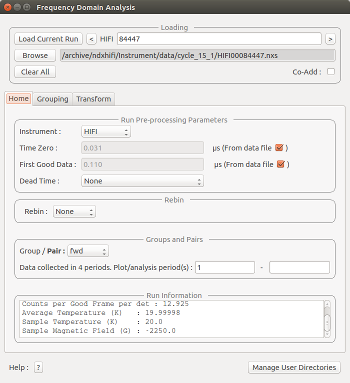

.. _muon_home_tab-ref:

Home Tab
--------

Pre-processing parameters
^^^^^^^^^^^^^^^^^^^^^^^^^

**Instrument** This selects the instrument used by the GUI

**Time Zero** This is the time zero value used. By default the time zero is taken from the file but
it can be specified here in which case the specified time zero is used for all calculations.

**First Good Data** This is the first good data value used. By default the first good data is taken from the file but
it can be specified here in which case the specified first good data is used for all calculations.

**Last Good Data** This is the Last good data value used. By default the last good data is taken from the file but
it can be specified here in which case the specified last good data is used for all calculations.

**Deadtime** The default is to use no deadtime correction. There are three deadtime correction options if required.

* ``From data file``: The deadtime table will be taken from the relevant data file
* ``From table workspace``: A previously loaded deadtime table may be selected which will then be used in all group and pair calculations.
* ``From other file``: A file may be selected to load a deadtime table from this will then be used in all group and pair calculations.

Rebin
^^^^^

**Fixed** Fixed rebinning allows a scale factor to be entered which will then be used to scale the raw bins.

**Variable** Variable binning allows a string to be entered which specifies the required binning. The string is of the format used by the :ref:`Rebin <algm-Rebin>` algorithm.

Groups and Pairs
^^^^^^^^^^^^^^^^

**Periods** For multi period data the Summed and Subracted periods may be specified here. These periods will then be used for
all groups and pairs.

Used By
^^^^^^^

:ref:`Muon Analysis 2 <MuonAnalysis_2-ref>`
:ref:`Frequency Domain Analysis <Frequency_Domain_Analysis_2-ref>`