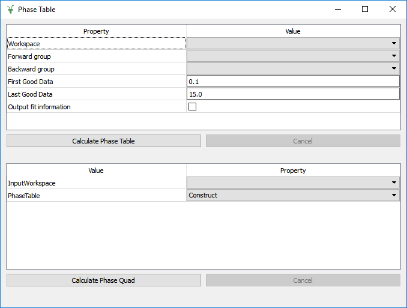

.. _muon_phase_table_tab-ref:

Phase Table Tab
===============

Phase Table Calculator
^^^^^^^^^^^^^^^^^^^^^^

The phase table calculator provides an interface to generate a table of detector phases and asymmetries.

**Workspace** This selects the workspace for which the phase table will be calculated.

**Forward group** This selects the forward detector group.

**Backward group** This selects the backward detector group.

**First good data** This selects the first good data value used, this is set separately to the value on the home tab.

**Last good data** This selects the last good data value used, this is set separately to the value on the home tab.

**Output fit information** Check this box to generate a workspace of fit information for your phase table.

Phase Quad Calculator
^^^^^^^^^^^^^^^^^^^^^

The phase quad calcuator use the :ref:`PhaseQuad <algm-PhaseQuad>` algorithm combine the signals from multiple detectors
into a quadrature phase signal.

**InputWorkspace** This selects the workspace used to calculate the phase quad.

**PhaseTable** This selects the phase table used to calculate the phase quad.

Used By
^^^^^^^

:ref:`Frequency Domain Analysis <Frequency_Domain_Analysis_2-ref>`