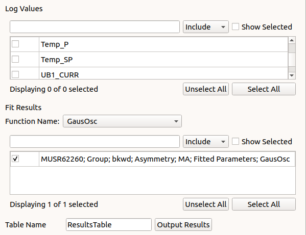

.. _muon_results_tab-ref:

Results Table Tab
-----------------

The results table tab outputs the results from the fitting tab as well as the log values from selected runs into a
tableworkspace.

Log Values Selection
^^^^^^^^^^^^^^^^^^^^
Lists log values from the fitted run(s) that can be selected to be output into the results
table

**Search bar** The search bar can be used to find (Include) or filter out (Exclude) log values by name.

**Show Selected** If this option is checked the selection box will be limited to only the values that have already
been selected to be output.

**Selection Box** Log values are listed in this section, they can be selected individually by checking the boxes on the
right side of the box.

**Unselect/Select All** When clicked these buttons will automatically unselect or select all log values currently in the
selection box

Fit Selection
^^^^^^^^^^^^^
The Fit selection area lists outputs from the fitting tab filtered by fitting function, selected functions can be
outputted to the results table

**Fit function selection** This drop down menu filters the selection box by fit function. Only fits with the same
function can be output together.

**Search bar** The search bar can be used to find (Include) or filter out (Exclude) fit functions by name.

**Show Selected** If this option is checked the selection box will be limited to only the functions that have already
been selected to be output.

**Selection Box** fitting functions are listed in this section, they can be selected individually by checking the boxes
on the right side of the box.

**Unselect/Select All** When clicked these buttons will automatically unselect or select all functions currently in the
selection box

Output
^^^^^^

**Table Name** The output tableworkspace's name is given here.

**Output results** This will put put the fit funtions for the selected runs along with the selected log values for that run.

Used By
^^^^^^^

:ref:`Muon Analysis <MuonAnalysis_2-ref>`
:ref:`Frequency Domain Analysis <Frequency_Domain_Analysis_2-ref>`
