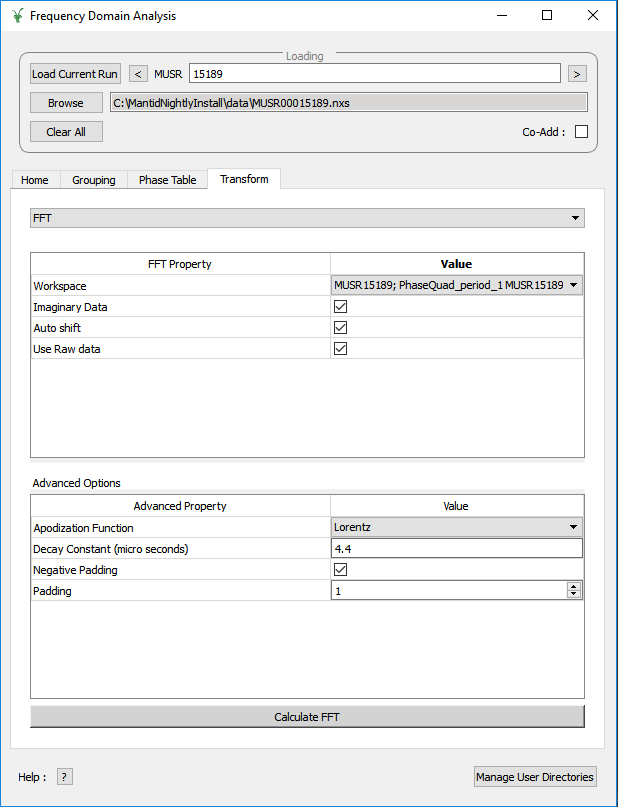
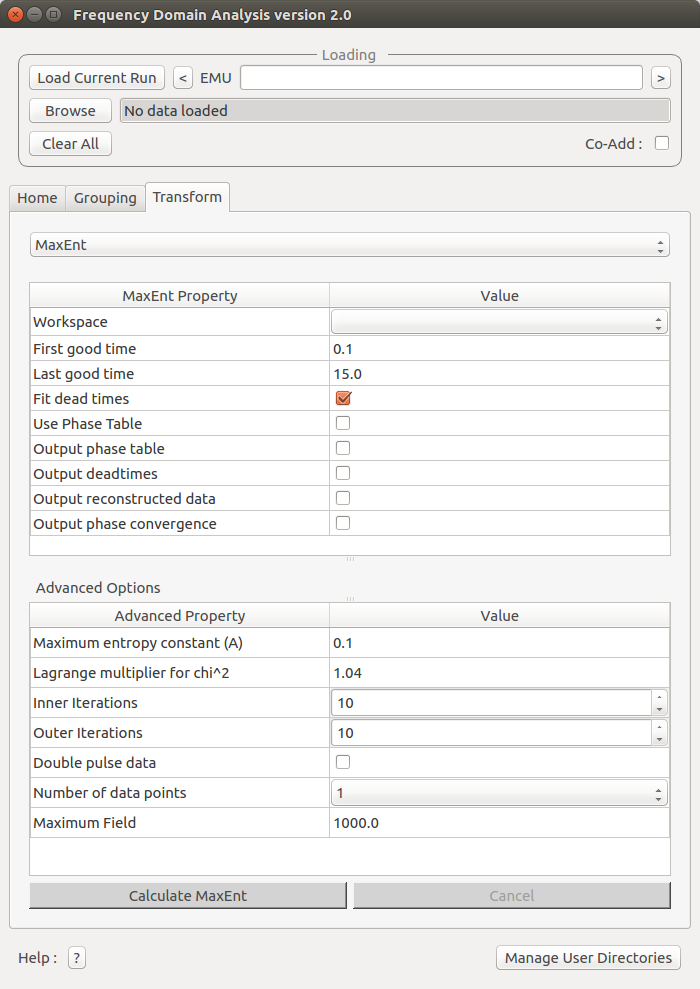

.. _muon_transform_tab-ref:

Transformation Tab
------------------

This tab is designed for the user to transform pre-loaded data into the frequency domain. At present there are two methods available, which the user can switch between by using the drop-down menu at the top of the tab.

Default: Fast Fourier Transforms
^^^^^^^^^^^^^^^^^^^^^^^^^^^^^^^^

In this mode the interface displays two tables, FFT and Advanced options. The FFT table contains
all of the information required to produce a forward FFT. The Advanced Options table contains the information
for adding padding and apodization functions to the data.

If the workspace contains the word ``PhaseQuad`` it will run the :ref:`PhaseQuad <algm-PhaseQuad>` algorithm on the selected run when ``Calculate`` is pressed. If no phase table is available then
the one will be generated and the result will be stored as ``PhaseTable``.

The ``Calculate`` button will execute the :ref:`Padding and Apodization <algm-PaddingAndApodization>`  and then :ref:`FFT <algm-FFT>` algorithms. The output workspace will be added to
appropriate grouped workspace.

Maximum Entropy Method
^^^^^^^^^^^^^^^^^^^^^^

The maximum entropy method can be used to calculate the frequency domain spectrum. This option uses the :ref:`MuonMaxent <algm-MuonMaxent>` algorithm to calculate the frequency spectrum. The MaxEnt Property table contains
the basic quantitites used during the calculation. If the ``Use Phase Table`` checkbox is set to true, then an input phase table will be used for the initial phase values. The phase table can be constructed or another phase table can be 
selected from the drop down menu. When the ``Calculate MaxEnt`` button is pressed, :ref:`CalMuonDetectorPhases <algm-CalMuonDetectorPhases>` is ran first if the phase table is to be ``Constructed``.

The advanced property table contains variables for users that would
like more control over the calculation.

For large calculations the interface can be slow, therefore the ``Calculate`` button is disabled until the current calculation is complete.

Used By
^^^^^^^

:ref:`Frequency Domain Analysis <Frequency_Domain_Analysis_2-ref>`
