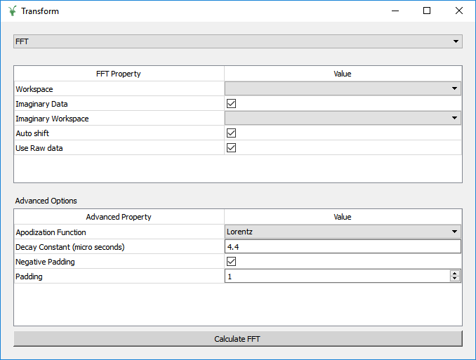
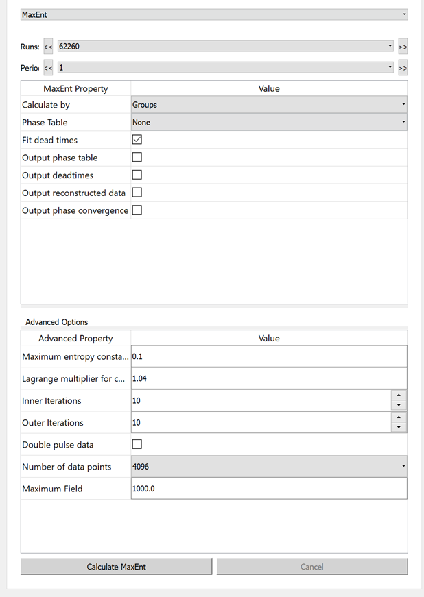

.. _muon_transform_tab-ref:

Transformation Tab
------------------

This tab is designed for the user to transform pre-loaded data into the frequency domain. At present there are two
methods available, which the user can switch between by using the drop-down menu at the top of the tab.

Fast Fourier Transforms (FFT)
^^^^^^^^^^^^^^^^^^^^^^^^^^^^^

In this mode the interface displays two tables, FFT and Advanced options. The FFT table contains
all of the information required to produce a forward FFT. The Advanced Options table contains the information
for adding padding and apodization functions to the data.

**Workspace** This selects the workspace to be transformed. If the workspace contains the word ``PhaseQuad`` it will
run the :ref:`PhaseQuad <algm-PhaseQuad>` algorithm on the selected run when ``Calculate`` is pressed. If no phase table
is available then the one will be generated and the result will be stored as ``PhaseTable``.

**Imaginary Data** If this is checked you will

**Imaginary Workspace** The imaginary component for the FFT.

**Auto shift** If this is checked it will automatically calculate and apply phase shift, if this is unchecked it will
ask you to supply a correction (defaults to 0.0).

**Use Raw data** If this is checked it will use the raw data from the instrument with its defailt bins, if it is
unchecked it will use data rebinned using the specifications from the home tab.

The Advanced Options table contains the information for adding padding and apodization functions to the data.

**Apodization Function** selects th apodization function to apply to the data before performing the FFT.

**Decay Constant** The decay constant for the apodization function.

**Negative Padding** If this si checked it will add padding to both sides of the data.

**Padding** The amount of padding to be added to the data.

The ``Calculate`` button will execute the :ref:`Padding and Apodization <algm-PaddingAndApodization>`  and then
:ref:`FFT <algm-FFT>` algorithms. The output workspace will be added to appropriate grouped workspace.

Maximum Entropy Method (MaxEnt)
^^^^^^^^^^^^^^^^^^^^^^^^^^^^^^^

The maximum entropy method can be used to calculate the frequency domain spectrum. This option uses the
:ref:`MuonMaxent <algm-MuonMaxent>` algorithm to calculate the frequency spectrum. The MaxEnt Property table contains
the basic quantities used during the calculation.

**Workspace** Select the workspace for the transformation to be performed on.

**Phase Table** Select a phase table to be used for the initial phase values.

**Fit dead times** Check this to fit dead times.

**Output (phase table/deadtimes/reconstructed data/phase convergence)** If these are checked it will output the chosen
results in the appropriate workspace group.

The advanced property table contains variables for users that would like more control over the calculation.
For large calculations the interface can be slow, therefore the ``Calculate`` button is disabled until the current calculation is complete.

Used By
^^^^^^^

:ref:`Frequency Domain Analysis <Frequency_Domain_Analysis_2-ref>`
