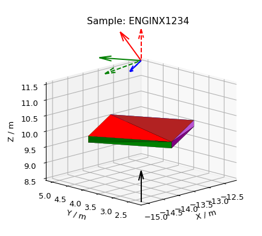

.. _Mesh_Plots:

===============================
3D Mesh Plots for Sample Shapes
===============================

`3D plotting in Matplotlib <https://matplotlib.org/stable/users/explain/toolkits/mplot3d.html>`_

**Other Plot Docs**

* :ref:`3D_Plots`
* :ref:`06_formatting_plots`
* :ref:`02_scripting_plots`

|
|

.. contents:: 3D Mesh Plots - Table of contents
    :local:

Here the mesh is plotted as a Poly3DCollection `Polygon <https://matplotlib.org/stable/users/explain/toolkits/mplot3d.html#polygon-plots>`_.

These sample shapes can be created with :ref:`algm-SetSample`, :ref:`algm-LoadSampleShape` or
:ref:`algm-LoadSampleEnvironment` and copied using :ref:`algm-CopySample`.
For help defining CSG Shapes and Rotations, see :ref:`HowToDefineGeometricShape`.

Workbench
#########

To quickly plot all Sample, Container and Component shapes attached to a workspace, right-click on it
in the Workspaces Toolbox and select ``Show Sample Shape``. A black arrow will be added for the beam direction
and, if there is a UB matrix, colored arrows for lattice vectors.
The real lattice vectors :math:`a,\ b,\ c` are represented by **solid** line arrows in red, green and blue, respectively.
Similarly, the reciprocal lattice vectors :math:`a^*,\ b^*,\ c^*`
are represented by **dashed** line arrows in red, green and blue, respectively.

A sample shape plot also takes into account any goniometer rotations.

Scripting
#########
Here are some examples of what you can achieve by plotting the sample shapes with a script. Click on ``Source Code``
above each plot (only available on html page) to download the relevant code snippet.

Scripting is useful to show only certain component shapes.
For help defining Containers and Components, see :ref:`SampleEnvironment`.
Note Component index 0 is usually the Container.

.. plot::

   # import mantid algorithms, numpy and matplotlib
   from mantid.simpleapi import *
   import numpy as np
   import matplotlib.pyplot as plt
   from mpl_toolkits.mplot3d.art3d import Poly3DCollection

   # A fake host workspace, replace this with your real one.
   ws = CreateSampleWorkspace()
   LoadInstrument(Workspace=ws,RewriteSpectraMap=True,InstrumentName="Pearl")
   SetSample(ws, Environment={'Name': 'Pearl'})

   sample = ws.sample()
   environment = sample.getEnvironment()

   mesh = sample.getShape().getMesh()
   container_mesh = environment.getContainer().getShape().getMesh()

   mesh_polygon_a = Poly3DCollection(mesh, facecolors = 'green', edgecolors='blue',alpha = 0.5, linewidths=0.1, zorder = 0.3)
   mesh_polygon_b = Poly3DCollection(container_mesh, edgecolors='red', alpha = 0.1, linewidths=0.05, zorder = 0.5)
   mesh_polygon_b.set_facecolor((1,0,0,0.5))

   fig, axes = plt.subplots(subplot_kw={'projection': 'mantid3d', 'proj_type': 'ortho'})
   axes.add_collection3d(mesh_polygon_a)
   axes.add_collection3d(mesh_polygon_b)

   for i in (1,3,5):
      print(i)
      mesh_polygon_i = Poly3DCollection(environment.getComponent(i).getMesh(), edgecolors='red', alpha = 0.1, linewidths=0.05, zorder = 0.5)
      mesh_polygon_i.set_facecolor((1,0,0,0.5))
      axes.add_collection3d(mesh_polygon_i)

   # Auto scale to the mesh size
   axes_lims = (-0.03,0.03)
   axes.auto_scale_xyz(axes_lims, axes_lims, axes_lims)

   axes.set_title('Pearl Sample in Container and Components(1,3,5) with black beam arrow')
   axes.set_xlabel('X / m')
   axes.set_ylabel('Y / m')
   axes.set_zlabel('Z / m')
   axes.set_box_aspect((1, 1, 1))

   def arrow(ax, vector, origin = None, factor = None, color = 'black',linestyle = '-'):
      if origin == None:
         origin = (ax.get_xlim3d()[1],ax.get_ylim3d()[1],ax.get_zlim3d()[1])
      if factor == None:
         lims = ax.get_xlim3d()
         factor = (lims[1]-lims[0]) / 3.0
      vector_norm = vector / np.linalg.norm(vector)
      ax.quiver(
            origin[0], origin[1], origin[2],
            vector_norm[0]*factor, vector_norm[1]*factor, vector_norm[2]*factor,
            color = color,
            linestyle = linestyle
      )
   # Add arrow along beam direction
   source = ws.getInstrument().getSource().getPos()
   sample = ws.getInstrument().getSample().getPos() - source
   arrow(axes, sample, origin=(0,0,-0.04))
   axes.view_init(vertical_axis='y', elev=30, azim=-135)
   fig.show()

Plot a cuboid sample shape, rotate it by the goniometer and add lattice vector arrows.

.. plot::

   # import mantid algorithms, numpy and matplotlib
   from mantid.simpleapi import *
   import matplotlib.pyplot as plt
   import numpy as np
   from mpl_toolkits.mplot3d.art3d import Poly3DCollection

   cuboid = " \
   <cuboid id='some-cuboid'> \
   <height val='2.0'  /> \
   <width val='2.0' />  \
   <depth  val='0.2' />  \
   <centre x='10.0' y='10.0' z='10.0'  />  \
   </cuboid>  \
   <algebra val='some-cuboid' /> \
   "

   ws = CreateSampleWorkspace()
   SetGoniometer(ws, Axis0="45,0,1,0,-1")
   SetSample(ws, Geometry={'Shape': 'CSG', 'Value': cuboid})
   sample = ws.sample()

   SetUB(ws, a=1, b=1, c=2, alpha=90, beta=90, gamma=60)
   if not sample.hasOrientedLattice():
      raise Exception("There is no valid lattice")

   UB = np.array(ws.sample().getOrientedLattice().getUB())
   hkl = np.array([[1.0,0.0,0.0],[0.0,1.0,0.0],[0.0,0.0,1.0]])
   QSample = np.matmul(UB,hkl)
   Goniometer = ws.getRun().getGoniometer().getR()
   reciprocal_lattice = np.matmul(Goniometer,QSample)#QLab
   real_lattice = (2.0*np.pi)*np.linalg.inv(np.transpose(reciprocal_lattice))

   shape = sample.getShape()
   mesh = shape.getMesh()

   facecolors = ['purple','mediumorchid','royalblue','b','red','firebrick','green', 'darkgreen','grey','black', 'gold', 'orange']
   mesh_polygon = Poly3DCollection(mesh, facecolors = facecolors, linewidths=0.1)

   fig, axes = plt.subplots(subplot_kw={'projection': 'mantid3d', 'proj_type': 'ortho'})
   axes.add_collection3d(mesh_polygon)

   axes.set_title('Cuboid Sample \n with Real and Reciprocal lattice vectors')
   axes.set_xlabel('X / m')
   axes.set_ylabel('Y / m')
   axes.set_zlabel('Z / m')

   axes.set_mesh_axes_equal(mesh)
   axes.set_box_aspect((1, 1, 1))

   def arrow(ax, vector, origin = None, factor = None, color = 'black',linestyle = '-'):
      if origin == None:
         origin = (ax.get_xlim3d()[1],ax.get_ylim3d()[1],ax.get_zlim3d()[1])
      if factor == None:
         lims = ax.get_xlim3d()
         factor = (lims[1]-lims[0]) / 3.0
      vector_norm = vector / np.linalg.norm(vector)
      ax.quiver(
            origin[0], origin[1], origin[2],
            vector_norm[0]*factor, vector_norm[1]*factor, vector_norm[2]*factor,
            color = color,
            linestyle = linestyle
      )

   colors = ['r','g','b']
   for i in range(3): # plot real_lattice with '-' solid linestyle
      arrow(axes, real_lattice[:,i], color = colors[i])
   for i in range(3): # plot reciprocal_lattice with '--' dashed linestyle
      arrow(axes, reciprocal_lattice[:,i], color = colors[i], linestyle = '--')

   axes.view_init(vertical_axis='y', elev=27, azim=50)
   fig.show()

**Other Plotting Documentation**

* :ref:`plotting`
* `Matplotlib Keyboard Shortcuts <https://matplotlib.org/stable/users/explain/figure/interactive.html#navigation-keyboard-shortcuts>`_
* See :ref:`here <plotting>` for custom color cycles and colormaps
