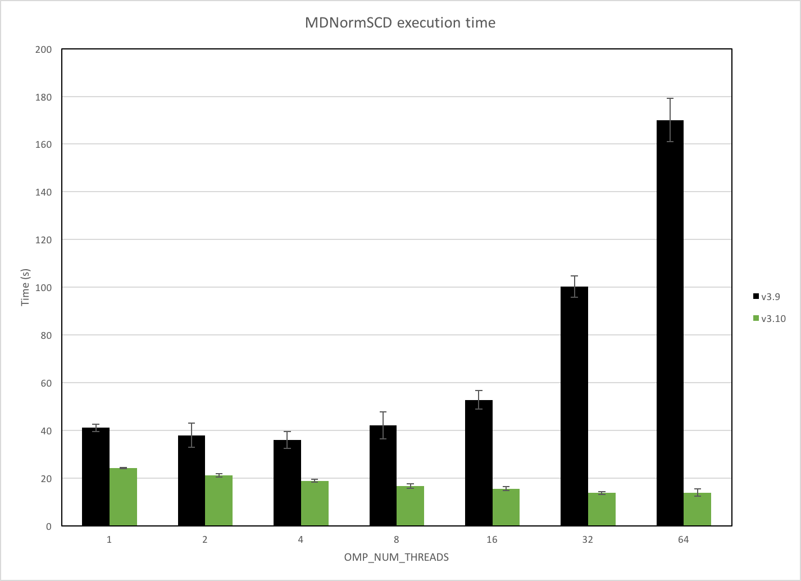
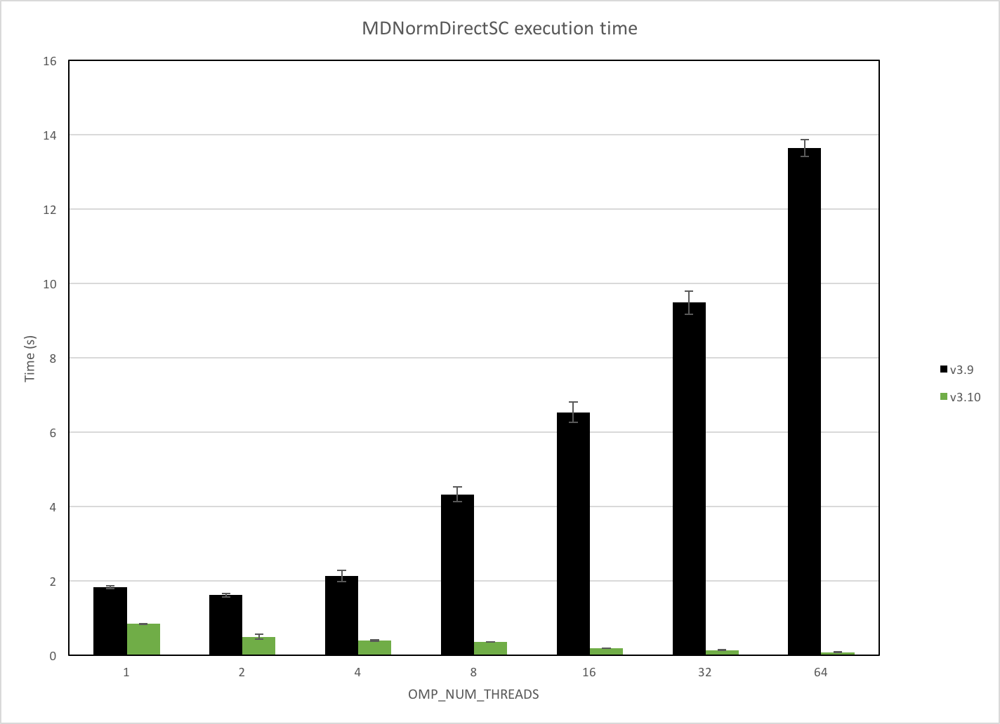

=================
Framework Changes
=================

.. contents:: Table of Contents
   :local:

API
---

- The default multiple file limit is now made facility dependent. It is 1000 for ILL, and 100 for all the others.
- Frequency unit (GHz) included as an option to represent energy transfer.
- Framework changes now mean scanning workspaces (workspaces with moving detectors) can be created. Currently this can be tested using a new option in :ref:`CreateSampleWorkspace <algm-CreateSampleWorkspace-v1>`, by setting `NumScanPoints`. This is still experimental, as such the instrument view, saving workspaces and some algorithms will not work correctly with the scanning workspaces.
- Fixed a bug where certain validators would crash with SingleValuedWorkspaces instead of rejecting them.
- New unit :math:`d_{\perp}` (Angstrom) is implemented for TOF powder diffraction.

Algorithms
----------

- Removed the optional flag ``LocationParameters`` from ``ClearInstrumentParameters``.
- New method `IAlgorithm::helpURL` returns an optional documentation webpage. Useful when registering Python
  algorithms at runtime that are not part of the Mantid distribution.

New
###

- :ref:`DeleteWorkspaces <algm-DeleteWorkspaces>` will delete a list of workspaces.
- :ref:`algm-IntegrateEllipsoidsTwoStep` which can be used to integrate weak single crystal peaks by using parameters derived from strong peaks.
- :ref:`FindEPP-v2 <algm-FindEPP-v2>` reimplements `FindEPP-v1` in C++, providing an order of magnitude gain in execution time for large workspaces.
- :ref:`LineProfile <algm-LineProfile>` will give a horizontal or vertical line profile over a workspace.
- :ref:`SaveYDA <algm-SaveYDA>` do export :ref:`Workspace2D <Workspace2D>` to `Frida 2.0 <http://apps.jcns.fz-juelich.de/doku/frida/start>`_ YAML format.

Improved
########

- :ref:`RawFileInfo <algm-RawFileInfo-v1>` now provides sample information.
- :ref:`SetInstrumentParameter <algm-SetInstrumentParameter-v1>` now supports also boolean parameters, and better validates the inputs.
- :ref:`FilterEvents <algm-FilterEvents-v1>` now accepts a general TableWorkspace as the splitters workspace.  The TableWorkspace must have at least 3 columns.  The first 3 columns are for relative starting time, relative stopping time and target workspace tag for splitters, respectively.
- :ref:`GenerateEventsFilter <algm-GenerateEventsFilter-v1>` now set the unit of X-axis of the MatrixWorkspace (i.e., output splitters workspace) to second.
- :ref:`FilterEvents <algm-FilterEvents-v1>` now generates a sample log named *splitter* of each output workspace (i.e., splitted workspace) to represent the event filter that is applied to it.
- :ref:`FilterEvents <algm-FilterEvents-v1>` now splits all the sample logs if the input splitters are given by MatrixWorkspace or a general TableWorkspace.
- :ref:`FilterEvents <algm-FilterEvents-v1>` now supports to filter by pulse time with input splitters in format of MatrixWorkspace and general TableWorkspace.
- :ref:`FilterEvents <algm-FilterEvents-v1>` now sorts events before filtering.  There is no need to call :ref:`SortEvents <algm-SortEvents-v1>` before calling ``FilterEvents``.
- :ref:`FilterEvents <algm-FilterEvents-v1>` now accept splitters from ``TableWorkspace`` and ``MatrixWorkspace`` in both relative time and epoch time.
- :ref:`FilterEvents <algm-FilterEvents-v1>` now only accept splitters from ``TableWorkspace`` and ``MatrixWrokspace`` in unit as second.
- Two new properties were added to :ref:`algm-Integration` *RangeLowerList* and *RangeUpperList* can be used to give histogram-specific integration ranges.
- :ref:`algm-FindEPP` does not output the two extra workspaces from the :ref:`algm-Fit` anymore.
- :ref:`ApplyDetailedBalance <algm-ApplyDetailedBalance>`: User can select the dynamic susceptibility versus energy or frequency.
- :ref:`PredictPeaks <algm-PredictPeaks-v1>` is now faster on instruments that do not have rectangular detectors. The speed up with vary from instrument to instrument, but for CORELLI this was shown to reduce execution time from ~64 mins to < 1 min.
- :ref:`MergeRuns <algm-MergeRuns>` now has a sum option and more control over failure when binning is different or sample logs do not match.
- Made it possible for LiveListeners to read properties from the calling Algorithm. This gives greater flexiblity for authors of LiveListener plugins.
- Improved verification of IDFs
- :ref:`AddSampleLog <algm-AddSampleLog>` now can optionionally take a MatrixWorkspace for the time and value of the newly-added TimeSeriesProperty sample log.
- :ref:`ExportTimeSeriesLog <algm-ExportTimeSeriesLog>` now can export the first derivative of the sample log as an opotion.
- :ref:`ExportTimeSeriesLog <algm-ExportTimeSeriesLog>` now add information of exported log to the output work, which
  :ref:`AddSampleLog <algm-AddSampleLog>` can retrieve automatically.
- ``ThreadPool`` now respects the value of ``OMP_NUM_THREADS`` environment variable (documented in [gcc](https://gcc.gnu.org/onlinedocs/libgomp/OMP_005fNUM_005fTHREADS.html))
- Improved parallel scaling of :ref:`MDNormSCD <algm-MDNormSCD>` with > 4 cores.

   Benchmark machine: 4 x Intel Xeon E5-4650 @ 2.7GHz (32 cores / 64 threads)

- Improved parallel scaling of :ref:`MDNormDirectSCD <algm-MDNormDirectSC>` with > 4 cores.

   Benchmark machine: 4 x Intel Xeon E5-4650 @ 2.7GHz (32 cores / 64 threads)

- Added optional inputs `TemporaryDataWorkspace` and `TemporaryNormalizationWorkspace` to :ref:`MDNormSCD <algm-MDNormSCD>` and :ref:`MDNormDirectSCD <algm-MDNormDirectSC>` for accumulating data and normalization from multiple runs. This avoids allocating and deallocating temporary workspaces.
- Reduced execution time of ``EventList::sortTof`` by over 2x, improving performance in algorithms such as :ref:`algm-CompressEvents` and :ref:`algm-SortEvents` which call it.
- :ref:`LoadDNSLegacy <algm-LoadDNSLegacy-v1>` can now read the TOF data. CoilCurrentsTable is now optional. The default coil currents are now in the instrument parameters file.
- :ref:`LoadNexusProcessed <algm-LoadNexusProcessed>` is now approximately 33x faster when loading a ``PeaksWorkspace`` with a large instrument attached.
- The default values for guessed peak widths in :ref:`PDCalibration <algm-PDCalibration>` have been changed to match the values used in  :ref:`FindPeaks <algm-FindPeaks>`.

Bug Fixes
#########

- Fixed two issues with absolute rotations that affected :ref:`RotateInstrumentComponent <algm-RotateInstrumentComponent>`. Previously, setting the absolute rotation of a component to ``R`` would result in its rotation being ``parent-rotation * R * inverse(relative-parent-rotation)``.
- :ref:`MonteCarloAbsorption <algm-MonteCarloAbsorption>` has been modified to allow ``EventWorkspace`` as input
- Fixed an issue where the log ``proton_charge_by_period`` was not loaded for :ref:`LoadEventNexus <algm-LoadEventNexus>`.
- Fixed an issue where :ref:`algm-MonteCarloAbsorption` would use the wavelengths from the first histogram of *InputWorkspace* only making the algorithm unusable for workspaces with varying bins.
- Fixed an issue with the ``GroupingPattern`` property in :ref:`algm-GroupDetectors`, where incorrect spectra were being used if spectrum numbers are not 1-based indices.
- Fixed an issue with :ref:`algm-CreateWorkspace` where giving bin edges as ``VerticalAxisValues`` would fail.
- Fixed an issue with the `TimeInterval` property in :ref:`GenerateEventsFilter <algm-GenerateEventsFilter>`, where the algorithm would get stuck in an infinite loop if no non-zero values were provided to the property.
- Fixed progress reporting in :ref:`LoadNexusProcessed <algm-LoadNexusProcessed>`.

Performance
-----------

Following a large effort to change some of the core instrument  aspects of Mantid, we are pleased to announce very significant improvements in performance as part of the 3.10.0 release. :ref:`ConvertUnits <algm-ConvertUnits>`, for example, is running >2x times faster than possible in our last major 3.9.0 release. Amongst others, :ref:`NormaliseVanadium <algm-NormaliseVanadium>` and :ref:`MaskDetectorsInShape <algm-MaskDetectorsInShape>` now give a 2x speedup. :ref:`ConvertSpectrumAxis <algm-ConvertSpectrumAxis>` and :ref:`AnvredCorrection <algm-AnvredCorrection>` are examples, of a few monitored algorithms, that are demonstrating a more modest 10% improvement in speed over the last major Mantid release. Aside from granular improvements at the algorithm level, we have observed that many of the Direct Inelastic technique area workflows are 2x faster than before.

As a consequence of these changes, :ref:`CopyInstrumentParmeters <algm-CopyInstrumentParameters>`, :ref:`LoadInstrument <algm-LoadInstrument>` and several other Load Algorithms are reporting a modest slowdown. We hope to address these as part of our scheduled future work in this area.

Bugs
----

- We have fixed a bug where Mantid could crash when deleting a large number of workspaces.
- Fixed a bug in :ref:`ConvertToMD <algm-ConvertToMD>` causing it to fail with the error "Run::storeEnergyBinBoundaries - Inconsistent start & end values" if monitors were all NaN, Inf, or zero.
- Fixed a bug in illuminated volume calculation which could make :ref:`MonteCarloAbsorption <algm-MonteCarloAbsorption>` fail.

CurveFitting
------------

Improved
########

- :ref:`UserFunction <func-UserFunction>` now supports :math:`erf` and :math:`erfc`.

- :ref:`IkedaCarpenterPV <func-IkedaCarpenterPV>` now constrains all parameters to be non-negative which helps the fits converge faster and produces better fits.

Python
------

- For multiple output parameters, python algorithms now return a ``namedtuple`` instead of a ``tuple``. Old scripts should still work,
  but one can now do

  .. code-block:: python

      results = GetEi(w)
      print(results)
      print(results.IncidentEnergy)
      print(results[0])

  This will yield:

  .. code-block:: python

      GetEi_returns(IncidentEnergy=3.0, FirstMonitorPeak=0.0, FirstMonitorIndex=0, Tzero=61.77080180287334)
      3.0
      3.0

- :class:`mantid.geometry.Object` has a new method ``volume()`` which calculates the volume of the shape.
- A ``SpectraAxis`` object can now be created from Python, in a similar way to the other Axis types:

  .. code-block:: python

     ws1 = CreateSampleWorkspace()
     # Create a new axis reference
     s_axis = SpectraAxis.create(ws1)

- ``CrystalStructure``, ``UnitCell``, ``PointGroup``, and ``SpaceGroup`` all have better console printing
- Fixed a bug on MDHistogramWorkspaces where passing an index larger than the size of the dimensions of the workspace to ``setSignalAt`` would crash Mantid.

Full list of
`Framework <http://github.com/mantidproject/mantid/pulls?q=is%3Apr+milestone%3A%22Release+3.10%22+is%3Amerged+label%3A%22Component%3A+Framework%22>`__
and
`Python <http://github.com/mantidproject/mantid/pulls?q=is%3Apr+milestone%3A%22Release+3.10%22+is%3Amerged+label%3A%22Component%3A+Python%22>`__
changes on GitHub
