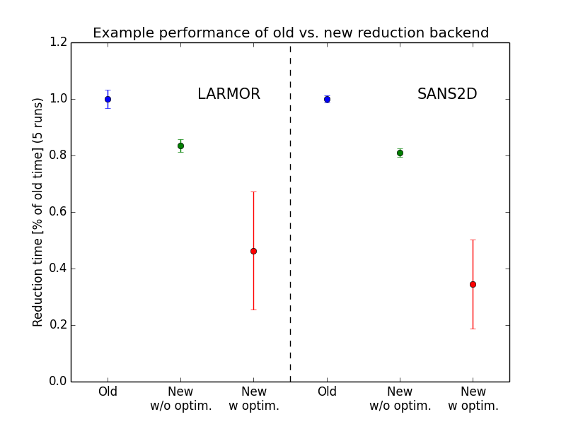

============
SANS Changes
============

.. contents:: Table of Contents
   :local:

ISIS SANS
---------

A new reduction backend was added. It improves considerably on performance, robustness and maintainability. Currently the new reduction backend can be used via a Python API. See `here <https://www.mantidproject.org/Scripting_SANS_Reductions_With_The_New_Reduction_Backend>`_  for more details on how to use the new reduction backend via this API.

One of the most noteable improvements of this new reduction backend is an enhanced performance which is most prominent when running batch reductions.

Bug Fixes
---------
- Fixed wrong first spectrum number for LARMOR. The first non-monitor spectrum number is 11, but it had been set to 10.
- Fixed inconsistent detector selection for high-angle-bank-type detectors.
- Fixed LOQ Batch mode bug where geometry information was not saved out when using SaveCanSAS1D.
- Fixed LOQ Batch mode bug where custom user file without a .txt ending was not being picked up.
- Fixed Batch mode bug where the output name suffix was hardcoded to SANS2D. It now takes the individual instruments into account.
- Fixed LOQ bug where prompt peak was not set correctly for monitor normalisation.
- Fixed Batch mode bug where merged reductions set in the GUI were not respected.
- Fixed display of current IDF, which was not updated when operating in batch mode.
- Fixed a bug where the user could try to save 1D data in the CanSAS format and caused a crash.

`Full list of changes on github <http://github.com/mantidproject/mantid/pulls?q=is%3Apr+milestone%3A%22Release+3.10%22+is%3Amerged+label%3A%22Component%3A+SANS%22>`__
