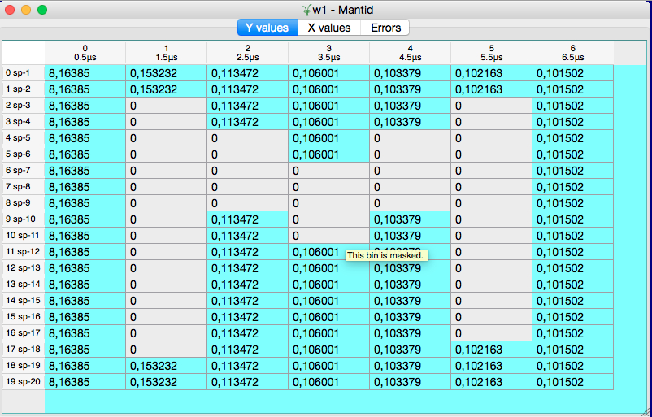
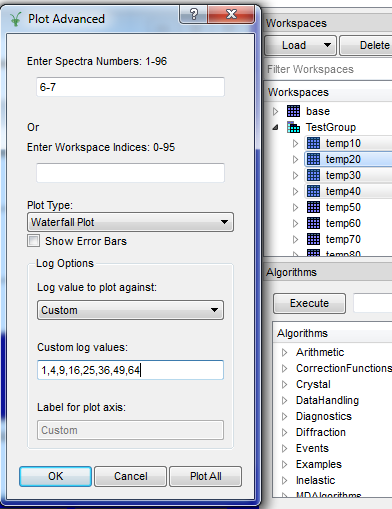

======================
UI & Usability Changes
======================

.. contents:: Table of Contents
   :local:

Installation
------------

Windows
#######

- At RAL administrative 03 accounts have been introduced.  As before Mantid does not need administrator access to be installed into a windows PC, so you do not need to use your 03 account.  Just use your normal account to install Mantid.  The trade off here is that it will only install desktop icons in the account you use to install it, if you need them in another account you can run the installer again from that account.

User Interface
--------------

- MantidPlot now respects the system scaling on high-resolution displays. All icons and bitmaps will now be sized
  appropriately rather than being too small to be usable (Windows only).
- A new Print button has been added to the MantidPlot help window.

- Masked bins are greyed out in the table view of the workspaces (except for EventWorkspaces):

Instrument View
###############

- Added the ability to visualise peaks generated by :ref:`algm-PredictPeaks` which fall off detectors.
- Added the ability to zoom out on an unwrapped view.
- Fixed a bug preventing the some of the banks from being visible when using a U correction.
- Fixed a bug where pressing delete would delete a workspace even when the dock was not focused.
- Fixed a bug where the user would not be prompted before deleting workspaces even if confirmations were turned on

Plotting Improvements
#####################

- There is now a Plot Advanced right click option on workspaces

  + This allows a wider selection of plot types: Surface, Contour, Waterfall, 1D and Tiled plotting
  + If you have more than one workspace selected, either by using ctrl or shift, or by selecting a group workspace this enables multiple workspaces to be included in the plots
  + This interface also give you much better control over the labelling of the data in the plots
  
    * Log values can be used as labels, which is good for temperature or pressure ramps
    * Custom labels can be input if log data is not available
    * For Waterfall and 1D plots, the labelling appears in the legend
    * For Surface plots the labels form the Z axis   
    
- Curves where all(Y) <= 0 are now not plotted when the Y-scale is set to logarithmic.
  The previous behaviour assigned an arbitrary value of 0.1 which was confusing.

+----------------------------------------------+-------------------------------------------------+
|Plots of a temperature ramp on WISH using "Temp" selected as the log:                           |
|More details `here <https://www.mantidproject.org/MBC_Displaying_data_in_multiple_workspaces>`_ |
+----------------------------------------------+-------------------------------------------------+
| .. image:: ../../images/ArtWaterfallT1.PNG   |   .. image:: ../../images/ArtSurfacePlotT1.PNG  |
+----------------------------------------------+-------------------------------------------------+

Algorithm Toolbox
#################

- The Algorithm Progress bar has been improved to handle reporting the progress of multiple algorithms much better.  Now it will correctly show the progress of the most recently started algorithms, and correctly move onto the next most recent should  the first finish sooner.  In addition the "Details" button now shows whether Mantid is Idle or how many algorithms it is running.

Scripting Window
################
- Fixed a bug where Mantid would crash when trying to select the font for the script window

SliceViewer Improvements
########################
- Fixed a bug where the rebin button was toggled when the user switch axes.
- Changed zoom level on peak. Now when zooming onto a spherical or ellipsoidal peak, the entire peak is visible when using the default window size.
- Fixed a bug where swapping the dimensions did not rebin the workspace despite having autorebin enabled.
- Fixed a bug where swapping the dimensions did not draw the axis scale correctly.
- Fixed a bug where the normalization selection was not respected.

VSI Improvments
###############
- ParaView was updated to to `v5.3.0 <https://blog.kitware.com/paraview-5-3-0-release-notes/>`_.
- The mapped array vtkMDHWSignalArray has been refactored to use the new vtkGenericDataArray class template. This interface minimizes virtual indirection and allows advanced compiler optimizations such as vectorization.
- Minimize the number of times the workspace min and max values are calculated.
- Threshold filter now reports progress to the user.
- Add option to automatically choose a contrasting color for axes grid and colorbar.
- Camera toolbar snaps to views along crystallographic axes,

Custom Interfaces
#################

- Indirect > Corrections > CalculatePaalmanPings is upgraded with few new options for computation of the corrections. Those are needed to be able to compute the corrections for different scenarios, like QENS, FWS, diffraction.
- Indirect > Corrections and Indirect > Analysis interfaces have been configured to not to accept GroupWorkspace as input.

Bugs Resolved
-------------

- Fixed an issue in the Script Window that caused the Convert Tabs to Spaces and vice versa operations to corrupt the script.
- Fixed an issue where some graphs not associated with a workspace would not be shown in the project save as view.
- Fixed an issue where the Spectrum Viewer could crash when a workspace contained infinities.
- Fixed an issue where contour lines were displayed at the wrong location.
- Fixed an issue where some workspaces might not get deleted from the workspace dock if group workspaces were present.
- Fixed an issues in the Detectors table where monitor information did not show up correctly.
- Fixed an issue where MantidPlot could crash if a workspace's instrument was changed while the Instrument Window was open.

|

Full list of
`GUI <http://github.com/mantidproject/mantid/pulls?q=is%3Apr+milestone%3A%22Release+3.10%22+is%3Amerged+label%3A%22Component%3A+GUI%22>`_
and
`Documentation <http://github.com/mantidproject/mantid/pulls?q=is%3Apr+milestone%3A%22Release+3.10%22+is%3Amerged+label%3A%22Component%3A+Documentation%22>`_
changes on GitHub
