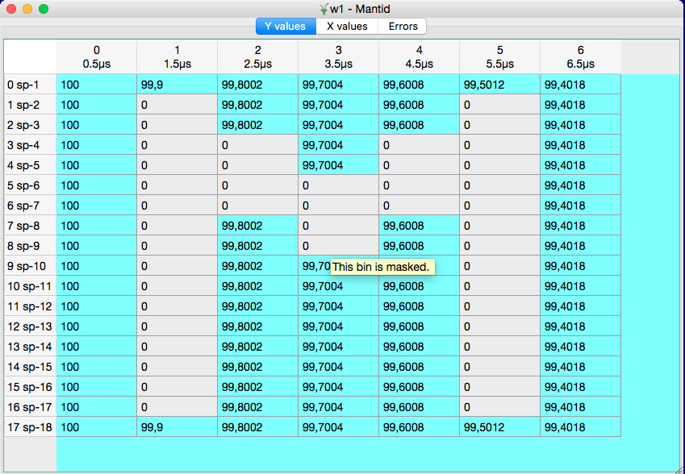

======================
UI & Usability Changes
======================

.. contents:: Table of Contents
   :local:

Installation
------------

Windows
#######

OS X
####

User Interface
--------------

- MantidPlot now respects the system scaling on high-resolution displays. All icons and bitmaps will now be sized
  appropriately rather than being too small to be usable (Windows only).
- A new Print button has been added to the MantidPlot help window.
- Masked bins are greyed out in the table view of the workspaces (except for EventWorkspaces):

Instrument View
###############

- Added the ability to visualise peaks generated by :ref:`algm-PredictPeaks` which fall off detectors.
- Added the ability to zoom out on an unwrapped view.
- Fixed a bug preventing the some of the banks from being visible when using a U correction.
- Fixed a bug where pressing delete would delete a workspace even when the dock was not focused.
- Fixed a bug where the user would not be prompted before deleting workspaces even if confirmations were turned on.

Plotting Improvements
#####################

- Curves where all(Y) <= 0 are now not plotted when the Y-scale is set to logarithmic.
  The previous behaviour assigned an arbitrary value of 0.1 which was confusing.

Algorithm Toolbox
#################

- The Algorithm Progress bar has been improved to handle reporting the progress of multiple algorithms much better.  Now it will correctly show the progress of the most recently started algorithms, and correctly move onto the next most recent should  the first finish sooner.  In addition the "Details" button now shows whether Mantid is Idle or how many algorithms it is running.

.. figure:: ../../images/Progress_running.png
   :class: screenshot
   :width: 396px

Scripting Window
################
- Fixed a bug where Mantid would crash when trying to select the font for the script window

Documentation
#############

Custom Interfaces
#################

- Indirect > Corrections > CalculatePaalmanPings is upgraded with few new options for computation of the corrections. Those are needed to be able to compute the corrections for different scenarios, like QENS, FWS, diffraction.
- Indirect > Corrections and Indirect > Analysis interfaces have been configured to not to accept GroupWorkspace as input.

Bugs Resolved
-------------

- Fixed an issue in the Script Window that caused the Convert Tabs to Spaces and vice versa operations to corrupt the script.
- Fixed an issue where some graphs not associated with a workspace would not be shown in the project save as view.

SliceViewer Improvements
------------------------
- Fixed a bug where the rebin button was toggled when the user switch axes.
- Changed zoom level on peak. Now when zooming onto a spherical or ellipsoidal peak, the entire peak is visible when using the default window size.
- Fixed a bug where swapping the dimensions did not rebin the workspace despite having autorebin enabled.

VSI Improvments
---------------
- ParaView was updated to to `v5.3.0 <https://blog.kitware.com/paraview-5-3-0-release-notes/>`_.
- The mapped array vtkMDHWSignalArray has been refactored to use the new vtkGenericDataArray class template. This interface minimizes virtual indirection and allows advanced compiler optimizations such as vectorization.
- Minimize the number of times the workspace min and max values are calculated.
- Threshold filter now reports progress to the user.
- Add option to automatically choose a contrasting color for axes grid and colorbar.
- Camera toolbar snaps to views along crystallographic axes,

|

Full list of
`GUI <http://github.com/mantidproject/mantid/pulls?q=is%3Apr+milestone%3A%22Release+3.10%22+is%3Amerged+label%3A%22Component%3A+GUI%22>`_
and
`Documentation <http://github.com/mantidproject/mantid/pulls?q=is%3Apr+milestone%3A%22Release+3.10%22+is%3Amerged+label%3A%22Component%3A+Documentation%22>`_
changes on GitHub
