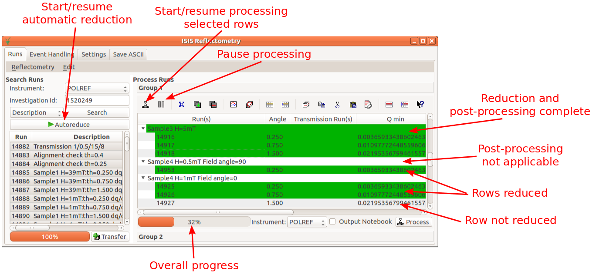

=====================
Reflectometry Changes
=====================

.. contents:: Table of Contents
   :local:

Reflectometry Reduction Interface
---------------------------------

ISIS Reflectometry
##################

   New features of the ISIS Reflectometry Interface

Automatic reduction
^^^^^^^^^^^^^^^^^^^

- New 'automatic reduction' functionality has been added for automatically reducing all runs obtained from a given investigation ID.
- With an investigation ID supplied, clicking ``Autoreduce`` searches for runs that are included in the investigation, transfers them to the processing table and processes all runs.
- Automatic reduction can be paused using the new ``Pause`` button. It can be resumed by pressing the ``Autoreduce`` button again. This will continue the automatic reduction from the last processed row.
- Changing the instrument, investigation ID or transfer method while paused means that automatic reduction cannot continue where it left off. Therefore, clicking the ``Autoreduce`` button again will start a new automatic reduction based on the new settings.

Pausing and resuming reduction
^^^^^^^^^^^^^^^^^^^^^^^^^^^^^^

- A new ``Pause`` button has been added which allows pausing of any reduction, whether started using the ``Process`` or ``Autoreduce`` button.
- The ``Process`` and ``Autoreduce`` buttons are greyed out while a reduction is in progress. They are enabled again when the reduction is paused so that they can be used to resume the reduction.
- When the ``Pause`` button is clicked, the reduction might not stop immediately, but will stop as soon as the current row has finished processing. This ensures that nothing is left in a partially-completed state.
- If the row selection is changed while a reduction is paused, the newly-selected rows will be processed instead of the original rows when the ``Process`` button is clicked. However, the row selection is irrelevant when using ``Autoreduce``, because this will continue from the last-processed row.
- The interface cannot be closed while a reduction is in progress. Therefore, the ``Pause`` button can be used to stop data reduction so that the interface can be closed.
- Data and settings should not be edited while a reduction is in progress. Pausing reduction allows changes to be safely made:

  - Rows and groups may be edited while a reduction is paused. They will be marked as 'unprocessed' so that they are re-processed when the reduction is resumed.
  - Altering data within a row will mean that its containing group will also be re-processed.
  - Adding/removing rows from a group will mean that the group will be re-processed.
  - Deleting or renaming output workspaces of processed rows/groups will mean that that row/group will be re-processed.

Other changes
^^^^^^^^^^^^^
- Rows and groups that have been successfully processed are highlighted green:

  - Rows are highlighted when reduction has completed.
  - Groups are highlighted when post-processing has completed. Note that if a group does not have any applicable post-processing then it will never be highlighted, even if all of its child rows are highlighted.

- The interface now operates asynchronously, so that one can still interact with the rest of MantidPlot while data is processing (instead of freezing MantidPlot until processing has finished).

- The calculation of :math:`\frac{dQ}{Q}` has been fixed in line with the changes to the :ref:`algm-NRCalculateSlitResolution` algorithm detailed below. An additional bug has been fixed where the interface was passing :math:`\theta` to this algorithm instead of :math:`2\theta`.

ISIS Reflectometry (Old)
########################

- The calculation of :math:`\frac{dQ}{Q}` has been fixed in line with the changes to the :ref:`algm-NRCalculateSlitResolution` algorithm. An additional bug has been fixed where the interface was passing :math:`\theta` to this algorithm instead of :math:`2\theta`.

Algorithms
----------

- The following bugs have been fixed in the summation in Q functionality in :ref:`algm-ReflectometryReductionOne`:

  - the incorrect angle was being used in the final conversion to Q in the divergent beam case
  - the input was being cropped, causing loss of counts
  - summation in Q was giving incorrect results for a point detector

- The following new properties have been added to :ref:`algm-ReflectometryReductionOneAuto`:

  - ``ThetaLogName``: allows you to specify the name of a log value to use for ``theta``.
  - ``CorrectDetectors``: specifies whether detector positions should be corrected when ``ThetaIn`` or ``ThetaLogName`` is provided. If true (default), detectors will be moved to the specified ``theta`` using :ref:`algm-SpecularReflectionPositionCorrect`. Otherwise, ``theta`` will still be overridden but without detector positions being changed.
  - ``Diagnostics``: enable the output of additional interim workspaces for debug/validation.

- A new version of :ref:`SpecularReflectionCalculateTheta <algm-SpecularReflectionCalculateTheta>` (version 2) has been added which works with detectors at :math:`2\theta`, in line with :ref:`algm-ReflectometryReductionOneAuto`. Version 1 works with detectors at :math:`\theta`. Note that :ref:`algm-ReflectometryReductionOneAuto` has been adjusted so that its output is not affected.

- The following changes have been made to :ref:`CalculateResolution <algm-NRCalculateSlitResolution>`:

  - The algorithm has been renamed to :ref:`algm-NRCalculateSlitResolution` as this algorithm is specific to neutron reflectometry, and the resolution it calculates is the slit resolution.
  - Some errors in the resolution calculation have been fixed. Note that **this affects the Q binning in the results** of :ref:`ReflectometryReductonOneAuto <algm-ReflectometryReductionOneAuto>` (versions 1 and 2) and :ref:`ReflectometryReductionOne <algm-ReflectometryReductionOne>` (version 1 only).
  - The ``TwoThetaLogName`` property has been replaced by ``ThetaLogName``. This still takes ``Theta`` as the default log name. This was causing confusion because it **was being used as two theta**; it is **now being used as theta**, as the new property name suggests.
  - The output property ``TwoThetaOut`` has been removed because it is not useful. The algorithm now returns a single value which is the resolution.

- :ref:`algm-LoadILLReflectometry` has been fixed to correctly load D17 files acquired in the TOF mode.

`Full list of changes on github <http://github.com/mantidproject/mantid/pulls?q=is%3Apr+milestone%3A%22Release+3.11%22+is%3Amerged+label%3A%22Component%3A+Reflectometry%22>`__
