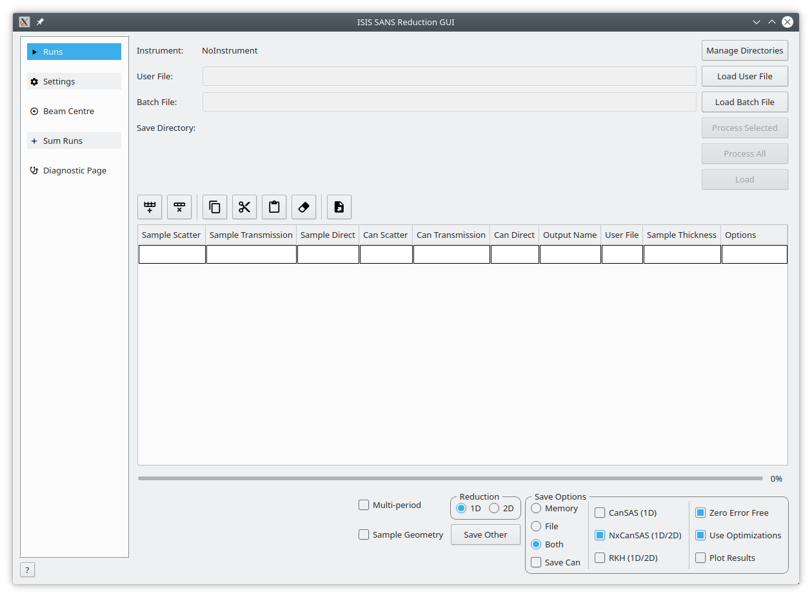

============
SANS Changes
============

.. contents:: Table of Contents
   :local:

Interfaces
----------

   
- SANS > ISIS SANS v2 experimental interface has become available. It has basic reduction functionalities and makes use of the new reduction backend.

EQSANS
######

- Following hardware changes in the instrument, sample and detector offsets were added as parameters of the reduction.

Bug Fixes
---------

- Displaying the masked workspace in the mask tab now makes sure that the masks are displayed in a grey color.

`Full list of changes on github <http://github.com/mantidproject/mantid/pulls?q=is%3Apr+milestone%3A%22Release+3.11%22+is%3Amerged+label%3A%22Component%3A+SANS%22>`__
