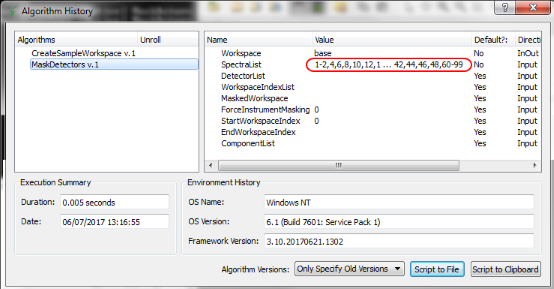
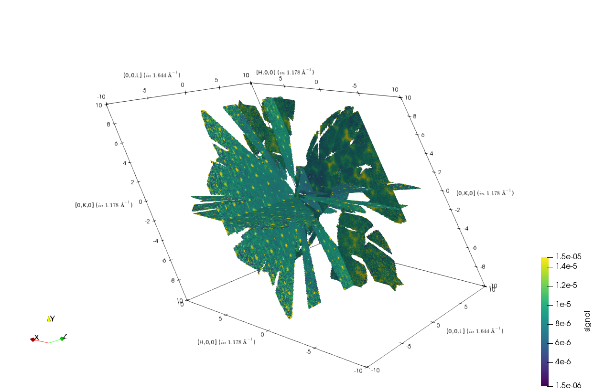

======================
UI & Usability Changes
======================

.. contents:: Table of Contents
   :local:

Installation
------------

Windows
#######

OS X
####

User Interface
--------------

- Choosing 'Show Detectors' for a workspace will now also show the time indexes for scanning workspaces.

Instrument View
###############

Plotting Improvements
#####################

Algorithm Toolbox
#################

Workspace History Window
########################

- Algorithm proprties with long values are now shown in a shortened format both in this display and the log.  The full history is still retained, and genereated python scripts will still work as before.

Documentation
#############

- Improve documentation for `RewriteSpectraMap` property of the `LoadInstrument`
  algorithm

Custom Interfaces
#################

- General > Multi dataset fitting interface and the general fitting dock now display the status string returned by the `Fit` algorithm. If an error occured during fitting it will be reported in this string.
- Indirect ILL calibration tab, deprecated since v3.9 is now dropped.
- SANS > ISIS SANS v2 experimental interface has become available. It has basic reduction functionalities and makes use of the new reduction backend.

Bugs Resolved
-------------
- Fixed a bug causing table windows with string values to appear truncated if the string contained a space.
- Fixed a bug where setting a table column's plot type would not be saved to the workspace correctly.

SliceViewer Improvements
------------------------

- SliceViewer input of number of bins, thickness, and slice point now waits until the editing is finished to rebin or changing slice point instead of changing with each digit entered.

VSI Improvements
----------------
- ParaView has been updated to to `v5.4.0 <https://blog.kitware.com/paraview-5-4-0-release-notes/>`_.

- Multislice view uses a custom `representation <https://www.paraview.org/ParaView/index.php/Views_And_Representations>`_ to speed up slicing by taking advantage of the consistent bin 
  sizes in a MDHistoWorkspace. Smooth interaction with typical data sizes (< 10 million cells) is now possible.

|

Full list of
`GUI <http://github.com/mantidproject/mantid/pulls?q=is%3Apr+milestone%3A%22Release+3.11%22+is%3Amerged+label%3A%22Component%3A+GUI%22>`_
and
`Documentation <http://github.com/mantidproject/mantid/pulls?q=is%3Apr+milestone%3A%22Release+3.11%22+is%3Amerged+label%3A%22Component%3A+Documentation%22>`_
changes on GitHub
