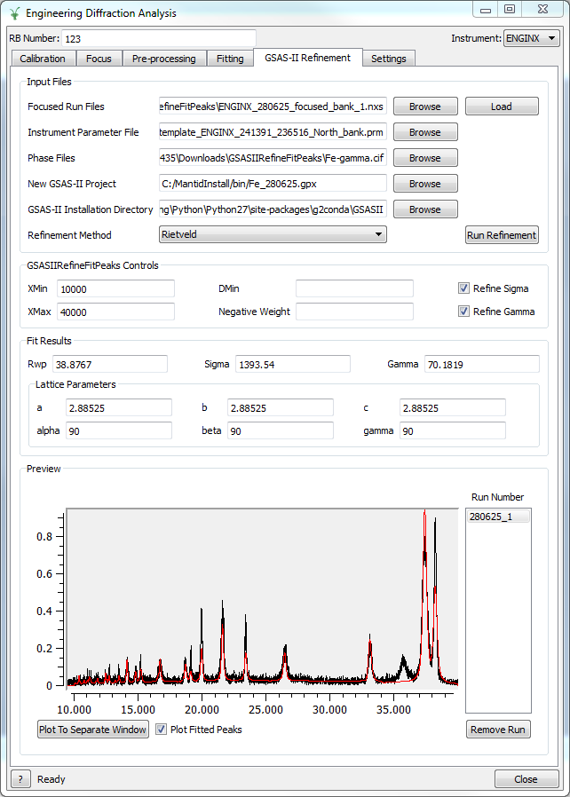

===================
Diffraction Changes
===================

.. contents:: Table of Contents
   :local:

Powder Diffraction
------------------

New features
############

- New features in ISIS Powder which affect all instruments:

  + 'suffix' parameter added for output filenames
  + Offset files may now be specified by an absolute path. The default behaviour of assuming they live in calibration/label has been retained
  + Output workspace names altered slightly to allow for easier renaming of GroupWorkspaces (see RenameWorkspace)
  + Scripts no longer crash when current-normalising a workspace with no current. Instead, no normalisation or empty calibration is applied, and processing continues as normal
  + It is now possible to set beam parameters (height and width) using ``instrument_object.set_beam_parameters(height=123, width=456)``.
  + Using grouping files with only one bank was enabled, and related errors to do with mismatched number of parameters were made more readable

- New features in ISIS Powder scripts for PEARL:

  + Scripts now support creation of grouping .cal files from ceria run(s)
  + Absorption corrections enabled for all samples, not just vanadium
  + ``subtract_empty_instrument`` parameter added for disabling empty subtraction, useful for focusing empties
- New functionality for POLARIS in the ISIS Powder scripts. Some default parameters adjusted and output unsplined vanadium workspace by default.
- New algorithm :ref:`algm-EstimateDivergence` estimates the beam divergence due to finite slit size.
- New algorithm :ref:`algm-SumOverlappingTubes` combines a detector scan for D2B into a single workspace.

Improvements
############

- :ref:`CalculateDIFC <algm-CalculateDIFC>` has been extended to allow for calibration workspaces from :ref:`PDCalibration <algm-PDCalibration>`.
- :ref:`SaveFocusedXYE <algm-SaveFocusedXYE>` has been amended to write the metadata (e.g. temperature) value in the header, in the form of the Fullprof readable keyword.
- Improvements in ISIS Powder for HRPD:

  + The prompt pulse is now masked out for the long window
  + Extra TOF windows 10-50 and 180-280 now supported
  + Default bin widths have been updated
- Improvements in ISIS Powder for POLARIS:

  + The ``mode`` parameter now behaves as described in the documentation - it persists through function calls and is case insensitive
  + After calling create_vanadium and focus, the output workspaces always contain the sample material if it is set using ``set_sample_material``. (To view the sample material, right click the workspace and click 'Sample Material...')

- The ``CalibrationFile`` is now optional in :ref:`SNSPowderReduction <algm-SNSPowderReduction>`. In this case time focussing will use :ref:`ConvertUnits <algm-ConvertUnits>` and the instrument geometry. Care must be taken to supply a ``GroupingFile`` otherwise all of the spectra will be kept separate.
- :ref:`SaveGSS <algm-SaveGSS>` is relaxed to accept non-TOF point data workspaces as well.
- :ref:`PDCalibration <algm-PDCalibration>` returns three more diagnostic workspaces: one for the fitted peak heights, one for the fitted peak widths, and one for observed resolution.
- :ref:`LoadILLDiffraction <algm-LoadILLDiffraction>` now supports D2B files with calibrated data.
- **PowderDiffILLReduction** and **PowderDiffILLDetEffCorr** enable the basic data reduction for D20 scanning powder diffractometer at ILL.
- :ref:`ApplyDetectorScanEffCorr <algm-ApplyDetectorScanEffCorr>` applies the calibration file generated by **PowderDiffILLDetEffCorr** to detector scan workspaces.
- **PowderDiffILLDetScanReduction** supports D2B and D20 (when doing a detector scan) powder diffraction reduction at the ILL.
- :ref:`SaveGSS <algm-SaveGSS>` has been extended to allow user to specify GSAS general header, each bank's header and XYE decimal precision for SLOG.
- :ref:`SaveVulcanGSS <algm-SaveVulcanGSS>` has been moved to a workflow algorithm and largely rewritten by using recent change in histogram and Workspace2D.  It is also improved such that there is no constraint on the number of spectra and number of various binning parameters on the workspace to be saved to a GSAS file for VULCAN.
- :ref:`PDLoadCharacterizations <algm-PDLoadCharacterizations>` now allows for the azimuthal angles to be optionally specified in the file.

Engineering Diffraction
-----------------------

Improvements
############

- GSAS Fitting tab was added to the GUI to allow convenient GSAS-style refinement using GSASIIRefineFitPeaks

   The Engineering diffraction GSAS-II GUI

- :ref:`GSASIIRefineFitPeaks <algm-GSASIIRefineFitPeaks>` has been re-integrated with the
  latest version of GSAS-II, allowing Rietveld and Pawley refinement
  within Mantid.
  + Fitted peaks are now output as a Mantid workspace.

- Usability improvements in the GUI:

  + The "Invalid RB number" popup window in the GUI has been replaced with a more user-friendly message.
  + Improved progress reporting for Calibration and Focus.
  + Enabled multi-run fitting and plotting in the Fitting tab.
  + Improved unit conversions when using the peak picker.

Bug fixes
#########

- Fixed a bug where the engineering diffraction GUI could hang when performing a long running file search.

Single Crystal Diffraction
--------------------------

New features
############

- New algorithm :ref:`LoadWAND <algm-LoadWAND>` that will load event data for WAND² integrating out the events and correctly setting the units.

Improvements
############

- :ref:`FilterPeaks <algm-FilterPeaks>` now supports filtering peaks by TOF, d-spacing, and wavelength.
- HB3A reduction interface has been enhanced.  A child window is added to it for users to pre-process scans and save the processed and merged data to NeXus files in order to save time when they start to reduce and visualize the data. A record file is generated along with processed scans to record the calibration information. During data reduction, scans that have been processed in pre-processing will be loaded automatically from corresponding MD files.
- :ref:`IntegratePeaksMDHKL <algm-IntegratePeaksMDHKL>` now has option to specify background shell instead of using default background determination.

- In HB3A reduction interface, section for downloading experimental data via http server has been removed from main UI.

- :ref:`IntegratePeaksMDHKL <algm-IntegratePeaksMDHKL>` now has option to specify background shell instead of using default background determination.

- :ref:`IndexPeaks <algm-IndexPeaks>` now has option, CommonUBForAll, to use the current UB to index all peaks from different runs. This option does not optimize the UB for the different runs.

- :ref:`FindUBUsingFFT <algm-FindUBUsingFFT>` now has options to specify number of iterations to refine UB and also resolution of the search through possible orientations.  Minimum angle between a,b,c vectors reduced for large unit cells.

- :ref:`FindUBUsingLatticeParameters <algm-FindUBUsingLatticeParameters>` now has option to specify number of iterations to refine UB.

- SCD Event Data Reduction interface now uses the Indexing Tolerance for Index Peaks to index the peaks for the Select Cell options in Choose Cell tab.  Previously it used a constant, 0.12, for the tolerance.

- :ref:`SaveLauenorm <algm-SaveLauenorm>` now has option to save peaks in geasc format for input into exchge and then lauescale from the laue package.

- :ref:`FindPeaksMD <algm-FindPeaksMD>` now has an option to calculate the Goniometer rotation (around y-axis only) for a constant wavelength source.

- :ref:`StatisticsOfPeaksWorkspace <algm-StatisticsOfPeaksWorkspace>` now can accept long or short names for the point group and reflection condition.

Bug fixes
#########

- Fixed a bug in :ref:`IntegrateEllipsoids <algm-IntegrateEllipsoids>` and :ref:`IntegrateEllipsoidsTwoStep <algm-IntegrateEllipsoidsTwoStep>` that forced output to be weighted by the bin width.
- Fixed a bug in :ref:`IntegrateEllipsoidsTwoStep <algm-IntegrateEllipsoidsTwoStep>` where peaks with negative intensity values would be set to zero.

Total Scattering
----------------

New features
############

- A basic analysis for total scattering method ``create_total_scattering_pdf`` has been added to POLARIS. More information can be found on the POLARIS reference page.

Features Removed
----------------

* The "Test the Curve Fit widget" graphical interface has been removed, it was a test harness for developers and was not intended to be exposed during earlier releases.

:ref:`Release 3.12.0 <v3.12.0>`
