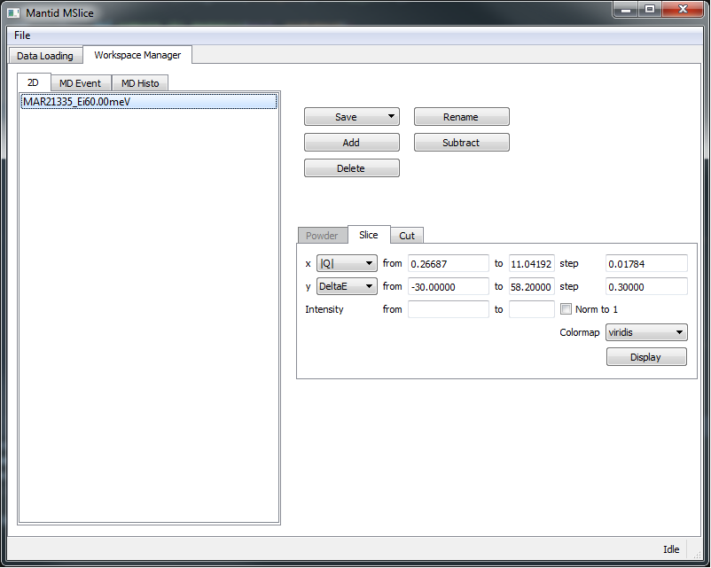
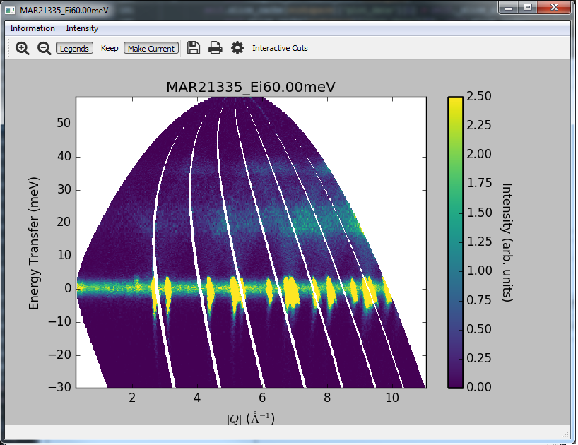
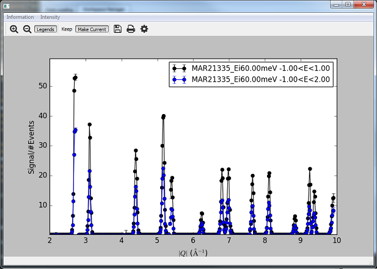

========================
Direct Inelastic Changes
========================

.. contents:: Table of Contents
   :local:

Interfaces
----------

New features
############

- The `MSlice <https://github.com/mantidproject/mslice>`_ user interface can now be launched from the MantidPlot Interfaces menu.

	

Similar to the slice viewer, MSlice plots slices and cuts from workspaces. It creates customisable publication quality figures. Cuts can be created interactively by dragging a rectangle across a slice, and information such as recoil lines and bragg peaks can be overplotted.

- The algorithms :ref:`algm-SofQWCentre`, :ref:`algm-SofQWPolygon` and :ref:`algm-SofQWNormalisedPolygon`, which rebin an inelastic workspace (has a `DeltaE` axis) from spectrum numbers (angle) to `MomentumTransfer` may now rebin the energy (`DeltaE`) axis as well as the :math:`|Q|` (`MomentumTransfer`) axes.
- :ref:`algm-SofQWNormalisedPolygon` now has uses a faster method for calculating the polygon intersections.
- The crystal field computation and fitting engine is now feature complete. It can now handle multi-site computation and simultaneous fitting of inelastic spectra and physical properties dataset. See the :ref:`Crystal Field Python Interface` help page for details, and `<http://www.mantidproject.org/Crystal_Field_Examples>`_ for examples of use.
- A new Python module :ref:`directtools <Directtools Python module>` includes utilities for plotting :math:`S(Q,W)` workspaces and cuts (line profiles) in constant :math:`Q` and :math:`E`.

Improvements
############
- PyChop has been updated with new look-up tables for the upgraded MAPS (with guide). Some minor bugs in PyChop have been fixed.
- TOFTOF data reduction GUI has been improved. In the new version it has options to delete intermediate workspaces, to replace NaNs in S(Q,W), to create diffractograms and to save the reduced data in NXSPE and NeXus format.
- :ref:`algm-MonitorEfficiencyCorUser` is not anymore restricted to TOFTOF instrument.

Crystal Field
-------------

New features
############

- The crystal field computation and fitting engine is now feature complete. It can now handle multi-site computation and simultaneous fitting of inelastic spectra and physical properties dataset. See the :ref:`Crystal Field Python Interface` help page for details, and `<http://www.mantidproject.org/Crystal_Field_Examples>`_ for examples of use.
- Multi-site calculations and fitting are now supported by the crystal field (Python commandline) interface.
- Calculation of dipole transition matrix elements has been added, together with the addition of a :math:`\chi_0` term in the :ref:`CrystalFieldSusceptibility <func-CrystalFieldSusceptibility>` function.

Bug fixes
#########

Several bugs in the Python and C++ code has been fixed - see the `github page <https://github.com/mantidproject/mantid/pull/21604>`_ for details.

Algorithms
----------

New features
############

- New algorithm :ref:`HyspecScharpfCorrection <algm-HyspecScharpfCorrection-v1>` that can be used to calculate spin incoherent scattering from polarized neutron data
- The algorithms :ref:`algm-SofQWCentre`, :ref:`algm-SofQWPolygon` and :ref:`algm-SofQWNormalisedPolygon`, which rebin an inelastic workspace (has a `DeltaE` axis) from spectrum numbers (angle) to `MomentumTransfer` may now rebin the energy (`DeltaE`) axis as well as the :math:`|Q|` (`MomentumTransfer`) axes.
- :ref:`algm-SofQWNormalisedPolygon` now has uses a faster method for calculating the polygon intersections.

Bug fixes
#########

- Fixed a bug in :ref:`algm-DirectILLApplySelfShielding` which could cause confusion among workspaces when the algorithm was run without both self shielding correction and empty container workspaces.
- A `bug <https://github.com/mantidproject/mantid/pull/20953>`_ in the handling of workspaces with fractional bin weights (generated by :ref:`algm-SofQWNormalisedPolygon`) has been fixed.

Instrument definitions
----------------------

- The MAPS instrument definition file dating back to 2017-06-03 was changed.

Features Removed
----------------

* The Direct Convert To Energy graphical interface has been removed, it had not been used for several years, and was a source of bugs as well as using testing effort that is better directed elsewhere.

`Full list of changes on GitHub <http://github.com/mantidproject/mantid/pulls?q=is%3Apr+milestone%3A%22Release+3.12%22+is%3Amerged+label%3A%22Component%3A+Direct+Inelastic%22>`_

:ref:`Release 3.12.0 <v3.12.0>`
