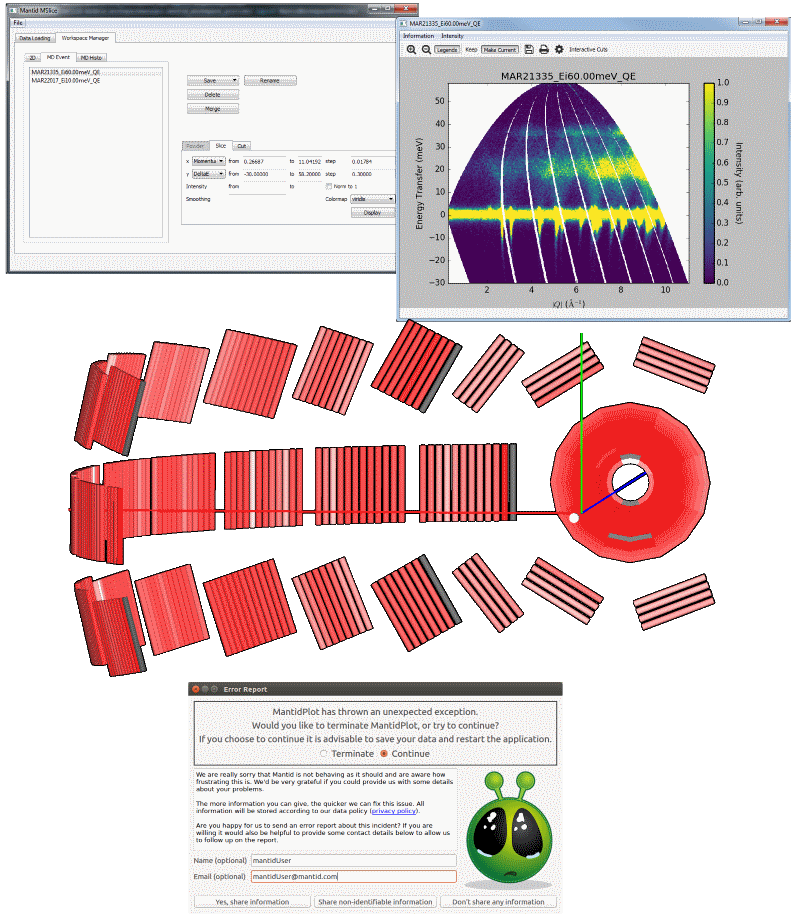

.. _v3.12.0:

===========================
Mantid 3.12.0 Release Notes
===========================

.. contents:: Table of Contents
   :local:

We are proud to announce version 3.12.0 of Mantid.

We have included the Mantid Mslice interface with this release for the first time, this alternative to the Dave or matlab variants has been developed separately  for some time, but has now been included with Mantid to make installation easier. 

This version of Mantid will also go live across 6 instruments at the ILL with the startup in March.  

We have also listened to your concerns about stability issues with previous releases during long experiments and have implemented error reporting into Mantidplot to capture information about crashes allowing us to quantify the problems and help track them down and resolve them.

These are just some of many improvements in this release, so please take a
look at the release notes, which are filled with details of the
important changes and improvements in many areas. The development team
has put a great effort into making all of these improvements within
Mantid, and we would like to thank all of our beta testers for their
time and effort helping us to make this another reliable version of Mantid.

Throughout the Mantid project we put a lot of effort into ensuring
Mantid is a robust and reliable product. Thank you to everyone that has
reported any issues to us. Please keep on reporting any problems you
have, or crashes that occur on our `forum`_.

Installation packages can be found on our `download page`_
which now links to sourceforge to mirror our download files around the world, you can also
access the source code on `GitHub release page`_.

Citation
--------

Please cite any usage of Mantid as follows:

- *Mantid 3.12.0: Manipulation and Analysis Toolkit for Instrument Data.; Mantid Project*. `doi: 10.5286/SOFTWARE/MANTID3.12.0 <http://dx.doi.org/10.5286/SOFTWARE/MANTID3.12.0>`_

- Arnold, O. et al. *Mantid-Data Analysis and Visualization Package for Neutron Scattering and mu-SR Experiments.* Nuclear Instruments and Methods in Physics Research Section A: Accelerators, Spectrometers, Detectors and Associated Equipment 764 (2014): 156-166 `doi: 10.1016/j.nima.2014.07.029 <https://doi.org/10.1016/j.nima.2014.07.029>`_ (`download bibtex <https://raw.githubusercontent.com/mantidproject/mantid/master/docs/source/mantid.bib>`_)

Changes
-------

.. toctree::
   :titlesonly:

   Framework <framework>
   User Interface & Usability <ui>
   Diffraction <diffraction>
   Muon Analysis <muon>
   Reflectometry <reflectometry>
   SANS <sans>
   Direct Inelastic <direct_inelastic>
   Indirect Inelastic <indirect_inelastic>

Full Change Listings
--------------------

For a full list of all issues addressed during this release please see the `GitHub milestone`_.

.. _download page: http://download.mantidproject.org

.. _forum: http://forum.mantidproject.org

.. _GitHub milestone: http://github.com/mantidproject/mantid/pulls?utf8=%E2%9C%93&q=is%3Apr+milestone%3A"Release+3.12"+is%3Amerged

.. _GitHub release page: https://github.com/mantidproject/mantid/releases/tag/v3.12.0
