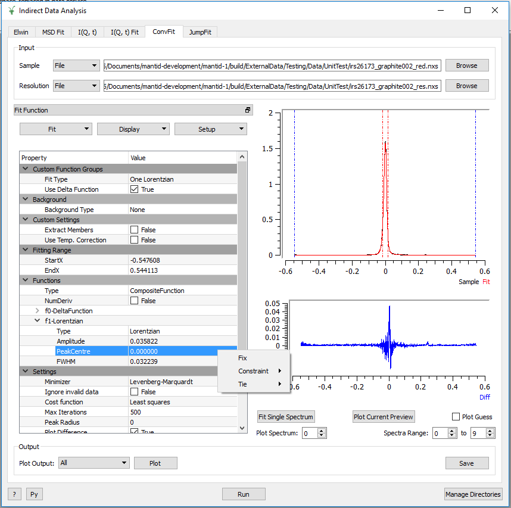
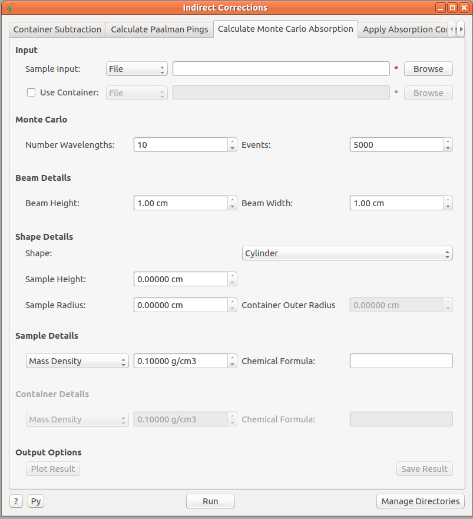

==========================
Indirect Inelastic Changes
==========================

.. contents:: Table of Contents
   :local:

Vesuvio
-------

New
###
- Cumulative Angle-Averaged Data (sum of fits normalised by their integral) can be calculated and produced as output by setting the *calculate_caad* flag to True.

Improved
########
- A pre-loaded runs workspace can now be passed to the fit_tof VESUVIO routine, which will skip the loading subroutine, given this input.
- Loading the sample log files into a workspace can be disabled within a Vesuvio Driver Script, by setting the *load_log_files* flag to False.

Bugfixes
########
- Previously, running a script which only applied a single correction (e.g. container subtraction), would produce an error *f0.Scaling*, this has now been fixed.

Data Analysis Interfaces
------------------------

New
###
- ConvFit, IqtFit, MSDFit and JumpFit now have a second mini-plot for the difference. The sample and calculated fit are found in the top mini-plot, the difference is found in the bottom mini-plot.
- The function browser in each of the Fitting tabs (ConvFit, IqtFit, MSDFit, JumpFit) has been replaced with a new IndirectFitPropertyBrowser widget (which can be separated and embedded into the fit interfaces).

   The new design of the Indirect Fitting tabs, shown here within ConvFit (the IndirectFitPropertyBrowser is seen on the left and can be ejected into a separate window).

- The IndirectFitPropertyBrowser widget provides the following additional functionality to the Indirect Fit Interfaces (MSDFit, IqtFit, ConvFit, JumpFit):

  * Ties can now be used to tie parameters between all functions and custom ties (involving mathematical expressions) are now available.
  * It is now possible to add constraints to parameters.
  * Any additional functions can be added from the library of available MANTID functions by right-clicking on *Functions* in the browser and selecting *Add Function*.
  * Function setups can now be saved and re-loaded (Custom Setups) from the *Setup* menu.
  * Functions can be copied and loaded from the clipboard.
  * Right-clicking on any function in the browser and selecting *Help* will open a window containing the documentation for that function.
  * The guess can be plot in a separate window from the interface (automatically updates as the fit model is changed), accessible through the *Display* menu.

Improved
########
- The Plot Guess Feature in the ConvFit Interface is now enabled for the diffusion functions.
- The Plot Guess Feature in the MSDFit Interface is now implemented for the three models introduced in release v3.11 (MsdGauss, MsdPeters and MsdYi).
- The ExtractMembers option in the ConvFit Interface will now function correctly for diffusion functions.
- The ExtractMembers option is now available in the IqtFit interface.
- The parameter ties created by the *Constrain Intensities* option in the IqtFit interface, are now shown in the function browser.
- 'Plot Current Preview' plots input if a fit has yet to be calculated and is disabled if no input workspace has been provided.

Bugfixes
########
- The X-Limits for all of the Indirect Data Analysis interfaces are now correctly updated when data is loaded.
- In the IqtFit interface, the *AO* parameter now defaults to 0.
- The mini preview plot now updates correctly in the Indirect Data Analysis interfaces, when the fit function is changed; when changed to a function that wasn't used in the most recent fit, will plot only the sample, else will plot the sample, fit and difference.
- Plotting individual parameters of the fit in the interface (*Plot Options*), will no longer produce an error in the ConvFit interface, when plotting *FWHM*.
- Entering bad values for ELow/EHigh on the Iqt interface no longer produces an unhandled exception error.

Diffraction
-----------

Improved
########
- Manual D-Range option removed from the indirect diffraction reduction interface; D-Ranges are now automatically calculated for sample, container and vanadium runs.

Corrections Interfaces
----------------------

Improved
########
- The Apply Paalman Pings interface has been renamed to Apply Absorption Correction.
- The Apply Absorption Correction interface no longer requires workspaces to be in units of wavelength (this is done within :ref:`algm-ApplyPaalmanPingsCorrection`).
- Calculate Monte Carlo Absorption interface has been restructured in a more appropriate format, as outlined in the following image:

- Result plotting in the Calculate Monte Carlo Absorption interface is now the same as that in Apply Absorption Correction; ability to select whether to plot result in Wavelength, Angle or Both.

Bugfixes
########
- In the Calculate Paalman Pings tab of the Indirect Correction interface the container back thickness is now set correctly.
- Fixed an issue where the *Plot Current Preview* option in the Container Subtraction and Apply Paalman Pings interfaces would not plot the transformed container or result.
- Fixed the inconsistent naming styles of the Calculate Paalman Pings and Calculate Monte Carlo Absorption interfaces.

Abins
-----

Improved
########
- Performance of Abins rebinning routines significantly improved (a factor of 10-20 times for data size of 4000).

Algorithms
----------

New
###

- :ref:`algm-ExtractQENSMembers` can be used to extract the fit members from any QENS fit.
- New algorithm :ref:`BASISDiffraction <algm-BASISDiffraction-v1>` to determine the orientation of crystal samples for the BASIS beamline.

Improved
########

- :ref:`algm-ApplyPaalmanPingsCorrection` now accepts a corrections group containing only an :math:`A_{s,s}` and an :math:`A_{c,c}` workspace (produced by :ref:`algm-CalculateMonteCarloAbsorption`).
- :ref:`BASISReduction  <algm-BASISReduction>` now permits the user to exclude a contiguous time segment from the reduction process.
- :ref:`BASISReduction <algm-BASISReduction>` option *noMonitorNorm* changed to *MonitorNorm*.
- :ref:`BASISReduction <algm-BASISReduction>` now contains log entry *asString* storing the options passed to to the algorithm.
- :ref:`IqtFitSequential <algm-IqtFitSequential>` and :ref:`IqtFitMultiple <algm-IqtFitMultiple>` can now both extract members from the fit (when the ExtractMembers property is set to True).
- Loading the sample log files into a workspace can be disabled when calling the :ref:`LoadVesuvio <algm-LoadVesuvio>` algorithm by supplying *LoadLogFiles=False* to the algorithm call
- :ref:`OSIRISDiffractionReduction <algm-OSIRISDiffractionReduction>` no longer has options *DetectDRange* and *DRange*, D-Ranges are now always calculated automatically within the algorithm.

:ref:`Release 3.12.0 <v3.12.0>`
