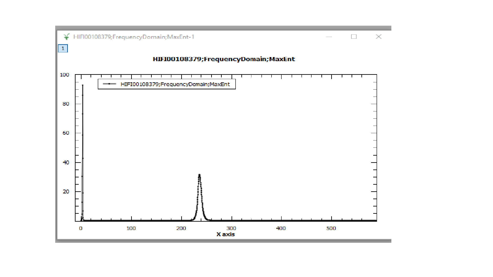

============
MuSR Changes
============

.. contents:: Table of Contents
   :local:

Bug Fixes
---------
- :ref:`CalMuonDetectorPhases <algm-CalMuonDetectorPhases>` has had the sign of the phase shift changed, this produces data with a positive frequency spike as expected.
- Log values are no longer filtered by start time when loaded into muon analysis.

Interface
---------
- Added a cancel button to the MaxEnt widget in Frequency Domain Analysis.
- Added checkboxes for "add all pairs" and "add all groups" to the settings tab.
- The data plot style in the settings tab of Muon Analysis, only alters the plot range. It no longer crops the data.
- Results table in Muon Analysis now sets relevant columns to numeric.
- The period display no longer becomes blank when changing the period selection in multiple fitting mode.
- The group/pair selection in Muon Analysis no longer resets when changing tabs or loading data.
- The Frequency Domain Analysis GUI now uses :ref:`CalMuonDetectorPhases <algm-CalMuonDetectorPhases>` to create the phase table for PhaseQuad FFTs.
- The Frequency Domain Analysis GUI now uses :ref:`MuonMaxent <algm-MuonMaxent>` to calculate the frequency spectrum in MaxEnt mode.  
- The ALC interface now allows background sections with negative values.
- If data is loaded with 0 good frames into Muon Analysis then it will try to load the data without dead time correction (does not need number of good frames).
- Muon analysis no longer disables the "co add" and "simultaneous" buttons in the multiple fitting interface.
- Frequency domain analysis will reload the data if the active workspace has changed.
- Muon analysis no longer crashes when using the browse button in sequential fitting.
- The period summation/subtraction can now be used in multiple fitting. 
- Muon analysis now handles the "auto background" gracefully in single and multiple fitting modes.
- We have disabled some non functional graph right click context menu items or adding functions when in multi data fitting mode, in the Data Analysis tab of the Muon Analysis Interface.

Algorithms
----------
- :ref:`MuonProcess <algm-MuonProcess>` now has a flag to determine if to crop the input workspace (default is true). In the Muon Analysis interface this flag has been set to false.
- :ref:`MuonMaxent <algm-MuonMaxent>` calculates a single frequency spectrum from multiple time domain spectra.
-  :ref:`EstimateMuonAsymmetryFromCounts <algm-EstimateMuonAsymmetryFromCounts-v1>`: if the number of good frames is zero, then a value of 1 is assumed for the number of good frames.

:ref:`Release 3.12.0 <v3.12.0>`
