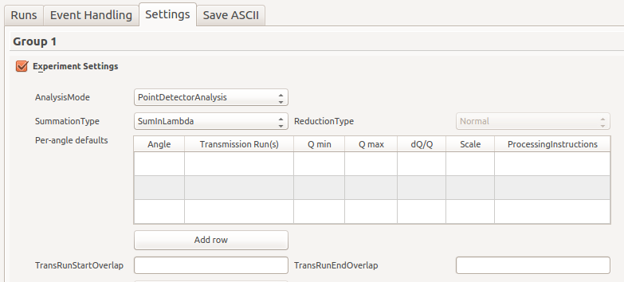

=====================
Reflectometry Changes
=====================

.. contents:: Table of Contents
   :local:

ISIS Reflectometry Interface
----------------------------

New features
############

   New table to specify settings on a per-angle basis

- The following new options have been added to the Settings tab:

  - A new table has been added to the Experiment settings which allows default options to be specified on a per-angle basis. If a row in the Runs tab contains an angle, it will be looked up in this table and those options will be used if a matching angle is found (the angle does not have to be exact as it will match to within 100th of a degree). If you want to specify values that will be used by default for all runs, then simply leave the angle empty.
    
  - Two new drop-down boxes have been added to the Experiment settings, 'ReductionType' and 'SummationType', which are passed to the corresponding parameters of :ref:`algm-ReflectometryReductionOneAuto`.

  - A 'CorrectDetectors' check box has been added to the Instrument settings, which maps to the corresponding property in :ref:`algm-ReflectometryReductionOneAuto`.

- The 'Get Defaults' button now looks for values for the following additional properties in the IDF:
  
  - AnalysisMode
  - PolarizationAnalysis
  - TransRunStartOverlap
  - TransRunEndOverlap
  - IntegratedMonitors
  - DetectorCorrectionType
  - CorrectDetectors
  - SummationType
  - ReductionType

Improvements
############

- Output workspace names and plotting:
  
  - Output workspace names now use ``+`` to indicate preprocessed (i.e. summed) workspaces, rather than ``_``, which is used to indicate postprocessed (i.e. stitched) workspaces.
  - Output workspace names for time sliced data now contain the time periods, rather than just a slice index number.
  - Plotting results in event handling mode now plots the ``IvsQ_binned_`` workspaces rather than ``IvsQ_``, to make the behaviour consistent with non-event mode.
  - The Python code generated when you tick ``Output Notebook`` has been improved to support special characters (e.g. ``+``) in workspace names.
  - The ``Output Notebook`` option now works for all groups that are processed as non-event workspaces. Previously, if event handling was enabled but a group contained non-event workspaces, generating the notebook was not performed.
    
- Properties on the Runs tab now take precedence over properties on the Settings tab.
  
- Extra tooltips have been added along with a new ``?`` button which links to the documentation page.
  
- The runs tab table now contains grid lines to make it easier to see where to enter text.
  
- Menu items and toolbar buttons are now enabled/disabled when appropriate, e.g. to prevent table modification during processing. Directly editing table rows and settings is also disabled during processing.
  
- The 'DirectBeam' box has been from the settings tab because this is not used.

Bug fixes
#########

- Fixed some bugs where transmission runs entered on the Settings tab were not being found, whether entered as a run number to load or as the name of an existing workspace in the ADS.
  
- The Python code generated when you tick ``Output Notebook`` has been changed so that all algorithm property values are enclosed in quotes. Unquoted values were causing failures in some algorithms. A bug has also been fixed in setting the legend location for the 4th (stitched) plot, which is shown when post-processing is performed.
  
- If any of the mandatory parameters listed below are missing when pressing 'Get Default' a warning is shown rather than a crash.

  - MonitorIntegralMax
  - MonitorIntegralMin
  - MonitorBackgroundMin,
  - MonitorBackgroundMax,
  - LambdaMin,
  - LambdaMax,
  - I0MonitorIndex
  - TransRunStartOverlap and TransRunEndOverlap if on SURF or CRISP.

- Fixed a bug where the processed state of rows was being reset when transferring additional rows into the table.

Features Removed
################

* The REFL Reduction, REFL SF Calculator and REFM Reduction graphical interface have been removed, they were not in active use, and were a source of bugs as well as using testing effort that is better directed elsewhere.

Algorithms
----------

New features
############

- The new algorithm :ref:`algm-PolarizationEfficiencyCor` corrects for efficiencies in polarization analysis.
- The new algorithm :ref:`algm-LoadILLPolarizationFactors` can load the polarization efficiency files used on D17 at ILL.
- The new algorithm :ref:`algm-MRInspectData` takes in raw event data and determines reduction parameters.
- The new algorithm :ref:`algm-MRFilterCrossSections` loads a MR (SNS) data file into a workspace group comprising of a workspace for each cross-section.

Improvements
############

- Improvements to :ref:`algm-LoadILLReflectometry`:

  - Figaro NeXus files are now properly handled.
  - A new property, *BeamCentre* allows user to manually specify the beam position on the detector.
  - The *BeamPosition* property was renamed to *DirectBeamPosition* to better reflect its usage.
  - The *BraggAngle* property of :ref:`algm-LoadILLReflectometry` now works as expected: the detector will be rotated such that the reflected peak on the detector will be at twice *BraggAngle*.
  - Slits S2 and S3 have been added to D17 and Figaro IDFs; the loader will adjust their positions according to the NeXus files.
  - The MagnetismReflectometryReduction now computes a Q-resolution estimate based on slit openings.

- Removed the ``RegionOfDirectBeam`` property from :ref:`algm-ReflectometryReductionOne` and :ref:`algm-ReflectometryReductionOneAuto` because this is not used.

Bug fixes
#########

:ref:`Release 3.12.0 <v3.12.0>`
