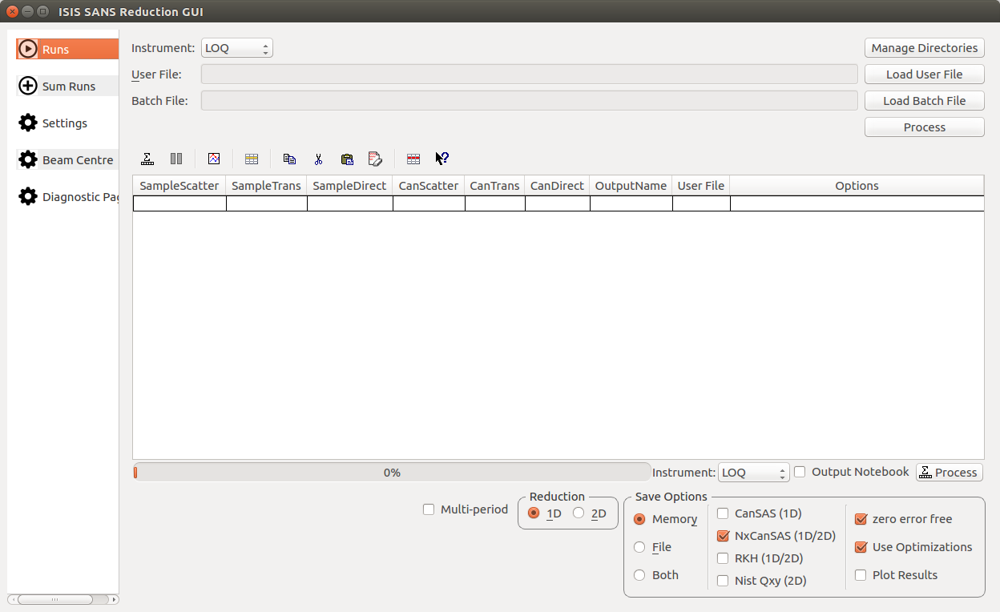

============
SANS Changes
============

.. contents:: Table of Contents
   :local:

ILL SANS
--------

Improvements
############

- Minor changes of the D33 instrument definition file, e.g. detector indexing.
- New instrument definition file for the D22 instrument
- New instrument definition file for the D11 instrument

ISIS SANS
---------

New features
############
- BeamCentreFinder has been implemented to work with the new backend in the python script window.
- Added find beam centre tab to Isis Gui v2.
- Added Sum runs tab to Isis Gui v2.
- Added Diagnostic tab to Isis Gui v2.

Improvements
############
- Added functionality to specify q values between which to merge.
- Grid lines are now displayed in Isis Gui v2.
- Added the option to hide the period selection columns in the Isis Gui v2.
- Have added the functionality to show diagnostic transmission workspaces to Isis Gui v2.
- Have added functionality to continually plot latest results to Isis Gui v2.
- Added more prominent instrument selection and process buttons to Isis Gui v2.
- Added manage directories button to Isis Gui v2.
- Added link to documentation at the bottom left of Isis Gui v2.

Bug fixes
#########

- Fixed a bug in the new Isis backend where merged or all reductions were overwriting each other as they were being given the same name.
- Fixed a bug where specifying fit range was not working for merged reductions. Previously the user specified range was being ignored.
- Fixed a bug in the old GUI where loading files on UNIX systems would not work unless the file name was in uppercase letters.
- Fixed a bug in the old GUI where merged reductions of time sliced data was not working.
- Fixed a bug in the old GUI where 2D reductions were being run in 1D if a new user file was specified in a batch file.
- Fixed a bug in Isis Gui v2 whereby the sum runs script was not working for ZOOM.

Deprecation
###########
- As an advance warning we plan to remove the 1D Analysis tab from the old Gui for the next release.

:ref:`Release 3.12.0 <v3.12.0>`
