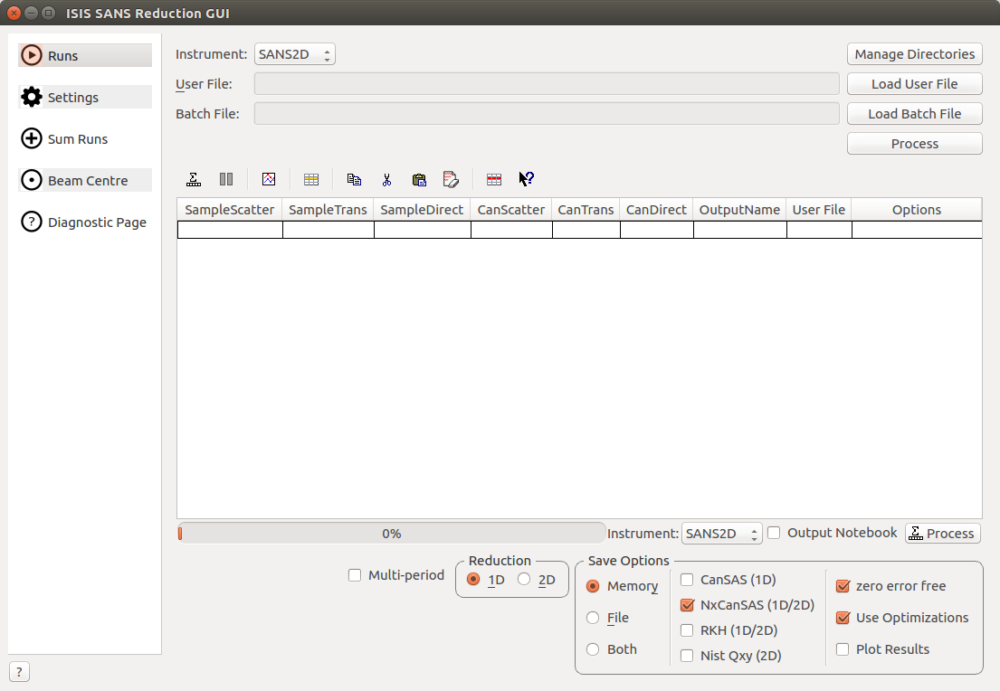

============
SANS Changes
============

.. contents:: Table of Contents
   :local:

ILL SANS
--------

- Minor changes of the D33 instrument definition file, e.g. detector indexing.
- New instrument definition file for the D22 instrument
- New instrument definition file for the D11 instrument

ISIS SANS
---------

New features
############
- BeamCentreFinder has been implemented to work with the new backend in the python script window.
- Added find beam centre tab to SANS GUI V2.
- Added Sum runs tab to SANS GUI V2.
- Added Diagnostic tab to SANS GUI V2.

Improvements
############
- Added functionality to specify q values between which to merge.
- Grid lines are now displayed in ISIS SANS V2
- Added the option to hide the period selection columns in the SANS GUI V2
- Have added the functionality to show diagnostic transmission workspaces to new GUI.
- Have added functionality to continually plot latest results to new GUI.
- Added more prominent instrument selection and process buttons.
- Added manage directories button.

Bug fixes
#########

- Fixed an bug where merged or all reductions were overwriting each other as they were being given the same name.
- Fixed a bug where specifying fit range was not working for merged reductions. Previously the user specified range was being ignored.
- Fixed a bug in the old GUI where loading files on UNIX systems would not work unless the file name was in uppercase letters.
- Fixed a bug in the old GUI where merged reductions of time sliced data was not working.
- Fixed a bug where 2D reductions were being run in 1D if a new user file was specified in a batch file.
- Fixed a bug whereby sum runs was not working for ZOOM.

:ref:`Release 3.12.0 <v3.12.0>`
