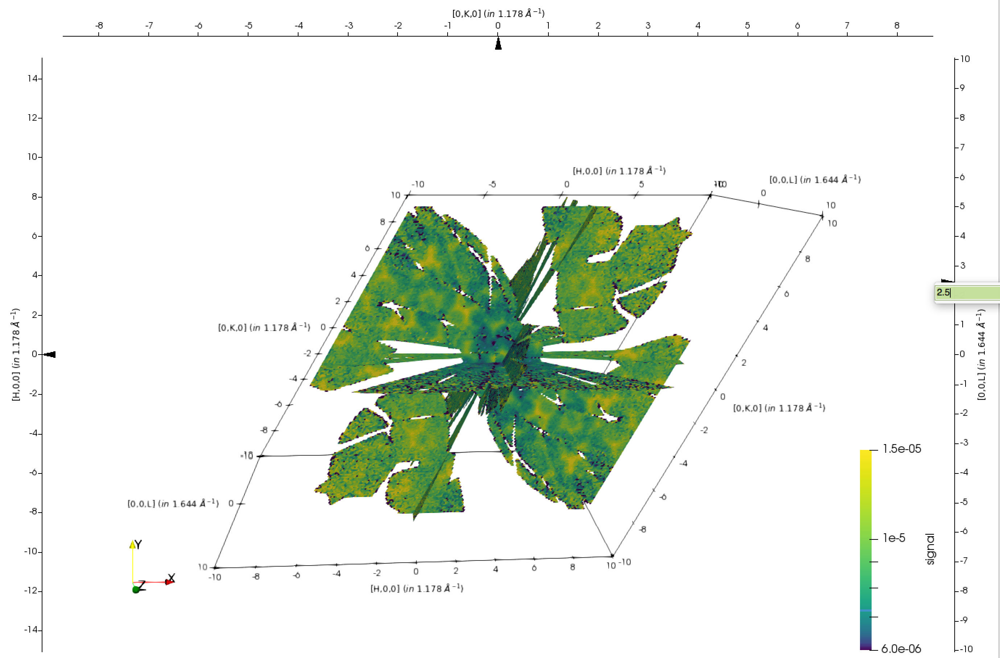
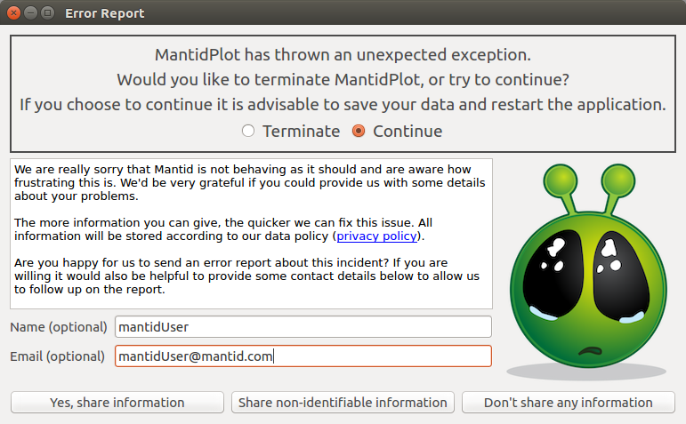

======================
UI & Usability Changes
======================

.. contents:: Table of Contents
   :local:

General
-------
- Added :mod:`mantid.plots` to provide convenience functions for plotting mantid workspaces with matplotlib.
  An example :ref:`gallery <plotting>` is available.
- Fixed a bug where MantidPlot could freeze when performing a long running search for files.
- Fixed a bug where MantidPlot would crash if the sample log fields used for run start and end contained non-ISO8601 conforming values.
- Fixed an issue where updating a workspace changes the number format from decimal to scientific notation if the workspace is being viewed.

SliceViewer and Vates Simple Interface
--------------------------------------

- Update SwitchToSliceViewer (shift + click) in MultiSlice view to work with nonorthogonal axes.
- Pressing alt while clicking an arrow in the MultiSlice view opens a text box where one may precisely enter the slice position.
- Peaks can now be added in the SliceViewer in MDWorkspace in QLab and QSample frames as well as HKL.
- Users can now sort by the I/sigma and energy columns in the SliceViewer when viewing a peaks workspace.
- Fixed bug which would cause slice viewer to crash when deleting an overlaid peaks workspace.
- Fixed a bug where overwriting peaks workspaces with overlaid in the slice viewer with peak backgrounds shown cause Mantid to crash.
- Fixed an issue preventing sorting of the VSI peaks table.

MultiDataset Fitting Interface
------------------------------

- After a simultaneous fit the parameters are saved in a TableWorkspace made to simplify plotting their values against the datasets.
  The parameters are organised into columns and each row corresponds to a dataset.
- Changed the behaviour of the exported graphs: on fit re-runs they update instead of closing.

SpectrumView
------------

- The SpectrumView is now available as a standalone widget in mantidpython. Below is a simple example of how the widget can be used in python.

.. code-block:: python
   :emphasize-lines: 11,12

   import PyQt4
   import mantid.simpleapi as simpleapi
   import mantidqtpython as mpy
   import sys

   SpectrumView = mpy.MantidQt.SpectrumView.SpectrumView
   app = PyQt4.QtGui.QApplication(sys.argv)

   wsOut = simpleapi.Load("/Path/to/multispectrum/dataset")

   sv = SpectrumView()
   sv.renderWorkspace("wsOut")
   sv.show()
   app.exec_()

HFIR HB3A Interface
-------------------

- Various issues reported from users have been fixed.  These issues include
  * How to define, modify and delete region of interest on 2D image.
  * User-specified wave length is not reflected to UB matrix calculation table.
  * Peak integration report window cannot be launched.
- User can load back previously saved region of interest.
- UI sets up default value of scale factor related to normalization type.
- User can choose to save peak intensities in Fullprof in  (3i4,2f8.2,i4) or (3i4,2f18.5,i4).
- The 'Max Counts' in survey tab is now normalized by counting time.
- In scans processing tab, the column name of corrected will be changed to 'F2;'Error' will be modified to 'F2 Error'.

Error Reporting
---------------

Error reporting has been enabled in place of the new last chance error handler. If Mantid catches an unknown exception it will now display the dialog box below. Currently there is no automatic error reporting enabled if Mantid crashes to desktop but the same system is planned to be implemented in this case as well.

The three options do the following:

**Don't share any information**

The dialog box will close having sent no information. Mantid will either continue or terminate depending on which option has been selected at the top of the dialog.

**Share non-identifiable information**

An error report will be sent to errorreports.mantidproject.org. It will contain the following information:
 
- Operating System including version.
- Mantid version including git Sha1.
- System architecture.
- The date and time at which the crash occured.
- The mantid application you were using, currently this will always be mantidplot.
- The default facility you have set.
- The paraview version.
- The amount of time mantid was running prior to the crash.
- A hashed user id and a hashed host id.

**Yes, share information**

All the information from the non-identifiable information will be shared. In addition the optional name and email will be shared if given.

Full details of the privacy policy are available `from the homepage <https://www.mantidproject.org/MantidProject:Privacy_policy>`_.

:ref:`Release 3.12.0 <v3.12.0>`
