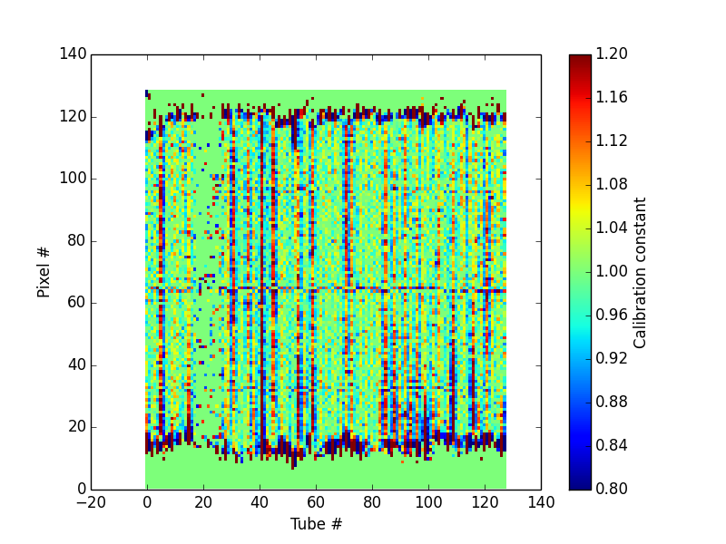
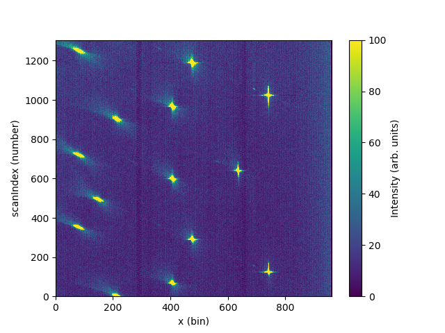

===================
Diffraction Changes
===================

.. contents:: Table of Contents
   :local:

:ref:`Release 3.13.0 <v3.13.0>`

Powder Diffraction
------------------

New
###

    D2B calibration constants generated from **PowderDiffILLDetEffCorr**.

- :ref:`LoadILLDiffraction <algm-LoadILLDiffraction>` is extended to apply vertical and horizontal tube alignment for D2B, based on the IPF.
- :ref:`LoadILLDiffraction <algm-LoadILLDiffraction>` is modified to comply with the U-shape convention for tube numbering for D2B.
- **PowderDiffILLDetEffCorr** is extended to compute the detector efficiencies also for the 2-dimensional scanning diffractometer D2B at the ILL.
- **PowderDiffILLDetEffCorr** is extended to provide automatic masking of the pixels with spurious calibration constants.
- **PowderDiffILLDetEffCorr** will now ignore the last scan point data, if some of the input files have 26 points, instead of 25.
- **PowderDiffILLDetScanReduction** is extended to provide initial masking of the top and bottom parts of the tubes, and final masking of the 2D outputs.
- :ref:`WANDPowderReduction <algm-WANDPowderReduction>` performs powder diffraction data reduction for WAND² with calibration, monitor normalisation and background subtraction.
- New NOMAD instrument geometry for 2018 run cycle
- New POWGEN instrument geometry for 2018 run cycle
- New SNAP instrument geometry for 2018 run cycle with configuration for live data

Improvements
############

- Changing settings while running methods on the PEARL object no
  longer updates the default settings. Instead, initial settings are
  taken as the default, and any changes are reverted back to the
  default once the line they were made on has finished executing
- Focusing in texture-mode (160 banks) was enabled for GEM. The output
  is saved to several formats:

  - The three-column ``.gem`` format
  - The ``.maud`` calibration file format, for conversion to d-spacing (uses a new algorithm
    :ref:`SaveGEMMAUDParamFile <algm-SaveGEMMAUDParamFile>`
- :ref:`PDCalibration <algm-PDCalibration>` has major upgrades including making use of :ref:`FitPeaks <algm-FitPeaks>` for the individual peak fitting
- :ref:`StripPeaks <algm-StripPeaks>` has been adjusted to allow for removing peaks that have only 3 bins across them (decreased from 5 bins)
- :ref:`AlignAndFocusPowder <algm-AlignAndFocusPowder>` had a bug when binning in time-of-flight without using a property manager to specify the time-of-flight range. In other words: characterization files are no longer necessary.

Engineering Diffraction
-----------------------

Improvements
############

- Improvements to the GSAS tab:

  - GSASIIRefineFitPeaks is now run asynchronously in the GUI, so the
    tab no longer locks when a refinement is run
  - A **Refine All** button was added to run refinement on every run
    loaded into the tab

- :ref:`GSASIIRefineFitPeaks <algm-GSASIIRefineFitPeaks>` now supports Pawley refinement as well as Rietveld
- HDF5 is now the standard format for saving data from the GUI:

  - Single peak fitting output is now saved as HDF5 instead of CSV,
    using :ref:`EnggSaveSinglePeakFitResultsToHDF5
    <algm-EnggSaveSinglePeakFitResultsToHDF5>`. The algorithm
    previously used for saving to CSV, **SaveDiffFittingAscii**, has
    been deprecated
  - Fit results and parameters are saved to HDF5 from the **GSAS
    Refinement** tab using :ref:`EnggSaveGSASIIFitResultsToHDF5
    <algm-EnggSaveGSASIIFitResultsToHDF5>`
  - After focusing, workspace sample logs are saved to HDF5 using
    :ref:`ExportSampleLogsToHDF5 <algm-ExportSampleLogsToHDF5>`

- The ``.nxs`` file from the Focus tab is now saved in the Focus directory with all the other focus output

Single Crystal Diffraction
--------------------------

New
###

    Integrated output from LoadWANDSCD :ref:`LoadDNSSCD <algm-LoadWANDSCD-v1>`

- New algorithm :ref:`LoadDNSSCD <algm-LoadDNSSCD>` to load multiple single crystal diffraction data files from the DNS instrument into MDEventWorkspace.

- New algorithms :ref:`LoadWANDSCD <algm-LoadWANDSCD>` and :ref:`ConvertWANDSCDtoQ <algm-ConvertWANDSCDtoQ>` to load single crystal HB2C data and convert it to either Q-sample or HKL space.

- New algorithm :ref:`IntegratePeaksProfileFitting <algm-IntegratePeaksProfileFitting>` to integrate peaks using 3D profile fitting in reciprocal space.

- New algorithm :ref:`FindSatellitePeaks <algm-FindSatellitePeaks>` to predict the location of fractional satellite peaks using a set of nuclear peaks and a set of seed satellite peaks.

- New algorithm :ref:`IndexSatellitePeaks <algm-IndexSatellitePeaks>` to index satellite peaks found using the :ref:`FindSatellitePeaks <algm-FindSatellitePeaks>` algorithm.

- :ref:`SaveLauenorm <algm-SaveLauenorm>` now has input options for crystal system and reflection condition for lscale output instead of trying to determine from lattice parameters.

- New TOPAZ instrument geometry for 2018 run cycle

Improvements
############

- :ref:`CreatePeaksWorkspace <algm-CreatePeaksWorkspace>` now accepts MD workspaces as input.

- PeaksWorkspace has column added for the unique peak number so peaks can be found after sorting or filtering.

- :ref:`StatisticsOfPeaksWorkspace <algm-StatisticsOfPeaksWorkspace>` has option to use a weighted Z score for determining which peaks are outliers and has a new output workspace for plotting intensities of equivalent peaks.
