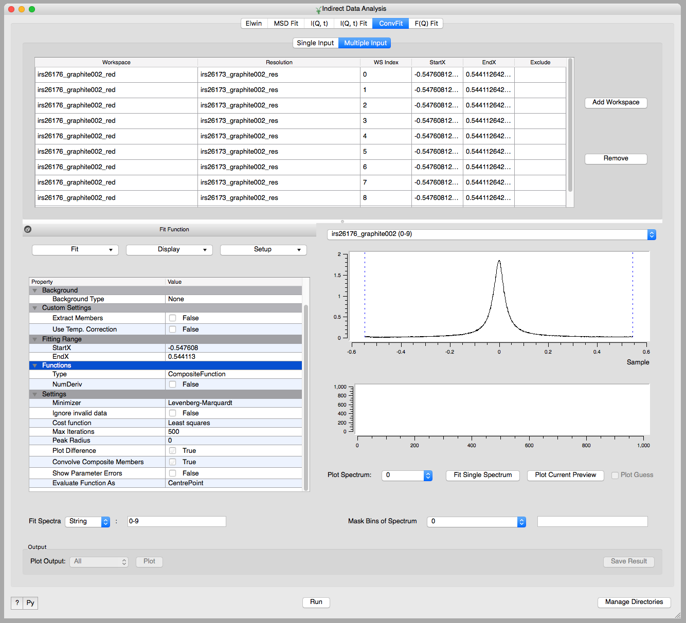

==========================
Indirect Inelastic Changes
==========================

.. contents:: Table of Contents
   :local:

:ref:`Release 3.13.0 <v3.13.0>`

Data Reduction Interfaces
-------------------------

Improvements
############

- Added 'Sum Files' checkbox to ISIS Calibration, to sum a specified range of input files on load.
- Detector grouping in ISISEnergyTransfer:  added custom grouping method to allow specific spectra or ranges, and
  the 'groups' method now includes all spectra including remainder.

Algorithms
----------

New
###

- :ref:`algm-QENSFitSequential` can be used to perform a general QENS sequential fit, in addition providing the
  functionality to fit across multiple datasets.
- :ref:`algm-QENSFitSimultaneous` can be used to perform a general QENS simultaneous fit, including across multiple
  datasets.
- :ref:`algm-ConvolutionFitSimultaneous` can be used to perform a QENS simultaneous fit over a convoluted model.
- :ref:`algm-IqtFitSimultaneous` can be used to perform a QENS simultaneous fit over I(Q,t) data.

Improvements
############

- :ref:`algm-ConvolutionFitSequential` and :ref:`algm-IqtFitSequential` can now accept multiple datasets as input, in
  the same format as that of :ref:`algm-PlotPeakByLogValue`.
- :ref:`algm-IndirectILLEnergyTransfer` was fixed to have the correct sign for the energy transfer.
- :ref:`algm-TransformToIqt` now calculates errors using a monte carlo method, and can take a number of iterations as input.

Data Analysis Interfaces
------------------------

    The ConvFit interface with the new multiple input section.

New
###

- The MSDFit, IqtFit and ConvFit interfaces now allow selection of discontinuous spectra ranges and masking energy
  ranges.
- The JumpFit interface now allows masking of energy ranges.
- The QENS Fitting interfaces can now be provided multiple data-sets as input -- these data-sets can be viewed
  individually within the interface (plot, fit result, etc.)

Improved
########

- A number of iterations for the new monte carlo error calculation can be specified in the I(Q,t) interface.

Bugfixes
########

- The MSDFit algorithm now uses the fully specified model given in the interface; previously MSDFit only used the
  model specified in the 'Fit Type' drop-down menu.
- Fixed a failure in the wavelength interpolation of :ref:`MonteCarloAbsorption <algm-MonteCarloAbsorption>` which occurred under certain input property combinations.

