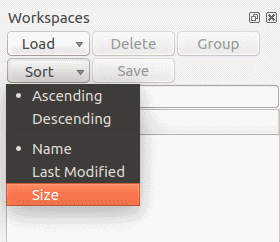
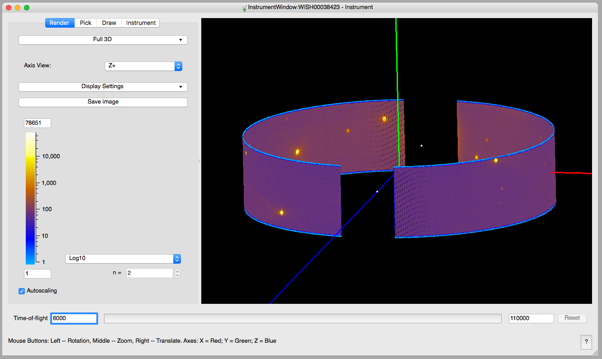

======================
UI & Usability Changes
======================

.. contents:: Table of Contents
   :local:

:ref:`Release 3.13.0 <v3.13.0>`

MantidPlot
----------

- MantidPlot's pyplot API has been removed.

Improvements
############

- Added functionality to sort based on Memory Size of the workspace

Bugfixes
########

- A bug in the load dialog where bad filename input would cause the last file to be loaded has been fixed.
- Fix crash when starting the Mantid VSI on MacOS.

Instrument View
---------------

Improvements
############

    The instrument view showing data from WISH.

The `Instrument View
<https://www.mantidproject.org/MantidPlot:_Instrument_View>`__ visualization
tool in Mantid has undergone some major changes under-the-hood which has
resulted in a smoother, more responsive interface.  Instruments generally load
faster as well. Below are a few noteworthy improvements to load times:

+------------+-----------+
| Instrument | Speedup   |
+============+===========+
| WISH       | 5x        |
+------------+-----------+
| BASIS      | 5x        |
+------------+-----------+
| GEM        | 4x        |
+------------+-----------+
| SANS2D     | 3x        |
+------------+-----------+
| POLARIS    | 3x        |
+------------+-----------+
| CNCS       | 2x        |
+------------+-----------+

Tested on Windows 10.

SliceViewer
-----------

Improvements
############

- A peaks workspace can now be overlaid on the slice viewer when the non-orthogonal view is displayed.

.. figure:: ../../images/NonOrthogonalPeaksSV.png
   :class: screenshot
   :align: center
   :figwidth: 70%

DGS Planner
-----------

New
###

- DGSPlanner has an option to load the UB matrix from the Nexus file metadata
