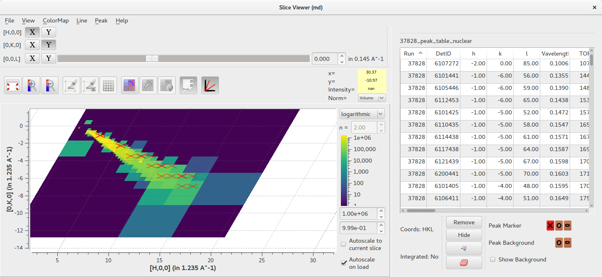

======================
UI & Usability Changes
======================

.. contents:: Table of Contents
   :local:

.. warning:: **Developers:** Sort changes under appropriate heading
    putting new features at the top of the section, followed by
    improvements, followed by bug fixes.

:ref:`Release 3.13.0 <v3.13.0>`

MantidPlot
----------

- MantidPlot's pyplot API has been removed.

Bugfixes
########

- A bug in the load dialog where bad filename input would cause the last file to be loaded has been fixed.
- Fix crash when starting the Mantid VSI on MacOS.

SliceViewer
-----------

- A peaks workspace can now be overlayed on the slice viewer when the non-orthogonal view is displayed.

DGS Planner
-----------

- DGSPlanner has an option to load the UB matrix from the Nexus file metadata
