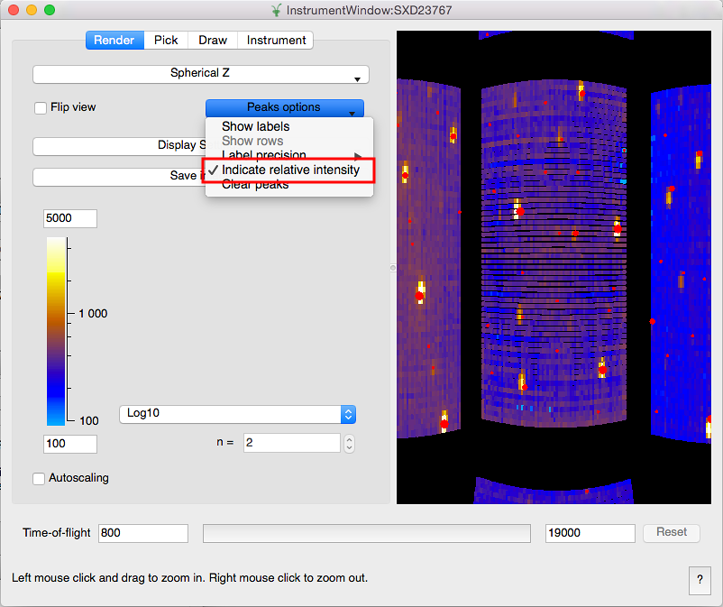
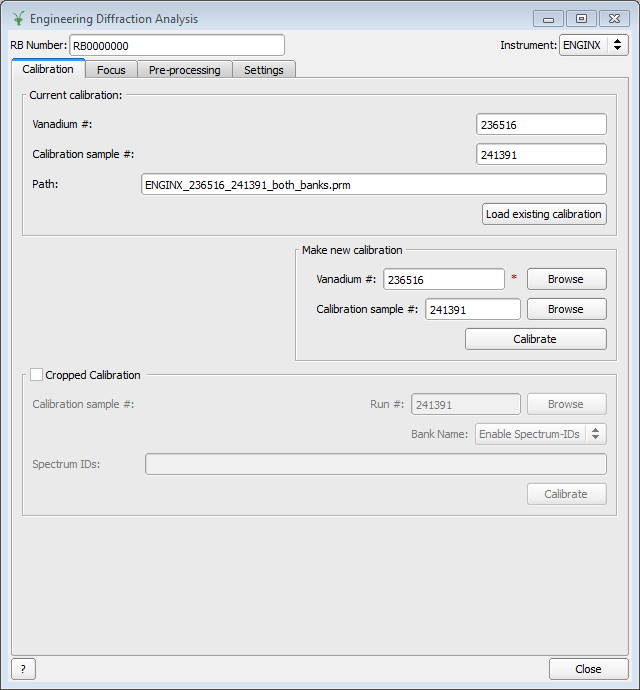
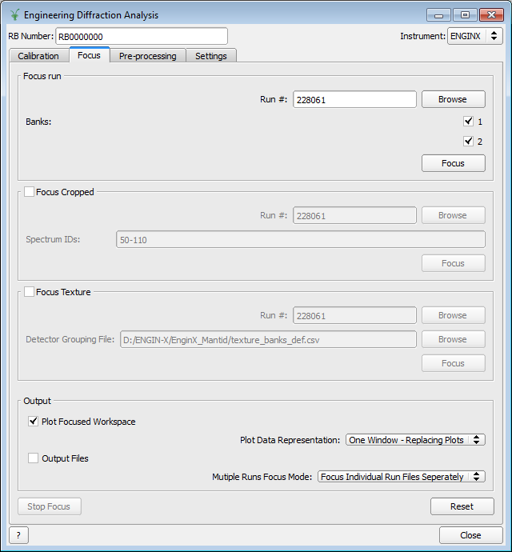
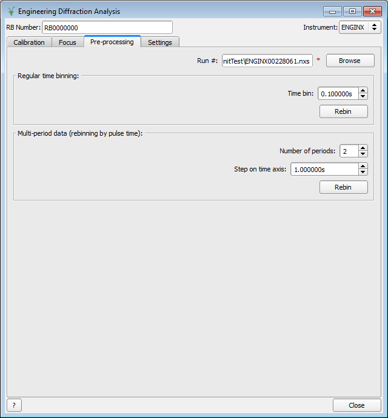
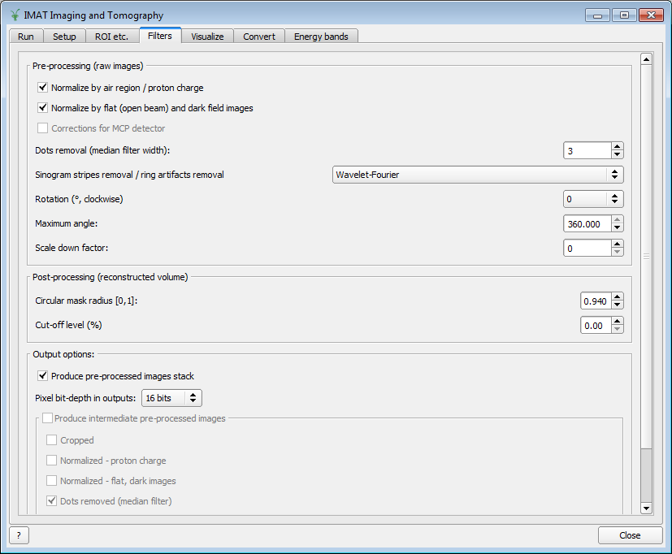
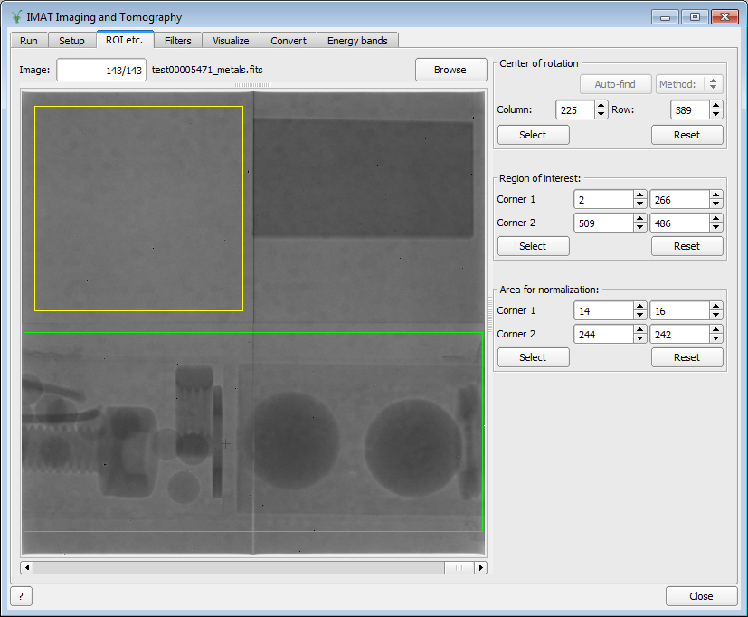
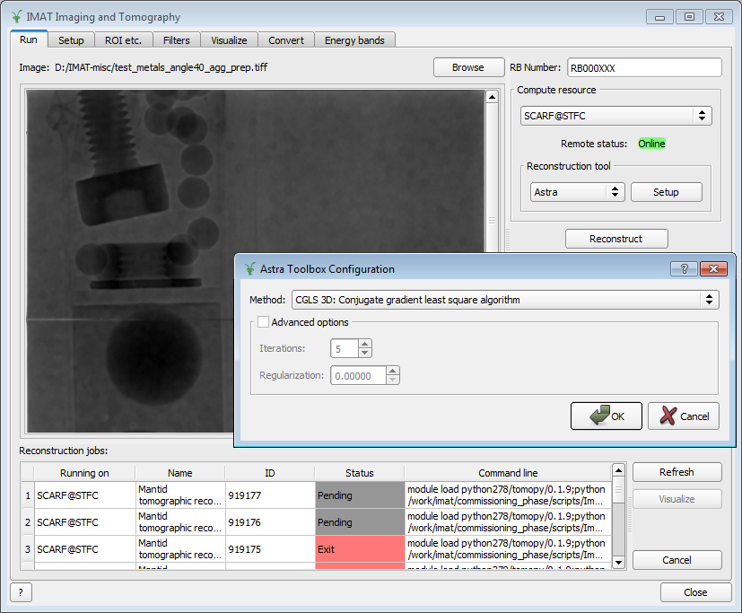

===================
Diffraction Changes
===================

.. contents:: Table of Contents
   :local:

Single Crystal
--------------

Instrument View
###############

-  The instrument view has been modified to optionally display relative
   peak intensities on a qualitative scale. The intensities are
   indicated by markers of different size. The option is found in the
   "Render"-tab of the instrument view:

Algorithms
##########

-  There is now an algorithm
   :ref:`LoadCIF <algm-LoadCIF>`
   which loads crystal structure information from a CIF-file into the
   sample associated to a workspace. Optionally, a UB-matrix can also be
   loaded from the file.
-  :ref:`PredictPeaks <algm-PredictPeaks>`
   has been modified to optionally use the crystal structure information
   to calculate structure factors for the predicted peaks.
-  :ref:`SortHKL <algm-SortHKL>`
   has received a major speedup for calculation of statistics for
   PeaksWorkspaces with large numbers of peaks and/or high symmetry.

Powder Diffraction
------------------

-  New algorithm
   :ref:`PDToPDFgetN <algm-PDToPDFgetN>`
   which converts events files into suitable PDFgetN files.
-  Various fixes and optimizations to make
   :ref:`SNSPowderReduction <algm-SNSPowderReduction>`
   run faster.
-  New documentation page for the `ISIS Powder Diffraction <http://docs.mantidproject.org/v3.6.0/api/python/techniques/PowderDiffractionISIS-v1.html>`_
   with comprehensive workflow-diagrams and usage example.
-  Many small changes made to the ISIS Powder Diffraction script to
   enable smoother process, which can be discovered on the `ISIS Powder Diffraction <http://docs.mantidproject.org/v3.6.0/api/python/techniques/PowderDiffractionISIS-v1.html>`_
   documentation page.

Crystal Improvements
--------------------

-  CrystalStructure has been exposed to Python, along with
   ReflectionGenerator. Both can be used together to calculate HKL-lists
   as well as d-spacings and structure factors for a given crystal
   structure. Usage examples are included in a new :ref:`documentation page <Crystal structure and reflections>`.
-  Alternative settings for space groups have been added, including
   different cell choices for monoclinic space groups, rhombohedral
   settings for trigonal space groups and origin choices. The :ref:`documentation <Point and space groups>`
   has been updated.
-  There is now a clear separation between crystal- and lattice system
   within PointGroup. This is relevant for trigonal space groups which
   can belong either to the rhombohedral or the hexagonal lattice
   system. This change affects the functions :ref:`LatticeFunction <func-LatticeFunction>` and
   :ref:`PawleyFunction <func-PawleyFunction>`, as well as the algorithm :ref:`PawleyFit <algm-PawleyFit>`, which now use
   lattice system instead of crystal system.
-  CorrectIfOnEdge option was added to :ref:`IntegratePeaksMD <algm-IntegratePeaksMD>` to estimate the
   part of the peak off the detector edge.

Updates for POLDI routines
--------------------------

Bugfixes
########

-  :ref:`PoldiFitPeaks2D <algm-PoldiFitPeaks2D>` now correctly refines hexagonal cell parameters for
   trigonal structures in hexagonal setting
   (`details <https://github.com/mantidproject/mantid/issues/13924>`_)

Engineering Diffraction
-----------------------

-  New functionality has been integrated in the Engineering diffraction
   GUI (and the Engineering diffraction algorithms have been updated and
   extended wherever needed):

   -  Multi-run processing
   -  Multi Runs Focus Mode combo-box enables user to carry out focusing
      process by focusing Individual Run Files Separately or by focusing
      the Sum Of Files
   -  Stop Focus button terminates the multi-run focussing process
   -  Basic support for event mode.
   -  Advanced calibration modes (cropped and texture).
   -  Additional plotting options for calibration and focusing results.
   -  A default calibration for EnginX is included with Mantid.
   -  Support for several output file formats (GSAS, OpenGenie, XYE
      format).
   -  GUI has been made further more interactive and customisable; user
      can now disable or enable particular functionality and features
      upon preference

.. container::

   |engg_calib_tab| |engg_focus_tab| |engg_preproc_tab|

Imaging
-------

-  The tomography reconstruction interface now supports the new
   functionality introduced in recent versions of the reconstruction
   tools Tomopy and Astra Toolbox.
-  Scripts to aggregate energy bands have been added.
-  Support for running third party tomographic reconstruction tools
   locally.
-  The GUI now provides an interface (new tabs) to simplify the
   following tasks:

   -  set up pre-processing steps and filters.
   -  visualize sequences or stacks of images and select regions of
      interest and regions for normalization.
   -  browse results produced by reconstruction tools and open them up
      in external 3D visualization tools.

.. container::

   |tomo_gui_snapshot_tab4| |tomo_gui_snapshot_tab3| |tomo_gui_snapshot_tab1|

|

Full list of `diffraction <http://github.com/mantidproject/mantid/pulls?q=is%3Apr+milestone%3A%22Release+3.6%22+is%3Amerged+label%3A%22Component%3A+Diffraction%22>`_
and
`imaging <http://github.com/mantidproject/mantid/pulls?q=is%3Apr+milestone%3A%22Release+3.6%22+is%3Amerged+label%3A%22Component%3A+Imaging%22>`_ changes on GitHub.
