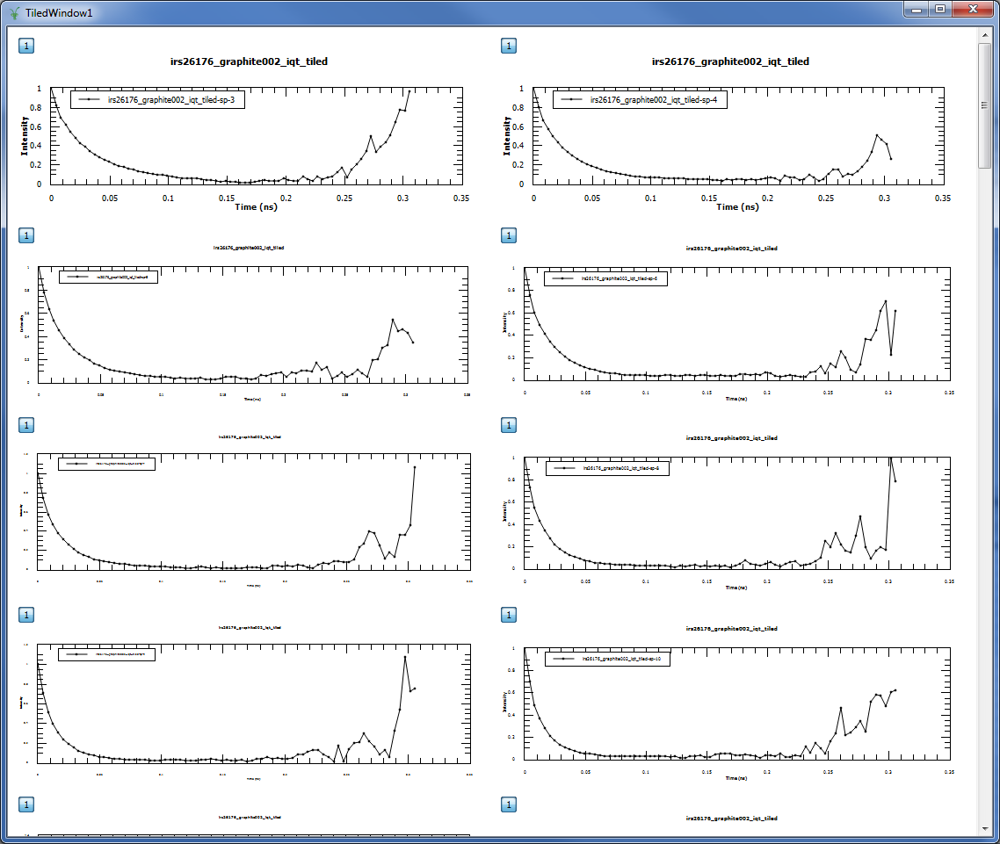

==========================
Indirect Inelastic Changes
==========================

.. contents:: Table of Contents
   :local:

New features
------------

Algorithms
##########

-  ``SwapWidths`` This algorithm is to be used on a BayesQuasi widths
   workspace where the 2 widths cross over for ascending Q value. The
   swap point is selected and a new workspace created which is then
   suitable for use in JumpFit.

Corrections
###########

Container Subtraction
~~~~~~~~~~~~~~~~~~~~~

-  Added new ``Shift x-values of container by adding`` option to allow
   for the use of non aligned peak centres between Sample and Container.

Apply PaalmanPings
~~~~~~~~~~~~~~~~~~

-  Added new ``Shift x-values of container by adding`` option to allow
   for the use of non aligned peak centres between Sample and Container.

Absorption
~~~~~~~~~~

-  Added new ``Shift x-values of container by adding`` option to allow
   for the use of non aligned peak centres between Sample and Container.

Data Analysis
#############

ConvFit
~~~~~~~

-  Mini plot shows a curve for the Diff after fitting the model as well
   as the fitted data in the interface
-  After selecting ``Use`` in the parameter under ``Delta Function``,
   this now displays the centre of the Delta Function

I(Q,t)
~~~~~~

   TiledPlot for I(Q,t) interface in the Data Analysis tab

-  I(Q,t) now has a Tile Plot option that allows you to plot all the
   spectra in the output in a tile view.

I(Q,t) :ref:`Fit <algm-Fit>`
~~~~~~~~~~~~~~~~~~~~~~~~~~~~

-  I(Q,t) :ref:`Fit <algm-Fit>` now plots the Diff after fitting the model as well as the
   fitted data in the mini plot within the interface.

Data Reduction
##############

ILL Energy Transfer
~~~~~~~~~~~~~~~~~~~

-  Changed `IndirectILLReduction <http://docs.mantidproject.org/v3.6.0/algorithms/IndirectILLReduction-v1.html>`_ algorithm to support the new format for
   raw ``.nxs`` files.

Diffraction
-----------

-  OSIRIS DiffOnly diffraction now allows for the user to specify a
   range of spectra (spectra min /spectra max)

Improvements
------------

Progress Tracking
#################

Many of the algorithms in Mantid have been given progress tracking. This
means that it is now easy to see the progress of an algorithm while it
is running in terms of percentage of completion and labels detailing the
current process. You can also cancel these algorithms while they are
running. So far the algorithms that have been given progress tracking
include:

-  ``ApplyPaalmanPingsCorrections``
-  ``BayesQuasi``
-  ``ConvolutionFitSequential``
-  ``CylinderPaalmanPingsCorrection``
-  ``EVSDiffractionReduction``
-  ``FlatPlatePaalmanPingsCorrection``
-  ``Indirect Calibration``
-  ``Indirect Energy Transfer``
-  ``Indirect Resolution``
-  ``PlotPeakByLogValue``
-  ``ResNorm``
-  ``SofQWMoments``
-  ``Symmetrise``
-  ``TimeSlice``
-  ``TransformToIqt``

Mantid Algorithms
#################

-  BayesQuasi (previously in IndirectBayes.py) has been adapted to be a
   Mantid algorithm. This has not effected the way this script is used
   in the Indirect Bayes: Quasi tab, but it does now have a dialogue box
   interface from the algorithm list as well. This also allows for
   better testing and progress tracking of the algorithm.

Validation
##########

-  Empty data input fields now have a better error message (this was
   previously blank)

-  ``ISIS Energy Transfer``

   -  Data is now validated in Removal of Background (TOF) to ensure
      that data in for Start and End is within the data range for the
      ToF of the raw file.
   -  :ref:`Rebin <algm-Rebin>` Width can now be negative indicating a logarithmic binning
      this was the default case for TOSCA and TFXA but the validation
      was stopping this in the case of TFXA
   -  PlotTime spectra is validated to ensure it can not load Spectra
      outside of the possible range for the current instrument

-  ``ContainerSubtraction``

   -  Additional validation to ensure that the number of histograms in
      the sample are the same as the number of histograms in the
      container

-  ``Quasi``

   -  Interface now has additional validation to ensure that the current
      default save directory is set and if not, the user is asked if
      using the current working directory is ok.
   -  EMin/Emax validation to ensure that EMin < EMax

-  ``ConvFit``

   -  Interface now ensures that if temperature correction is checked in
      the interface then a value must be provided in the corresponding
      input field.

-  ``ResNorm``

   -  No longer causes a crash in Mantid when run with no input files
      provided for Resolution or Vanadium
   -  EMin/Emax validation to ensure that EMin < EMax

-  ``Absorption``

   -  Interface now has validation to ensure the chemical formula
      entered for the sample and the container are valid.

-  ``CalculatePaalmanPings``

   -  Interface now has validation to ensure the chemical formula
      entered for the sample and the container are valid.

Workflow diagrams
#################

-  Several additional workflow diagrams have been added to the
   documentation of algorithms. These algorithms include:

   -  ``TOSCABankCorrection``
   -  ``IndirectFlatPlateAbsorption``
   -  ``IndirectCylinderAbsorption``
   -  ``IndirectAnnulusAbsorption``
   -  ``EVSDiffractionReduction``
   -  ``MuscatSofQW``
   -  ``OSIRISDiffractionReduction``
   -  ``FlatPlatePaalmanPingsCorrection``
   -  ``FuryFitMultiple``
   -  ``ProcessIndirectFitParameters``

Misc
####

-  The naming convention used for files produced in Indirect Corrections
   has been updated to be more informative of what changes took place.
-  The naming convention for files that are loaded in the Indirect Data
   Reduction section has been changed to ensure consistency. It is now
   ``[full instrument name] + [run number] + _ + [analyser] + [reflection] + _red``
   - This should all be lower case and any leading zeros should be
   removed.
-  ``FABADA``

   -  For most of our applications the MaxIterations parameter should be
      at least 1e6, the new default value. This is now properly passed
      through to the :ref:`PlotPeakByLogValue <algm-PlotPeakByLogValue>` algorithm for sequential
      fitting.

-  ``Multi Data Set Fitting``

   -  Many additions and corrections. This gives more functionality than
      the ConvFit interface.

Bugfixes
--------

Major
#####

-  Added Height of Delta function to the property table in ConvFit tab
   when it is in use.
-  Include ``_red`` at the end of files produced in Indirect Corrections
   so they can be used in other interfaces.
-  :ref:`ResNorm <algm-ResNorm>` should no longer have issues running/saving files when the
   ``Resolution`` input is a workspace not a file.
-  Files for the ``IN16B`` instrument at the ILL no longer cause Mantid
   to crash when loaded and now can be used in ``ConvFit``.
-  It should now be possible to save workspaces from the output of
   ``I(Q, t)`` regardless of the name of Input workspaces.
-  In ``ConvFit`` the resolution workspace is now extended to match the
   number of spectra in the sample workspace when the algorithm is run
   rather than when the workspaces are loaded. This makes ConvFit more
   robust when the interface is being manipulated quickly.
-  Remove the auto-running of various interfaces including:
   ``ISIS Diagnostics``, ``Moments`` and ``JumpFit`` when variables in
   the property tree are changed.
-  The ``ContainerSubtraction`` interface now allows for ``_multi_``
   files to be used (those which are reduced from multiple run numbers).
   This was previously being incorrectly stopped due to validation.
-  The ``Quasi`` interface now works correctly with ``_ResNorm`` files
-  It is once again possible to :ref:`Load <algm-Load>` ``_sqw`` files in to the ConvFit
   interface

Minor
#####

-  In the Indirect Data Reduction tab, ``Removal of Background (ToF)``
   is now also validated when Plot Time is called not only on a call to
   Run.
-  Ensure that the spectra range in ConvFit maps correctly onto the
   fitted workspaces in the workspace group when plotting in the mini
   plot.
-  Further improved Sample logs in Corrections to include shift of
   Container.
-  The curve that represents the Container plotted in the mini plot in
   ContainerSubtraction now scales accordingly with the
   ``Scale Container by factor`` option in the interface.
-  ``Fold Multiple Frames`` is no longer checked by default for IRIS and
   OSIRIS in ISIS Energy Transfer.
-  Reduced the number of calls to the ``FileFinder`` in ``LoadVesuvio``.
-  The plot options in ``I(Q, t) Fit`` have been reordered to be
   consistent with other interfaces in Indirect.
-  Ensured ``FWHM`` and ``Fitting Range`` in the plot and parameter tree
   in ``ConvFit`` update automatically based on the resolution of the
   instrument in the IDF and the range of the data being fitted in the
   mini plot.
-  ``ResNorm`` can now accept files of the old or new naming convention.
   It even works with a combination of the two.
-  ``ProcessIndirectFitParameters`` algorithm no longer produces a
   ``__TMP`` workspace when executed.
-  ``Absorption Corrections`` interface now has improved default values
   for ``Scale`` (1.000) and ``Shift`` (0.000).
-  ``Moments`` interface now has an improved default value for ``Scale``
   (1.000).
-  ``ConvFit``

   -  Plots the Diff of :ref:`Fit <algm-Fit>` Single Spectrum
   -  Improved default values for many of the properties in the property
      tree. They now default to 1 rather than 0.
   -  Does not crash if you change fit type or Plot Single Spectrum
      without data input files

`Full list of changes on github <http://github.com/mantidproject/mantid/pulls?q=is%3Apr+milestone%3A%22Release+3.6%22+is%3Amerged+label%3A%22Component%3A+Indirect+Inelastic%22>`_
