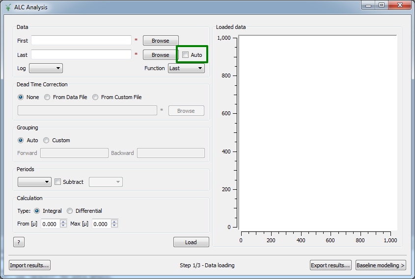
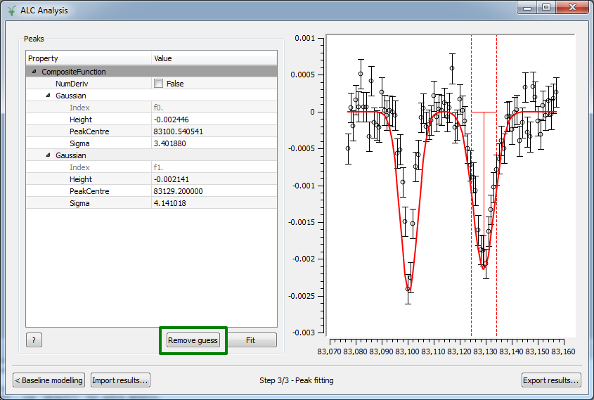
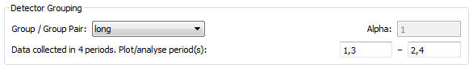
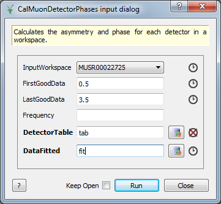

=============
Muon Analysis
=============

.. contents:: Table of Contents
   :local:

Interfaces
----------

Muon ALC
########

-  Set last run to "Auto" (watches directory for new files and updates data automatically) `#14601 <https://github.com/mantidproject/mantid/pull/14601>`_

-  Enable autoscaling of data plots `#14719 <https://github.com/mantidproject/mantid/pull/14719>`_
-  :ref:`Fit <algm-Fit>` progress shown in MantidPlot's progress bar `#14842 <https://github.com/mantidproject/mantid/pull/14842>`_
-  "Plot guess" button at the peak fitting stage displays the initial fit function
   `#14842 <https://github.com/mantidproject/mantid/pull/14842>`_

Muon Analysis
#############

-  Fixed period subtraction `#14018 <https://github.com/mantidproject/mantid/pull/14018>`_
-  Advanced period arithmetic `#14536 <https://github.com/mantidproject/mantid/pull/14536>`_

-  A bug was fixed where, when specifying run numbers in the sequential
   fitting dialog, Mantid previously searched using the default
   instrument (set at startup) rather than the instrument set in the
   drop-down box on the front tab of the instrument `#15244 <https://github.com/mantidproject/mantid/pull/15244>`_

Algorithms
----------

-  :ref:`AsymmetryCalc <algm-AsymmetryCalc>`: better error handling in :ref:`AsymmetryCalc <algm-AsymmetryCalc>` when entering
   non-existing spectra
   `#13873 <https://github.com/mantidproject/mantid/pull/13873>`_
-  :ref:`CalMuonDetectorPhases <algm-CalMuonDetectorPhases>`: new algorithm to calibrate detector phases
   `#13840 <https://github.com/mantidproject/mantid/pull/13840>`_. The
   output table "DetectorTable" can be used directly as the "PhaseTable"
   input to :ref:`PhaseQuad <algm-PhaseQuad>`.

-  :ref:`PhaseQuad <algm-PhaseQuad>`: unnecessary input properties were removed
   `#13840 <https://github.com/mantidproject/mantid/pull/13840>`_
-  *GetNegMuMuonicXRD*: Output workspaces now plot. The dialog has 'keep open' functionality.
   `#14484 <https://github.com/mantidproject/mantid/pull/14484>`_,
   `#14394 <https://github.com/mantidproject/mantid/pull/14394>`_
-  *MuonCalculateAsymmetry*/*MuonLoad*: Combined these two algorithms, which
   were only used internally by the Muon Analysis interface, into a new
   ":ref:`MuonProcess <algm-MuonProcess>`" algorithm
   `#14687 <https://github.com/mantidproject/mantid/pull/14687>`_,
   `#14807 <https://github.com/mantidproject/mantid/pull/14807>`_
-  A first version of :ref:`MaxEnt <algm-MaxEnt>` was added
   `#14675 <https://github.com/mantidproject/mantid/pull/14675>`_
-  The muon lifetime stored in Mantid has been updated to the Particle
   Data Group's `most recent
   value <http://pdg.lbl.gov/2015/tables/rpp2015-sum-leptons.pdf>`_.
   This will have a small effect on results from :ref:`CalMuonDeadTime <algm-CalMuonDeadTime>`,
   :ref:`CalMuonDetectorPhases <algm-CalMuonDetectorPhases>`, :ref:`RemoveExpDecay <algm-RemoveExpDecay>` and :ref:`PhaseQuad <algm-PhaseQuad>`.
   `#14983 <https://github.com/mantidproject/mantid/pull/14983>`_

Fit Functions
-------------

-  :ref:`StaticKuboToyabeTimesStretchExp <func-StaticKuboToyabeTimesStretchExp>` has been added
   `#14430 <https://github.com/mantidproject/mantid/pull/14430>`_

`Full list of changes <http://github.com/mantidproject/mantid/pulls?q=is%3Apr+milestone%3A%22Release+3.6%22+is%3Amerged+label%3A%22Component%3A+Muon%22>`_
on GitHub.
